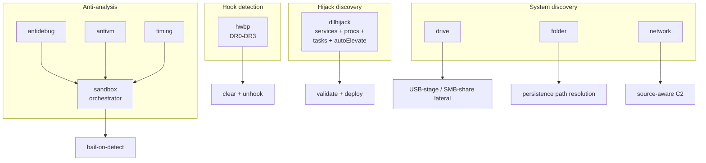

---
---

# Recon techniques

[← maldev README](../../../README.md) · [docs/index](../../index.md)

The `recon/*` package tree groups discovery + environmental
awareness primitives:

- **Anti-analysis** — debugger / VM / sandbox detection
  ([`antidebug`](anti-analysis.md), [`antivm`](anti-analysis.md),
  [`sandbox`](sandbox.md), [`timing`](timing.md)).
- **Hijack discovery** — DLL search-order hijack opportunities
  ([`dllhijack`](dll-hijack.md)).
- **Hook detection** — hardware breakpoint inspection
  ([`hwbp`](hw-breakpoints.md)).
- **System enumeration** — drives, special folders, network
  ([`drive`](drive.md), [`folder`](folder.md), [`network`](network.md)).

> **Where to start (novice path):**
> 1. [`sandbox`](sandbox.md) — multi-factor "is this a real
>    target?" orchestrator. Most operators ship with this at
>    startup.
> 2. [`anti-analysis`](anti-analysis.md) — debugger + VM
>    detection primitives that sandbox composes.
> 3. [`dll-hijack`](dll-hijack.md) — find privilege-escalation
>    opportunities programmatically (services / procs / tasks
>    / autoElevate).
> 4. [`drive`](drive.md), [`folder`](folder.md), [`network`](network.md)
>    — system enumeration when a specific question needs answering.

## Packages

| Package | Tech page | Detection | One-liner |
|---|---|---|---|
| [`recon/antidebug`](https://pkg.go.dev/github.com/oioio-space/maldev/recon/antidebug) | [anti-analysis.md](anti-analysis.md) | quiet | Cross-platform debugger detection (PEB / TracerPid) |
| [`recon/antivm`](https://pkg.go.dev/github.com/oioio-space/maldev/recon/antivm) | [anti-analysis.md](anti-analysis.md) | quiet | Multi-vendor hypervisor detection (7 dimensions) |
| [`recon/sandbox`](https://pkg.go.dev/github.com/oioio-space/maldev/recon/sandbox) | [sandbox.md](sandbox.md) | quiet | Multi-factor sandbox orchestrator |
| [`recon/timing`](https://pkg.go.dev/github.com/oioio-space/maldev/recon/timing) | [timing.md](timing.md) | quiet | CPU-burn defeats Sleep-hook fast-forward |
| [`recon/dllhijack`](https://pkg.go.dev/github.com/oioio-space/maldev/recon/dllhijack) | [dll-hijack.md](dll-hijack.md) | moderate | Discover DLL search-order hijack opportunities |
| [`recon/hwbp`](https://pkg.go.dev/github.com/oioio-space/maldev/recon/hwbp) | [hw-breakpoints.md](hw-breakpoints.md) | moderate | Detect + clear EDR HWBPs in DR0-DR3 |
| [`recon/drive`](https://pkg.go.dev/github.com/oioio-space/maldev/recon/drive) | [drive.md](drive.md) | very-quiet | Drive enum + USB-insert watcher (Windows) |
| [`recon/folder`](https://pkg.go.dev/github.com/oioio-space/maldev/recon/folder) | [folder.md](folder.md) | very-quiet | Windows special-folder path resolution |
| [`recon/network`](https://pkg.go.dev/github.com/oioio-space/maldev/recon/network) | [network.md](network.md) | very-quiet | Cross-platform interface IPs + IsLocal |

## Quick decision tree

| You want to… | Use |
|---|---|
| …bail if a debugger is attached | [`antidebug.IsDebuggerPresent`](anti-analysis.md) |
| …bail if running in a hypervisor | [`antivm.Detect`](anti-analysis.md) |
| …run multi-factor "is this analysis?" | [`sandbox.New(DefaultConfig).IsSandboxed`](sandbox.md) |
| …burn CPU to defeat Sleep fast-forward | [`timing.BusyWait`](timing.md) |
| …find DLL hijack candidates | [`dllhijack.ScanAll`](dll-hijack.md) |
| …UAC bypass via autoElevate hijack | [`dllhijack.ScanAutoElevate`](dll-hijack.md) |
| …detect EDR HWBPs in ntdll | [`hwbp.Detect`](hw-breakpoints.md) → [`ClearAll`](hw-breakpoints.md) |
| …list mounted drives + watch removable insertions | [`drive.NewWatcher`](drive.md) |
| …resolve `%APPDATA%` / `%PROGRAMDATA%` | [`folder.Get`](folder.md) |
| …list host IPs / detect self-references | [`network.InterfaceIPs`](network.md) / [`IsLocal`](network.md) |

## MITRE ATT&CK

| T-ID | Name | Packages | D3FEND counter |
|---|---|---|---|
| [T1622](https://attack.mitre.org/techniques/T1622/) | Debugger Evasion | `antidebug`, `hwbp` | [D3-EI](https://d3fend.mitre.org/technique/d3f:ExecutionIsolation/) |
| [T1497](https://attack.mitre.org/techniques/T1497/) | Virtualization/Sandbox Evasion | `sandbox` | [D3-EI](https://d3fend.mitre.org/technique/d3f:ExecutionIsolation/) |
| [T1497.001](https://attack.mitre.org/techniques/T1497/001/) | System Checks | `antivm` | [D3-EI](https://d3fend.mitre.org/technique/d3f:ExecutionIsolation/) |
| [T1497.003](https://attack.mitre.org/techniques/T1497/003/) | Time Based Evasion | `timing` | [D3-EI](https://d3fend.mitre.org/technique/d3f:ExecutionIsolation/) |
| [T1574.001](https://attack.mitre.org/techniques/T1574/001/) | Hijack Execution Flow: DLL Search Order Hijacking | `dllhijack` | [D3-EAL](https://d3fend.mitre.org/technique/d3f:ExecutableAllowlisting/) |
| [T1548.002](https://attack.mitre.org/techniques/T1548/002/) | Bypass UAC | `dllhijack` (autoElevate) | [D3-EAL](https://d3fend.mitre.org/technique/d3f:ExecutableAllowlisting/) |
| [T1027.005](https://attack.mitre.org/techniques/T1027/005/) | Indicator Removal from Tools | `hwbp` | [D3-PSA](https://d3fend.mitre.org/technique/d3f:ProcessSpawnAnalysis/) |
| [T1120](https://attack.mitre.org/techniques/T1120/) | Peripheral Device Discovery | `drive` | — |
| [T1083](https://attack.mitre.org/techniques/T1083/) | File and Directory Discovery | `folder`, `drive` | — |
| [T1016](https://attack.mitre.org/techniques/T1016/) | System Network Configuration Discovery | `network` | — |

## See also

- [Operator path: pre-flight discovery](../../by-role/operator.md)
- [Detection eng path](../../by-role/detection-eng.md)
- [`evasion/unhook`](../evasion/ntdll-unhooking.md) — pair with
  `hwbp.ClearAll` for full hook clear.
- [`win/syscall`](../syscalls/) — direct/indirect syscalls
  bypass both inline + HWBP.
- [`persistence/*`](../persistence/README.md) — consumes
  `folder.Get` for path resolution.
