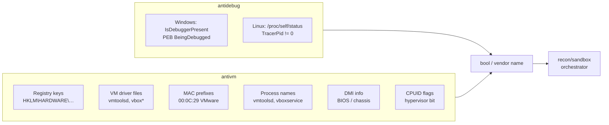

# Anti-analysis (debugger + VM detection)

[← recon index](README.md) · [docs/index](../../index.md)

## TL;DR

Before doing anything risky, ask the host: "am I being
analysed?" Two cheap checks run in microseconds and let your
implant bail before the analyst's pipeline records anything
useful.

Pick the right check based on what you want to detect:

| You want to detect… | Use | Cost | Strength |
|---|---|---|---|
| Live debugger attached | [`antidebug.IsDebuggerPresent`](#func-isdebuggerpresent-bool) | 1 syscall | Bulletproof for default debuggers; defeated by anti-anti-debug plugins (ScyllaHide etc.) |
| Common sandbox VMs (VirtualBox, VMware, Hyper-V, QEMU, Parallels, Xen, Docker, WSL) | [`antivm.RunChecks`](#func-runchecksopts-checkoptions-result) | <100ms | Multi-dimensional (registry + files + NICs + processes + DMI). Checks are vendor-fingerprintable. |
| Modern HVCI/hardware-virt-aware hypervisors | [`antivm.HypervisorPresent`](#func-hypervisorpresent-bool) | 1 CPUID | Detects ANY hypervisor (including Hyper-V on a "real" Win11 machine). Use as a soft signal, not a hard bail. |
| Comprehensive scoring across all signals | [`recon/sandbox`](sandbox.md) | varies | Orchestrator combining the above + idle time + drive count + uptime. |

Recommended startup pattern: bail on debugger immediately
(very-low false-positive), score on VM signals (sandbox vs
real machine is fuzzy), let `recon/sandbox` arbitrate.

## Primer — vocabulary

Five terms recur on this page:

> **Sandbox** — a managed analysis environment (Cuckoo, ANY.RUN,
> AV vendor labs) that runs your sample in a VM, traces every
> syscall + network packet, then writes a report. Sandboxes
> are usually VMs, so VM detection catches most of them.
>
> **PEB (Process Environment Block)** — Windows per-process
> structure containing the `BeingDebugged` byte at offset
> 0x02. Set by the kernel when a debugger attaches.
> `IsDebuggerPresent` reads this flag.
>
> **CPUID** — x86 instruction the CPU answers with its
> capabilities. The hypervisor-present bit (leaf 1, ECX bit 31)
> is set by EVERY hypervisor (VMware, KVM, Hyper-V, Xen…) —
> the hypervisor cannot lie about it without breaking the OS
> running inside.
>
> **DMI (Desktop Management Interface)** — a small database
> the BIOS exposes (manufacturer, product name, chassis type,
> BIOS vendor). VMs have characteristic DMI strings ("VMware,
> Inc.", "innotek GmbH" for VirtualBox, "Microsoft Corporation"
> for Hyper-V) that don't appear on physical machines.
>
> **Indicator dimension** — a category of fingerprint signal:
> registry keys (Windows), file paths, NIC MAC prefixes,
> running process names, BIOS/DMI info, CPUID flags. `antivm`
> runs configurable subsets via `CheckOptions`.

## How It Works



## API → godoc

[`pkg.go.dev/github.com/oioio-space/maldev/recon/antidebug`](https://pkg.go.dev/github.com/oioio-space/maldev/recon/antidebug) is the authoritative
reference for every exported symbol. This page teaches the
*concepts*; the godoc is the *specification*.

## Examples

### Quick start — startup bail-out triplet

The canonical "is this safe to run?" check at implant startup.
Three calls in order: debugger first (cheapest, hard fail),
hypervisor probe second (1 CPUID, scoring), full VM scan last
(most expensive, hard fail on known-sandbox vendors).

```go
package main

import (
    "log"
    "os"

    "github.com/oioio-space/maldev/recon/antidebug"
    "github.com/oioio-space/maldev/recon/antivm"
)

func safeToRun() bool {
    // Step 1: hard fail on attached debugger. Cheapest check
    //         (~one syscall on Windows, one file read on Linux).
    if antidebug.IsDebuggerPresent() {
        log.Println("debugger attached — bailing")
        return false
    }

    // Step 2: cheap CPUID-based hypervisor probe. Detects ANY
    //         hypervisor — including Hyper-V on a real Win11
    //         laptop, so use as a SOFT signal (log + lower
    //         threshold for further checks), not a hard bail.
    if antivm.HypervisorPresent() {
        vendor := antivm.HypervisorVendorName()
        log.Printf("hypervisor present: %s — running cautiously", vendor)
        // continue, but maybe skip the loudest payloads
    }

    // Step 3: full VM detection across registry / files / NICs /
    //         processes / DMI. Returns "" when no known sandbox
    //         fingerprint matches. Hard bail when it does.
    if name, _ := antivm.Detect(antivm.DefaultConfig()); name != "" {
        log.Printf("sandbox detected: %s — bailing", name)
        return false
    }

    return true
}

func main() {
    if !safeToRun() {
        os.Exit(0)
    }
    // ... real implant logic ...
}
```

What this DOES catch:

- ScyllaHide-free debuggers (x64dbg, Visual Studio, WinDbg
  out-of-the-box).
- Known sandboxes (Cuckoo, ANY.RUN, JoeSandbox) — they all run
  on detectable VM stacks.
- VirtualBox / VMware default installs.

What this does NOT catch:

- Hardware-level sandboxes running on bare metal with snapshot
  rollback. Rare but exist.
- Anti-anti-debug plugins (ScyllaHide, TitanHide) — patch the
  PEB byte before your check runs.
- Newer sandboxes that scrub VM artefacts (registry / DMI
  cleanup, MAC randomisation). The CPUID hypervisor bit can
  still be hidden by some hypervisors via VT-x manipulation.

For higher coverage, layer with [`recon/sandbox`](sandbox.md)
which adds idle-time + drive-count + uptime + recent-document
heuristics on top of these primitives.

### Simple — bail on detection

```go
import (
    "os"

    "github.com/oioio-space/maldev/recon/antidebug"
    "github.com/oioio-space/maldev/recon/antivm"
)

if antidebug.IsDebuggerPresent() {
    os.Exit(0)
}
if name, _ := antivm.Detect(antivm.DefaultConfig()); name != "" {
    os.Exit(0)
}
```

### Composed — narrow vendor + dimension

```go
cfg := antivm.Config{
    Vendors: []antivm.Vendor{
        {Name: "VMware", Nic: []string{"00:0C:29"}, Files: []string{`C:\windows\system32\drivers\vmtoolsd.sys`}},
    },
    Checks: antivm.CheckNIC | antivm.CheckFiles,
}
if name, _ := antivm.Detect(cfg); name != "" {
    return
}
```

### Composed — CPUID hypervisor probe (recommended)

```go
import "github.com/oioio-space/maldev/recon/antivm"

// One call covers all three CPUID/timing signals.
// Strongest "am I in a VM" detection userland can produce;
// the timing dimension catches even hypervisors that mask the
// CPUID.1:ECX[31] bit because they cannot hide the VMEXIT cost.
if r := antivm.Hypervisor(); r.LikelyVM {
    log.Printf("VM detected: vendor=%q name=%q timing=%d cycles",
        r.VendorSig, r.VendorName, r.TimingDelta)
    os.Exit(0)
}
```

If you want finer control over which signals contribute, build
the report by hand:

```go
if antivm.HypervisorPresent() ||
    antivm.LikelyVirtualizedByTiming(antivm.DefaultRDTSCThreshold) {
    os.Exit(0)
}
```

### Privileged — VMware backdoor I/O port (Ring 0 / root only)

`BackdoorVMware` reads the VMware-specific backdoor port (0x5658,
"VX"). When the hypervisor traps the `IN EAX, DX` instruction, EBX
echoes the magic ("VMXh") — a definitive VMware signature that
non-VMware HVMs cannot fake. The probe only runs after a
privilege check (Linux: `iopl(3)` succeeds; Windows: never in
user mode); otherwise [ErrBackdoorPrivilege] is returned and the
caller treats VMware status as unknown.

```go
import (
    "errors"
    "log"

    "github.com/oioio-space/maldev/recon/antivm"
)

rep, err := antivm.BackdoorVMware()
switch {
case errors.Is(err, antivm.ErrBackdoorPrivilege):
    log.Println("not privileged — fall back to Hypervisor() vendor check")
case err != nil:
    log.Printf("backdoor probe error: %v", err)
case rep.IsVMware:
    log.Printf("definitively VMware: echo=%#x ECX=%#x EDX=%#x",
        rep.Echo, rep.ECX, rep.EDX)
default:
    log.Println("not VMware (or backdoor disabled)")
}
```

Pair this with the user-mode-friendly `Hypervisor()` for a
two-tier signal: `Hypervisor()` always runs and identifies the
generic vendor; `BackdoorVMware` adds a high-confidence "this is
specifically VMware" bit when Ring 0 / iopl is available.

### Advanced — orchestrator integration

See [`recon/sandbox`](sandbox.md) for the multi-factor
[`Checker.IsSandboxed`](https://pkg.go.dev/github.com/oioio-space/maldev/recon/sandbox) — debugger +
VM detection are two of the seven dimensions it composes.

## OPSEC & Detection

| Artefact | Where defenders look |
|---|---|
| `IsDebuggerPresent` Win32 call | Universal — invisible |
| `/proc/self/status` read | Linux: invisible |
| Registry probes against VM driver keys | EDR usually invisible; some sandbox-aware AV may flag patterns |
| MAC-prefix interface enumeration | Universally invisible |
| CPUID `0x40000000` (hypervisor leaf) | Invisible to user-mode telemetry |
| Behavioural correlation: many checks then early exit | Sandboxes time-out themselves; correlation is post-fact |

**D3FEND counters:**

- [D3-EI](https://d3fend.mitre.org/technique/d3f:ExecutionIsolation/)
  — sandbox executor design.

**Hardening for the operator:**

- Pair `antidebug` + `antivm` with timing-based evasion
  ([`recon/timing`](timing.md)) — sandboxes time out before a
  multi-second BusyWait completes.
- Use [`recon/sandbox`](sandbox.md) for the multi-factor
  pipeline rather than calling primitives independently.

## MITRE ATT&CK

| T-ID | Name | Sub-coverage | D3FEND counter |
|---|---|---|---|
| [T1622](https://attack.mitre.org/techniques/T1622/) | Debugger Evasion | full — `antidebug.IsDebuggerPresent` | D3-EI |
| [T1497.001](https://attack.mitre.org/techniques/T1497/001/) | Virtualization/Sandbox Evasion: System Checks | full — `antivm` 7 dimensions | D3-EI |

## Limitations

- **PEB-only on Windows.** Sophisticated debuggers can clear
  the `BeingDebugged` flag — ScyllaHide and similar harden it.
- **No anti-VMI.** Bare-metal VMI (Volatility-on-host) defeats
  every userland check.
- **VMware-specific backdoor probe ([BackdoorVMware]) needs Ring 0.**
  The `IN EAX, DX` instruction against port 0x5658 ("VX") only
  succeeds at IOPL 3 (Linux: `iopl(3)` syscall, requires
  CAP_SYS_RAWIO + root) or in kernel-mode (Windows: Ring 0
  driver). User-mode probes return [ErrBackdoorPrivilege] without
  attempting the IN — issuing it from CPL 3 would otherwise
  SIGSEGV / #GP and crash the process. Pair with [Hypervisor]
  for the user-mode path (CPUID 0x40000000 vendor read).
- **Static fingerprints.** Vendors who customise OEM strings
  in DMI / registry can defeat default fingerprints; supply
  custom `Vendor` lists for hostile environments.
- **WSL detection is loose.** WSL2 looks very VM-like; expect
  false positives if WSL is a legitimate target.
- **CPUID timing — `DefaultRDTSCThreshold = 1000`.** Picked above
  any observed bare-metal CPUID baseline (~30-50 cycles) and
  below any observed HVM lower bound (~500-3000+). Hyper-V on
  modern Windows guests sits ~1000-1500 cycles, so the cut-off
  is tight at the bottom of the VM band — operators on KVM /
  VMware / Xen comfortably cross 1500. Lower the threshold for
  paranoid bail-on-any-signal flows; raise it on noisy bare-
  metal hosts (older CPUs, SMI storms) that occasionally spike
  past 1000.
- **CPUID timing — RDTSC traps defeat it.** A hypervisor that
  sets the VMCS "RDTSC exiting" control traps every RDTSC into
  a VMEXIT, hiding the CPUID-bracketed delta. Production HVMs
  rarely enable this (per-call cost imposed on every guest is
  prohibitive) but custom defensive hypervisors targeting
  malware analysis sometimes do — combine with
  [HypervisorPresent] / [HypervisorVendor] which reach the
  hypervisor through a different surface.
- **CPUID timing — non-amd64.** ARM64 / s390x have no RDTSC
  analogue exposed to userland; the stub returns 0 so
  `LikelyVirtualizedByTiming` always returns false. The
  CPUID-bit and vendor-string probes are likewise amd64-only.

## See also

- [Sandbox orchestrator](sandbox.md) — multi-factor pipeline.
- [Time-based evasion](timing.md) — pair to defeat sandbox
  fast-forward.
- [Operator path](../../by-role/operator.md).
- [Detection eng path](../../by-role/detection-eng.md).
