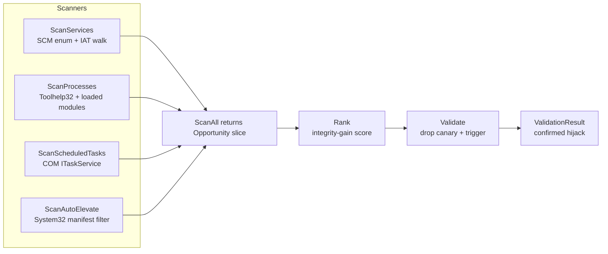

# DLL search-order hijack discovery

[← recon index](README.md) · [docs/index](../../index.md)

## TL;DR

You want to find places where you (current user) can drop a
malicious DLL such that a privileged target picks it up next
time it loads. Five scanner surfaces, each catching a different
victim class:

| Surface | Catches | Reward when hit |
|---|---|---|
| [`ScanServices`](#func-scanservicesopts-scanopts-opportunity-error) | SYSTEM-running services with writable binary dir + missing imported DLL | SYSTEM exec on next service start |
| [`ScanProcesses`](#func-scanprocessesopts-scanopts-opportunity-error) | Live processes with the same writable-search-path-+-missing-DLL pattern | Code exec at the process's privilege level on next launch |
| [`ScanScheduledTasks`](#func-scanscheduledtasksopts-scanopts-opportunity-error) | Tasks registered via COM ITaskService | Exec on next task trigger (often runs as SYSTEM or stored creds) |
| [`ScanAutoElevate`](#func-scanautoelevateopts-scanopts-opportunity-error) | System32 `.exe` with `autoElevate=true` manifest (fodhelper, sdclt, eventvwr, …) | UAC bypass — these silently elevate without prompt |
| [`ScanPATHWritable`](#func-scanpathwritableopts-scanopts-opportunity-error) | Writable directories in system or user `%PATH%` | SYSTEM exec whenever a higher-integrity process makes an **unqualified** `CreateProcess` call — cf. itm4n's MareBackup chain (`compattelrunner.exe → acmigration.dll → CreateProcessW(L"powershell.exe", …)`) |

Or run all five in one call:

| You want… | Use | Notes |
|---|---|---|
| Find every opportunity across all 4 surfaces | [`ScanAll`](#func-scanallopts-scanopts-opportunity-error) | Returns combined `[]Opportunity` |
| Score what you found by integrity gain | [`Rank`](#func-rankops-opportunity) | Sorts SYSTEM > High-IL > Medium > current. Use to pick the best target first. |
| Prove a candidate actually works | [`Validate`](#func-validateop-opportunity-opts-validateopts-validationresult-error) | Drops a canary DLL + triggers victim load + checks if the canary fired. Destructive — only run on opps you intend to use. |

What this DOES achieve:

- Programmatic discovery — no more eyeballing Process Monitor
  for `NAME NOT FOUND` events.
- Cross-surface coverage — services + processes + tasks +
  autoElevate UAC bypass candidates in one pass.
- Stealth scan — pass `ScanOpts.Opener` (stealthopen.Opener)
  so PE reads bypass path-keyed EDR file hooks.

What this does NOT achieve:

- **Doesn't write the DLL** — that's the operator's job. Pair
  with [`pe/dllproxy.Generate`](../pe/dll-proxy.md) to emit
  the forwarder/payload DLL and `os.WriteFile` to drop it.
- **Doesn't trigger the victim** — `Validate` does for
  testing, but in real ops you wait for a natural load
  (service restart, scheduled task fire) or trigger via your
  own action.
- **`KnownDLLs` are excluded** — DLLs in
  `HKLM\…\Session Manager\KnownDLLs` are early-load-mapped
  from `\KnownDlls\` and bypass search order entirely. Not
  hijackable; this package skips them.
- **ApiSet contracts are excluded** — names matching
  `api-ms-win-*.dll` or `ext-ms-win-*.dll` are resolved by the
  loader via the in-PEB ApiSet schema and never read from disk.
  Some Win10/11 builds ship physical stubs in
  `System32\downlevel\` which would otherwise trip the
  file-existence heuristic; the filter prevents false positives.
- **Doesn't catch service-trigger-launched binaries** —
  hosted services that load DLLs only when a specific event
  fires. The IAT walk catches static imports; LoadLibrary at
  runtime won't show up.

## Primer — vocabulary

Six terms recur on this page:

> **DLL search order** — Windows's resolution algorithm when a
> program calls `LoadLibrary("xyz.dll")` without a full path:
> application directory first, then `System32`, then `SysWOW64`,
> then `Windows`, then current dir, then `PATH`. If the
> application directory is writable by you and `xyz.dll` doesn't
> exist there, you can drop one and it'll be loaded first.
>
> **IAT (Import Address Table)** — the list of `(DLL, Function)`
> pairs a PE statically depends on. `dllhijack` walks it for
> every scanned binary; missing imports (DLL the IAT names but
> isn't on disk in any search-order location) are the prime
> hijack candidates.
>
> **autoElevate=true** — manifest attribute on Windows binaries
> Microsoft has whitelisted to elevate without UAC prompt.
> fodhelper.exe, sdclt.exe, eventvwr.exe, etc. A DLL hijack
> against one of these = silent UAC bypass.
>
> **`Opportunity`** — record returned by every scanner. Carries
> the writable hijack path (where you drop your DLL), the
> resolved legitimate DLL location (the donor for export
> forwarding), the victim binary + integrity level, and metadata
> for ranking.
>
> **Integrity level** — Windows's process trust hierarchy: Low
> (sandboxed apps), Medium (default user), High (elevated user),
> System (services, kernel-adjacent). `Rank` sorts opportunities
> by the gain you'd get hijacking them — System target from a
> Medium implant beats Medium-from-Medium.
>
> **`KnownDLLs`** — registry list at
> `HKLM\System\CurrentControlSet\Control\Session Manager\KnownDLLs`.
> Windows pre-maps these from `\KnownDlls\` object directory at
> boot; subsequent `LoadLibrary` for them never touches disk
> and bypasses search order entirely. Not hijackable.

## How It Works



## API Reference

### `type ScanOpts struct { Opener stealthopen.Opener }`

[godoc](https://pkg.go.dev/github.com/oioio-space/maldev/recon/dllhijack#ScanOpts)

Optional knob accepted by every scanner. Setting `Opener` routes
PE file reads through a [`stealthopen.Opener`](https://pkg.go.dev/github.com/oioio-space/maldev/evasion/stealthopen)
(e.g. NTFS Object-ID open) so path-keyed EDR file hooks see no
scan. Zero value is plain `os.Open`.

**Platform:** cross-platform.

### `type Kind int`

[godoc](https://pkg.go.dev/github.com/oioio-space/maldev/recon/dllhijack#Kind)

Victim surface enum: `KindService`, `KindProcess`,
`KindScheduledTask`, `KindAutoElevate`. `String()` returns the
lowercase label.

**Platform:** cross-platform.

### `type Opportunity struct { ... }`

[godoc](https://pkg.go.dev/github.com/oioio-space/maldev/recon/dllhijack#Opportunity)

One discovered hijack candidate. Fields: `Kind`, `ID`,
`DisplayName`, `BinaryPath`, `HijackedDLL`, `HijackedPath`
(writable target), `ResolvedDLL` (current legitimate path),
`SearchDir`, `Writable`, `Reason`, `AutoElevate`,
`IntegrityGain`, `Score` (filled by `Rank`).

**Platform:** cross-platform.

### `func ScanAll(opts ...ScanOpts) ([]Opportunity, error)`

[godoc](https://pkg.go.dev/github.com/oioio-space/maldev/recon/dllhijack#ScanAll)

Aggregates `ScanServices` + `ScanProcesses` +
`ScanScheduledTasks` + `ScanAutoElevate`. Pass at most one
`ScanOpts`.

**Returns:** flat `[]Opportunity` (un-ranked); first non-nil
scanner error.

**OPSEC:** SCM enumeration, Toolhelp32 process walk, ITaskService
COM enumeration — all routine reconnaissance APIs, but each
emits ETW + Sysmon events at high volume. Stealth-Opener swap
shifts file-read indicators from path-based to ObjectID-based.

**Required privileges:** unprivileged for `ScanProcesses`/
`ScanAutoElevate`; some service entries return `ACCESS_DENIED`
without admin.

**Platform:** Windows-only (stub on other OSes returns nil).

### `func ScanServices(opts ...ScanOpts) ([]Opportunity, error)`

[godoc](https://pkg.go.dev/github.com/oioio-space/maldev/recon/dllhijack#ScanServices)

Walks SCM-registered services + their PE imports.

**Returns:** opportunities pointing at SYSTEM-context binaries.

**Required privileges:** non-admin sees only services with
`SERVICE_QUERY_CONFIG` granted; admin sees the full list.

**Platform:** Windows-only.

### `func ScanProcesses(opts ...ScanOpts) ([]Opportunity, error)`

[godoc](https://pkg.go.dev/github.com/oioio-space/maldev/recon/dllhijack#ScanProcesses)

Toolhelp32 process snapshot + per-process IAT walk via the PE
on disk.

**Platform:** Windows-only.

### `func ScanScheduledTasks(opts ...ScanOpts) ([]Opportunity, error)`

[godoc](https://pkg.go.dev/github.com/oioio-space/maldev/recon/dllhijack#ScanScheduledTasks)

ITaskService COM enumeration of registered tasks + IAT walk.

**Platform:** Windows-only.

### `func ScanAutoElevate(opts ...ScanOpts) ([]Opportunity, error)`

[godoc](https://pkg.go.dev/github.com/oioio-space/maldev/recon/dllhijack#ScanAutoElevate)

Walks `%WinDir%\System32` for `.exe` whose manifest carries
`autoElevate=true` (fodhelper, sdclt, eventvwr, …); each hit
becomes a UAC-bypass candidate.

**Side effects:** reads every PE under System32 — Defender file-IO
heuristics may flag the bulk read pattern.

**Platform:** Windows-only.

### `func Rank(opps []Opportunity) []Opportunity`

[godoc](https://pkg.go.dev/github.com/oioio-space/maldev/recon/dllhijack#Rank)

In-place scores every Opportunity (+200 AutoElevate, +100
IntegrityGain, +50 Service, +20 ScheduledTask, +10
AutoElevate-base, +5 Process) and returns a new slice sorted by
descending `Score`. Ties broken by `BinaryPath` then
`HijackedDLL`.

**Returns:** copy of `opps`, sorted; original slice
score-mutated.

**Platform:** cross-platform.

### `func Validate(opp Opportunity, canaryDLL []byte, opts ValidateOpts) (*ValidationResult, error)`

[godoc](https://pkg.go.dev/github.com/oioio-space/maldev/recon/dllhijack#Validate)

Drops `canaryDLL` at `opp.HijackedPath`, triggers the victim
(restart service / run task), and polls `opts.MarkerDir` for a
file matching `opts.MarkerGlob`. Cleanup is unconditional.

**Parameters:** `opp` — target Opportunity (`KindProcess` is
unsupported and returns an error); `canaryDLL` — bytes of a DLL
whose `DllMain` writes the marker file; `opts` — see
`ValidateOpts`.

**Returns:** `*ValidationResult` describing each phase
(`Dropped`, `Triggered`, `Confirmed`, `MarkerPath`,
`MarkerContents`, `TriggerAt`, `ConfirmedAt`, `CleanedUp`,
`Errors`); error only on validation-fatal failures (missing
`HijackedPath`, empty canary, drop / trigger failure).

**Side effects:** writes a DLL to disk, restarts the target
service or invokes the scheduled task, removes both the canary
and any new markers on exit.

**OPSEC:** loud — file write + service restart is high-fidelity
EDR telemetry. Run only on dedicated test boxes; never on a
production target before first-run validation.

**Required privileges:** write to the hijack path (admin for
`%WinDir%\System32` siblings; SCM `SERVICE_STOP`/`SERVICE_START`
to restart services).

**Platform:** Windows-only.

### `type ValidateOpts struct { MarkerGlob, MarkerDir string; Timeout, PollInterval time.Duration; KeepCanary bool }`

[godoc](https://pkg.go.dev/github.com/oioio-space/maldev/recon/dllhijack#ValidateOpts)

Knobs for `Validate`. Zero value polls
`%ProgramData%\maldev-canary-*.marker` for 15 s every 200 ms
and removes the canary DLL on exit.

**Platform:** Windows-only.

### `type ValidationResult struct { ... }`

[godoc](https://pkg.go.dev/github.com/oioio-space/maldev/recon/dllhijack#ValidationResult)

Phase-by-phase outcome of `Validate`: `Dropped`, `Triggered`,
`Confirmed`, `MarkerPath`, `MarkerContents`, `TriggerAt`,
`ConfirmedAt`, `CleanedUp`, `Errors`.

**Platform:** Windows-only.

### `func SearchOrder(exeDir string) []string`

[godoc](https://pkg.go.dev/github.com/oioio-space/maldev/recon/dllhijack#SearchOrder)

Returns the directories the loader walks for a DLL load from
`exeDir`: app dir → System32 → SysWOW64 → Windows. Assumes
SafeDllSearchMode is enabled (default since XP SP1).

**Platform:** Windows-only (stub returns nil elsewhere).

### `func HijackPath(exeDir, dllName string) (hijackDir, resolvedDir string)`

[godoc](https://pkg.go.dev/github.com/oioio-space/maldev/recon/dllhijack#HijackPath)

Computes the hijack candidate for one (exe, DLL) pair. Skips
KnownDLLs (registry-listed, loader bypasses search). Returns
the first writable directory earlier than the resolved
location.

**Returns:** `(hijackDir, resolvedDir)` — both empty when no
hijack is possible.

**Platform:** Windows-only (stub returns empty pair elsewhere).

### `func IsAutoElevate(peBytes []byte) bool`

[godoc](https://pkg.go.dev/github.com/oioio-space/maldev/recon/dllhijack#IsAutoElevate)

Byte-level scan of the PE for an embedded manifest with
`<autoElevate>true</autoElevate>` or `autoElevate="true"`. No
XML parser.

**Returns:** `true` when the marker is present.

**Platform:** cross-platform — operates on bytes.

### `func ParseBinaryPath(cmdline string) string`

[godoc](https://pkg.go.dev/github.com/oioio-space/maldev/recon/dllhijack#ParseBinaryPath)

Extracts the executable path from an SCM-style
`BinaryPathName` (handles quoted / unquoted forms with
trailing args).

**Returns:** the path or empty string on parse failure.

**Platform:** cross-platform.

## Examples

### Simple — list ranked opportunities

```go
import "github.com/oioio-space/maldev/recon/dllhijack"

opps, _ := dllhijack.ScanAll()
for _, o := range dllhijack.Rank(opps)[:5] {
    fmt.Printf("%s %s → %s\n", o.Kind, o.DisplayName, o.HijackedPath)
}
```

### Composed — UAC-bypass scan only

```go
ae, _ := dllhijack.ScanAutoElevate()
for _, o := range ae {
    fmt.Printf("UAC bypass: drop %s in %s\n", o.ResolvedDLL, o.HijackedPath)
}
```

### PickBestWritable

One-shot variant of `ScanAll + Rank + filter`. Returns the
highest-scoring writable Opportunity, preferring those that also
carry `IntegrityGain` or `AutoElevate`; falls back to any
writable; returns `ErrNoWritableOpportunity` when nothing is
reachable.

```go
import (
    "errors"
    "github.com/oioio-space/maldev/recon/dllhijack"
)

best, err := dllhijack.PickBestWritable()
switch {
case errors.Is(err, dllhijack.ErrNoWritableOpportunity):
    log.Fatal("no writable hijack target on this host")
case err != nil:
    log.Fatal(err) // scan itself failed (non-Windows, etc.)
}
fmt.Printf("%s %s → %s (integrity-gain=%v)\n",
    best.Kind, best.DisplayName, best.HijackedPath, best.IntegrityGain)
```

Live end-to-end example: `examples/privesc-dll-hijack`'s `-discover` path
runs `PickBestWritable`, plants the packed DLL at `best.HijackedPath`,
triggers the victim, validates marker — full chain in 40 LOC.
See [`examples/privesc-dll-hijack/README.md`](../../../examples/privesc-dll-hijack/README.md).

### ScanPATHWritable — MareBackup-class precondition

Surfaces every writable directory in the system or user `%PATH%`.
The classic MareBackup PrivEsc pivot
([itm4n](https://itm4n.github.io/hijacking-the-windows-marebackup-scheduled-task-for-privilege-escalation/))
relies on a SYSTEM-context scheduled task whose call chain ends
in an **unqualified** `CreateProcessW(L"powershell.exe", …)` —
the EXE search reaches `%PATH%` before `System32`. This scanner
answers the prerequisite: "can my token write to any
system-PATH dir?".

```go
opps, _ := dllhijack.ScanPATHWritable()
for _, o := range opps {
    fmt.Printf("%s: %s (integrity-gain=%v)\n",
        o.Kind, o.SearchDir, o.IntegrityGain)
}
```

Unlike the IAT-based scanners this one ignores `ScanOpts.Opener`
(no PE reads) and reports `BinaryPath == ""` — the victim is
generic (any higher-integrity unqualified `CreateProcess`).

### Advanced — validate before deploying

```go
canary, _ := os.ReadFile("canary.dll") // emits %ProgramData%\maldev-canary-*.marker on load

res, err := dllhijack.Validate(opp, canary, dllhijack.ValidateOpts{
    Timeout: 30 * time.Second,
})
if err == nil && res.Triggered {
    // confirmed; safe to drop the real payload
}
```

The caller must invoke the victim binary out-of-band (e.g.
restart the service that owns the hijack target) so the
canary DLL is actually loaded and emits its marker.

## OPSEC & Detection

| Artefact | Where defenders look |
|---|---|
| Write to service directory by non-installer process | EDR file-write telemetry — high-fidelity |
| New DLL in `%PROGRAMFILES%\…` written by user-context process | Defender ASR rule |
| DLL load from non-System32 path with System32 binary name | EDR module-load rule |
| AutoElevate exe spawning child from unusual path | Defender for Endpoint MsSense flags |
| Sysmon Event 7 (image loaded) for unsigned DLL in System32-adjacent path | Universal high-fidelity |

**D3FEND counters:**

- [D3-EAL](https://d3fend.mitre.org/technique/d3f:ExecutableAllowlisting/)
  — strict allowlisting catches unsigned DLLs.
- [D3-FCA](https://d3fend.mitre.org/technique/d3f:FileContentAnalysis/)
  — DLL signature verification.

**Hardening for the operator:**

- Drop the hijack DLL with a Microsoft Authenticode signature
  via [`pe/cert.Copy`](../pe/certificate-theft.md).
- Match `VERSIONINFO` to the legitimate DLL via
  [`pe/masquerade`](../pe/masquerade.md).
- Validate before deploying — `Validate` runs the canary in
  isolation, no implant exposure.
- Prefer `ScanAutoElevate` results: UAC bypass is the highest
  integrity-gain category.

## MITRE ATT&CK

| T-ID | Name | Sub-coverage | D3FEND counter |
|---|---|---|---|
| [T1574.001](https://attack.mitre.org/techniques/T1574/001/) | Hijack Execution Flow: DLL Search Order Hijacking | full | D3-EAL, D3-FCA |
| [T1548.002](https://attack.mitre.org/techniques/T1548/002/) | Abuse Elevation Control Mechanism: Bypass UAC | partial — autoElevate hijacks | D3-EAL |

## Limitations

- **Static IAT only by default.** Runtime `LoadLibrary` calls
  not in the IAT are missed unless `ScanProcesses` happens to
  catch them via Toolhelp32.
- **Validate may detonate.** `Validate` actually runs the
  canary in the target's context — operators must understand
  the side-effects of triggering the victim.
- **Admin scans.** `ScanServices` enumerates SCM-registered
  services; some entries return ACCESS_DENIED without admin.
- **AutoElevate fragility.** Microsoft has been silently
  hardening autoElevate binaries — the canonical fodhelper
  bypass is patched on Win11; verify per build.

## See also

- [`pe/dllproxy`](../pe/dll-proxy.md) — pure-Go forwarder DLL emitter; the natural payload generator for the Opportunities discovered here.
- [`pe/imports`](../pe/imports.md) — sibling import-table walker.
- [`pe/cert`](../pe/certificate-theft.md) — sign the hijack DLL.
- [`pe/masquerade`](../pe/masquerade.md) — clone target DLL identity.
- [`persistence/service`](../persistence/service.md) —
  alternative SYSTEM persistence.
- [Operator path](../../by-role/operator.md).
- [Detection eng path](../../by-role/detection-eng.md).
