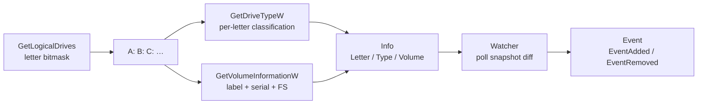

# Drive enumeration & monitoring

[← recon index](README.md) · [docs/index](../../index.md)

## TL;DR

You want to know what drives are mounted on the host (USB keys,
SMB shares, fixed disks) and react when new ones appear. Two
operations:

| You want… | Use | Returns |
|---|---|---|
| List every mounted drive right now | [`LogicalDriveLetters`](#func-logicaldriveletters-string) + [`New`](#func-newletter-string-info-error) | `[]string` letters, then per-letter `*Info` (type + label + serial + GUID) |
| React when a new drive mounts (USB insert, share map) | [`NewWatcher`](#func-newwatcheropts-watcheropts-watcher) + `Watch` | Channel of `Event{Type: EventAdded/EventRemoved, Info: *Info}` |

Common operational uses:

- **Initial recon** at startup — log every mounted drive's
  type + label so the operator picks staging targets.
- **USB-insert trigger** — long-running implant watches for
  `TypeRemovable` add events, exfiltrates payload to
  air-gapped media.
- **SMB-share discovery** — `TypeRemote` drives indicate the
  host is mapped to a network resource (lateral-movement hint).

What this DOES NOT do:

- **Doesn't read drive contents** — list/watch only. Use
  `os.ReadDir` or [`evasion/stealthopen`](../evasion/stealthopen.md)
  for the path-free file access.
- **Doesn't enumerate UNC paths or unmounted shares** — only
  letters that have a `DRIVE_*` mapping. Use `WNetEnumResource`
  upstream (not in this package) to find shares before they're
  mapped.
- **Polling-based watch** — `Watcher` snapshots every
  `Interval` (default 200 ms) and diffs. No `WM_DEVICECHANGE`
  notification path; trade-off: works without a hidden window,
  costs a thread.

## Primer — vocabulary

Five terms recur on this page:

> **Drive letter** — single-letter root (`A:`-`Z:`) the Win32
> API uses to address mounted volumes. Not stable across reboots
> (especially USB keys); use `GUID` for cross-reboot identity.
>
> **Drive type** — Windows's classification: `Fixed` (HDD/SSD
> on-machine), `Removable` (USB / floppy), `Remote` (SMB share),
> `CDROM`, `RAMDisk`, `NoRootDir` (mount point with no media),
> `Unknown`. Returned by `GetDriveTypeW`.
>
> **Volume GUID** — `\\?\Volume{...}\` form. Stable identifier
> across reboots, mount-point changes, and letter reassignments.
> Use this when you need to recognise the same USB key across
> sessions; the letter alone changes.
>
> **Device path** — kernel-level name like
> `\Device\HarddiskVolumeN`. Used by drivers and minifilters,
> rarely directly by user-mode code. Surfaced for
> completeness — most callers want `Letter` or `GUID`.
>
> **Snapshot polling** — the watcher's mechanism: every
> `Interval` it calls `LogicalDriveLetters`, builds a fresh
> snapshot, diffs against the previous, emits add/remove
> events. No system event subscription required.

## How It Works



Watcher polling is configurable (default 200 ms). Snapshots
are diffed; new entries emit `EventAdded`, removed entries
emit `EventRemoved`. The `FilterFunc` lets callers narrow to
e.g. `TypeRemovable` only.

## API → godoc

[`pkg.go.dev/github.com/oioio-space/maldev/recon/drive`](https://pkg.go.dev/github.com/oioio-space/maldev/recon/drive) is the authoritative
reference for every exported symbol. This page teaches the
*concepts*; the godoc is the *specification*.

## Examples

### Simple — single-drive lookup

```go
import "github.com/oioio-space/maldev/recon/drive"

d, _ := drive.New("C:")
fmt.Printf("%s %s\n", d.Letter, d.Type)
```

### Composed — list all removables

```go
letters, _ := drive.LogicalDriveLetters()
for _, l := range letters {
    if drive.TypeOf(l+`\`) == drive.TypeRemovable {
        info, _ := drive.New(l)
        fmt.Println(info.Letter, info.Volume.Label)
    }
}
```

### Advanced — USB-insert trigger (polling)

```go
ctx, cancel := context.WithCancel(context.Background())
defer cancel()

w := drive.NewWatcher(ctx, func(d *drive.Info) bool {
    return d.Type == drive.TypeRemovable
})
ch, _ := w.Watch(500 * time.Millisecond)
for ev := range ch {
    if ev.Kind == drive.EventAdded {
        // stage data on the inserted USB
        stageData(ev.Drive.Letter)
    }
}
```

### Advanced — event-driven (`WM_DEVICECHANGE`)

Same use-case, zero-CPU at idle. Requires an interactive
session — use the polling variant on services / SYSTEM contexts
where `WM_DEVICECHANGE` doesn't broadcast.

```go
ctx, cancel := context.WithCancel(context.Background())
defer cancel()

w := drive.NewWatcher(ctx, func(d *drive.Info) bool {
    return d.Type == drive.TypeRemovable
})
ch, err := w.WatchEvents(4) // buffer 4 — USB hub re-enum bursts
if err != nil {
    return err // RegisterClassExW / CreateWindowExW failure
}
for ev := range ch {
    if ev.Kind == drive.EventAdded {
        stageData(ev.Drive.Letter)
    }
}
```

## OPSEC & Detection

| Artefact | Where defenders look |
|---|---|
| `GetLogicalDrives` polling | Universal API — invisible at user-mode |
| Sustained 200 ms polling on idle process | Behavioural EDR may flag CPU patterns; raise interval |
| Subsequent file writes to removable media | EDR file-write telemetry — high-fidelity for sensitive paths |

**D3FEND counters:**

- [D3-FCA](https://d3fend.mitre.org/technique/d3f:FileContentAnalysis/)
  — DLP scans on writes to removable media.

**Hardening for the operator:**

- Raise watch interval (1-2 s) on idle hosts.
- Don't write to removable media while polling — the
  correlation is the high-fidelity signal.

## MITRE ATT&CK

| T-ID | Name | Sub-coverage | D3FEND counter |
|---|---|---|---|
| [T1120](https://attack.mitre.org/techniques/T1120/) | Peripheral Device Discovery | full | D3-FCA |
| [T1083](https://attack.mitre.org/techniques/T1083/) | File and Directory Discovery | partial — drive enumeration is a sibling primitive | D3-FCA |

## Limitations

- **Two watcher modes, pick per session shape.** `Watch(interval)`
  polls and works headless / in services / under SYSTEM (any
  context with no message broadcast). `WatchEvents(buffer)`
  uses `WM_DEVICECHANGE` and needs an interactive session —
  service / SYSTEM contexts get no broadcast. Both modes share
  the same `Snapshot` + diff machinery, so swapping is one
  line.
- **`WatchEvents` requires an OS-thread-locked goroutine.** The
  Win32 message pump cannot migrate threads, so the pump
  goroutine `runtime.LockOSThread`s for its entire lifetime.
  This adds one OS thread to the implant for the duration of
  the watcher.
- **`WatchEvents` registers a window class.** The class
  (`MaldevDriveWatcher`) is a uint atom in the per-process
  user-atom table — invisible to `EnumWindows` but discoverable
  by a debugger walking atom tables.
- **Volume serial may be 0.** Some virtual drives (RAM disks,
  some VPN drives) report serial 0.
- **Network drives cached.** Mapped network drives that drop
  off may take several poll cycles to surface as
  `EventRemoved` under `Watch`. `WatchEvents` fires on
  `WM_DEVICECHANGE`, which DOES broadcast network-drive
  arrival / removal — better latency on this class.
- **Windows only.** No Linux equivalent in this package; use
  `inotify` / `udev` directly.

## See also

- [`recon/folder`](folder.md) — sibling Windows special-folder
  resolution.
- [`recon/network`](network.md) — sibling network-interface
  enumeration (a UNC `\\server\share` "drive" is a network
  resource).
- [Operator path](../../by-role/operator.md).
- [Detection eng path](../../by-role/detection-eng.md).
