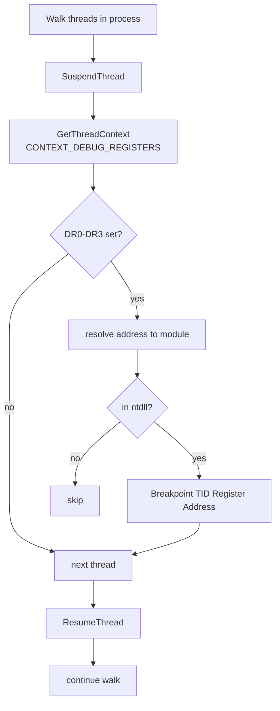

# Hardware breakpoint detection & clear

[← recon index](README.md) · [docs/index](../../index.md)

## TL;DR

EDRs (notably CrowdStrike Falcon) place hardware breakpoints on
NT function prologues using DR0-DR3 — invisible to the classic
ntdll-on-disk-unhook pass. [`Detect`](https://pkg.go.dev/github.com/oioio-space/maldev/recon/hwbp)
reads DR0-DR3 across every thread and returns those pointing
into ntdll; [`ClearAll`](https://pkg.go.dev/github.com/oioio-space/maldev/recon/hwbp) zeros them via
`SetThreadContext`.

## Primer

Hardware debug registers DR0-DR3 hold up to four breakpoint
addresses; DR6 is the status register, DR7 controls
enable/condition/length. The kernel maintains DR state
per-thread; user-mode reads/writes via `GetThreadContext` /
`SetThreadContext`.

EDRs use HWBPs to monitor `Nt*` calls without modifying ntdll's
`.text`. A breakpoint set at `NtOpenProcess+0` triggers a
`#DB` exception on entry that the EDR's vectored exception
handler intercepts. Because `.text` is unchanged, classic
"unhook ntdll from disk" defeats inline hooks but **does not**
defeat HWBPs.

`recon/hwbp` reads DR0-DR3 across every thread in the current
process, identifies breakpoints pointing into ntdll, and
clears them.

## How It Works



`ClearAll` walks the same threads, zeros DR0-DR3 + DR7 via
`SetThreadContext`, and resumes.

## API → godoc

[`pkg.go.dev/github.com/oioio-space/maldev/recon/hwbp`](https://pkg.go.dev/github.com/oioio-space/maldev/recon/hwbp) is the authoritative
reference for every exported symbol. This page teaches the
*concepts*; the godoc is the *specification*.

## Examples

### Simple — detect + report

```go
import "github.com/oioio-space/maldev/recon/hwbp"

bps, _ := hwbp.Detect()
for _, bp := range bps {
    fmt.Printf("DR%d → %x in %s (TID %d)\n",
        bp.Register, bp.Address, bp.Module, bp.TID)
}
```

### Composed — clear if any found

```go
if bps, _ := hwbp.Detect(); len(bps) > 0 {
    if cleared, err := hwbp.ClearAll(); err == nil {
        fmt.Printf("cleared %d HWBP(s)\n", cleared)
    }
}
```

### Advanced — chain with ntdll unhook

Full integrity restore: clear HWBPs + unhook inline hooks.

```go
import (
    "github.com/oioio-space/maldev/evasion"
    "github.com/oioio-space/maldev/evasion/unhook"
    "github.com/oioio-space/maldev/recon/hwbp"
)

techs := []evasion.Technique{
    hwbp.Technique(),                  // clear DR0-DR3
    unhook.Classic("NtOpenProcess"),   // unhook inline
    unhook.Classic("NtAllocateVirtualMemory"),
    // ...
}
_ = evasion.ApplyAll(techs, nil)
```

## OPSEC & Detection

| Artefact | Where defenders look |
|---|---|
| `SetThreadContext(CONTEXT_DEBUG_REGISTERS)` | EDRs that hook this API see the clear; rare but not unknown |
| Sustained `SuspendThread` / `ResumeThread` cycles | Behavioural anomaly on idle processes |
| ETW Microsoft-Windows-Threat-Intelligence DR-register-write events | Win11 22H2+ ETW-Ti provider; few SOCs subscribe |
| HWBPs cleared while EDR expects them set | EDR self-checks may detect (rare in production) |

**D3FEND counters:**

- [D3-PSA](https://d3fend.mitre.org/technique/d3f:ProcessSpawnAnalysis/)
  — debug-register manipulation telemetry.
- [D3-SCA](https://d3fend.mitre.org/technique/d3f:SystemCallAnalysis/)
  — kernel-side syscall observation unaffected by HWBP clear.

**Hardening for the operator:**

- Pair with [`evasion/unhook`](../evasion/ntdll-unhooking.md)
  in a single `evasion.ApplyAll` chain to clear HWBPs + inline
  hooks together.
- Use [`win/syscall`](../syscalls/) direct/indirect syscalls
  even after clearing — defeats both inline + HWBP regardless
  of clear success.
- Re-check periodically — long-running implants may see EDR
  re-set HWBPs on thread creation.

## MITRE ATT&CK

| T-ID | Name | Sub-coverage | D3FEND counter |
|---|---|---|---|
| [T1622](https://attack.mitre.org/techniques/T1622/) | Debugger Evasion | full — DR0-DR3 inspection + clear | D3-PSA |
| [T1027.005](https://attack.mitre.org/techniques/T1027/005/) | Indicator Removal from Tools | partial — neutralises EDR HWBPs | D3-PSA |

## Limitations

- **Per-process, per-thread.** New threads created after
  `ClearAll` may receive fresh HWBPs from the EDR.
- **Kernel-set HWBPs untouchable.** Some EDRs use kernel
  callbacks to set HWBPs on every thread creation; clearing
  user-mode just defers the problem to the next new thread.
- **Detection requires module attribution.** `Detect` only
  reports breakpoints in ntdll; HWBPs in other modules
  (kernelbase, user32) are missed unless using `DetectAll`.
- **Wow64 inheritance.** 32-bit threads under WoW64 use a
  separate DR context; this package targets the native context.
- **Thread suspension visible.** SuspendThread is itself
  monitored by some EDRs.

## See also

- [`evasion/unhook`](../evasion/ntdll-unhooking.md) — pair to
  also clear inline hooks.
- [`win/syscall`](../syscalls/) — bypass both inline + HWBP
  regardless.
- [Operator path](../../by-role/operator.md).
- [Detection eng path](../../by-role/detection-eng.md).
