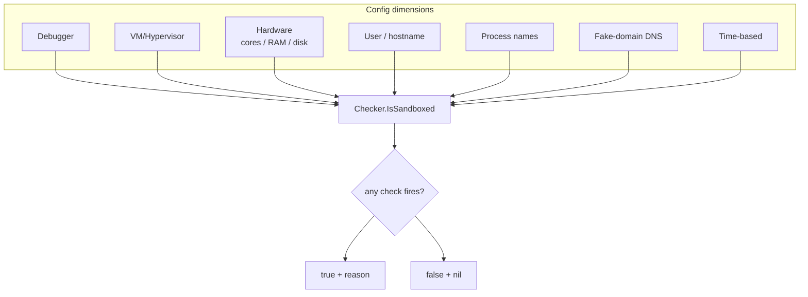

# Sandbox detection orchestrator

[← recon index](README.md) · [docs/index](../../index.md)

## TL;DR

You want to bail out before doing anything risky if the host
looks like a sandbox or analyst's machine. No single signal is
conclusive (a low-end laptop has 2 cores too, an admin's
hostname might just be "DESKTOP-X1") — so this orchestrator
stacks 7 orthogonal dimensions and fires when ANY of them flags.

Each dimension catches a different sandbox class:

| Dimension | Catches | False positive on |
|---|---|---|
| **Debugger** | Live analyst with attached debugger | nothing in practice |
| **VM/Hypervisor** | Cuckoo, Joe Sandbox, most public sandboxes | Hyper-V on a real Win11 laptop |
| **Hardware** (cores / RAM / disk) | Underprovisioned VMs (2 CPU / 4 GB RAM / 60 GB disk baseline) | Low-end real machines |
| **User/host name** | Generic analyst defaults (admin / user / sandbox / malware / `WORKSTATION-1`) | Lazy real-user provisioning |
| **Analysis tool processes** | procmon / wireshark / fiddler / x64dbg actively running | Reverse engineers on real machines |
| **Fake-domain DNS** | Sandbox internet simulation (every domain resolves) | Captive-portal hotspots |
| **Time-based** | Sandboxes that fast-forward `time.Sleep` | Real machines under heavy load |

Quick-pick:

| You want to… | Use | Cost |
|---|---|---|
| Apply the canonical defender-baseline check | [`DefaultConfig`](#func-defaultconfig-config) + [`Checker.IsSandboxed`](#func-checker-issandboxed) | <100ms total (most checks are syscalls/file reads) |
| Tighten/relax a specific dimension | Mutate `Config` fields then `NewChecker(cfg)` | same |
| Stop on first hit (default) vs collect all reasons | `Config.StopOnFirst` (true/false) | StopOnFirst=false sums all check times |

What this DOES NOT do:

- **Doesn't bypass anything** — orchestrator only DECIDES.
  Pair with `os.Exit(0)` or a "play dead" branch in your
  implant.
- **No HVCI / hardware-virt-aware probes** — that's
  [`recon/antivm.HypervisorPresent`](anti-analysis.md). Add
  manually if you want it scoring.
- **Time-based check on goroutine dispatch** — high-CPU real
  hosts can trip the timing dimension. Tune `EvasionTimeout`
  generously or disable when targeting under-resourced
  Windows servers.

## Primer — vocabulary

Five terms recur on this page:

> **Sandbox** — automated analysis environment (Cuckoo,
> JoeSandbox, ANY.RUN, hybrid-analysis, AV vendor labs) that
> runs your sample in a VM and traces every syscall + network
> packet. The implant's job is to bail before producing trace
> data the analyst can use.
>
> **Hardware threshold** — a sandbox is usually a VM provisioned
> with the bare minimum to boot Windows: 2 cores, 4 GB RAM,
> 60 GB disk. Real user machines have more. Setting min thresholds
> catches under-provisioned VMs without lying about real laptop
> baselines (which exceed these by 4-8×).
>
> **Fake-domain DNS** — most sandboxes simulate internet to keep
> the sample doing things. Side effect: `nonexistent-deadbeef.invalid`
> resolves with a real-looking IP. A real machine returns NXDOMAIN.
>
> **Time-based detection** — some sandboxes accelerate
> `Sleep`/`time.Sleep` so the sample doesn't waste analysis
> budget on long sleep loops. The orchestrator measures wall-clock
> elapsed during a known-duration sleep; mismatch → sandbox.
>
> **Indicator dimension** — a category of fingerprint signal
> (debugger / hardware / username / etc.). Each runs
> independently; the orchestrator combines verdicts.

## How It Works



Per-dimension tunables in `Config`: each check has a threshold
and an enable flag. `DefaultConfig` ships defender-baseline
values; operators harden against specific targets by tightening
or relaxing.

## API → godoc

[`pkg.go.dev/github.com/oioio-space/maldev/recon/sandbox`](https://pkg.go.dev/github.com/oioio-space/maldev/recon/sandbox) is the authoritative
reference for every exported symbol. This page teaches the
*concepts*; the godoc is the *specification*.

## Examples

### Simple — defender baseline

```go
import (
    "context"
    "os"

    "github.com/oioio-space/maldev/recon/sandbox"
)

c := sandbox.New(sandbox.DefaultConfig())
if hit, reason, _ := c.IsSandboxed(context.Background()); hit {
    fmt.Fprintf(os.Stderr, "bail: %s\n", reason)
    os.Exit(0)
}
```

### Composed — strict thresholds

Harden against a specific defender pipeline by raising
hardware thresholds and adding custom usernames.

```go
cfg := sandbox.DefaultConfig()
cfg.MinCPUCores = 4
cfg.MinRAMGB = 8
cfg.BadUsernames = append(cfg.BadUsernames,
    "test", "demo", "vagrant",
)
c := sandbox.New(cfg)
```

### Advanced — full audit + report

```go
results := c.CheckAll(ctx)
for _, r := range results {
    if r.Detected {
        fmt.Printf("%-15s %s\n", r.Name, r.Detail)
    }
}
```

### Advanced — score-based bail (recommended for tunable noise)

Replace the binary `IsSandboxed` verdict with a 0..100 score so
operators can tune the bail threshold per engagement.

```go
import "github.com/oioio-space/maldev/recon/sandbox"

c := sandbox.New(sandbox.DefaultConfig())
results := c.CheckAll(ctx)
score := sandbox.Score(results)
if score >= 60 {
    log.Printf("bail: sandbox score=%d", score)
    return
}
```

Audit / tune the weights:

```go
for name, w := range sandbox.Weights() {
    log.Printf("weight[%s] = %d", name, w)
}
```

## OPSEC & Detection

| Artefact | Where defenders look |
|---|---|
| Many checks then early exit | Sandboxes self-flag — they exhausted their analysis budget |
| Fake-domain DNS resolution | Sandboxes often sinkhole; the DNS query itself is logged |
| Analysis-tool process enumeration | Sandboxes know they run wireshark; the enumeration succeeds |
| BusyWait followed by exit | Time-based sandbox decoys |

**D3FEND counters:**

- [D3-EI](https://d3fend.mitre.org/technique/d3f:ExecutionIsolation/)
  — sandbox design itself.

**Hardening for the operator:**

- Calibrate thresholds against the actual target stack — too
  strict means false positives on real low-spec targets.
- Layer with [`timing`](timing.md) BusyWait; sandboxes time out
  before a 30-second wait completes.
- Run the full `IsSandboxed` once at startup, then cache —
  re-running on every callback is wasted effort.

## MITRE ATT&CK

| T-ID | Name | Sub-coverage | D3FEND counter |
|---|---|---|---|
| [T1497](https://attack.mitre.org/techniques/T1497/) | Virtualization/Sandbox Evasion | full — multi-factor orchestrator | D3-EI |

## Limitations

- **No bypass for VMI.** Bare-metal volatility analysis
  defeats every check.
- **False positives on low-spec real users.** Tightening
  hardware thresholds catches sandboxes but may catch real
  embedded / minimal-VM targets. The `Score` helper +
  operator-chosen threshold gives finer control than the
  binary `IsSandboxed`: a single hardware check failing on a
  real low-spec target only contributes 3-5 points; the
  operator's bail threshold (typically 50-70) absorbs that
  noise.
- **Score weights are static.** The current `detectionWeights`
  are tuned for "default-defender baseline" target shapes.
  Targets with unusual hardware (cheap VPS, dense Docker
  hosts) may need re-weighting via `Weights()` audit + a
  custom aggregator.
- **DNS check requires outbound resolution.** Air-gapped
  sandboxes that NXDOMAIN everything still defeat the
  fake-domain probe.
- **No rootkit awareness.** Hooks installed by sandbox kernel
  drivers are out of scope; pair with `evasion/unhook` +
  `recon/hwbp` for kernel-hook detection.

## See also

- [`antidebug` + `antivm`](anti-analysis.md) — primitives.
- [`recon/timing`](timing.md) — time-based evasion sub-check.
- [Operator path](../../by-role/operator.md).
- [Detection eng path](../../by-role/detection-eng.md).
