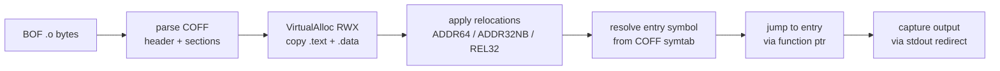

# BOF (Beacon Object File) loader

[← runtime index](README.md) · [docs/index](../../index.md)

## TL;DR

You have a `.o` file (compiled C object) — typically a public
BOF from TrustedSec / Outflank / FortyNorth (whoami, situational
awareness, file ops). You want to run it inside your implant
without spawning a child process. This package loads + executes
the COFF in memory.

| You want to… | Use | Notes |
|---|---|---|
| Run a BOF from disk | [`Run`](#run) | Loads `.o`, parses COFF, resolves Beacon API, executes |
| Run a BOF from memory | [`RunBytes`](#runbytes) | When the BOF was decrypted in-process and never landed on disk |
| Pass arguments to the BOF (parsed via `BeaconData*`) | `Config.Args` | Variadic — the BOF's `BeaconDataInt` / `BeaconDataPtr` etc. consume them |

What this DOES achieve:

- Public BOFs (TrustedSec/CS-Situational-Awareness-BOF,
  TrustedSec/CS-Remote-OPs-BOF, Outflank/C2-Tool-Collection)
  run unmodified.
- Beacon API stubs implemented in Go — no Cobalt Strike needed
  on the operator side.
- Dynamic imports (`KERNEL32`, `ADVAPI32`, …) resolve through
  PEB + ROR13 hash, so the BOF's import table doesn't appear
  as plaintext strings.

What this does NOT achieve:

- **x64 only** — no x86, no ARM64.
- **Doesn't sandbox** — BOF runs in your process address space.
  Crash in the BOF = crash in your implant.
- **AMSI / ETW telemetry from the BOF still fires** — pair
  with [`evasion/preset.Stealth`](../evasion/preset.md) before
  `Run`.

## Primer

A BOF is a relocatable COFF (`.o`) object compiled by MSVC /
MinGW. The format is the same as Linux's `.o` but for Windows
PE-style relocations. BOFs were popularised by Cobalt Strike's
`inline-execute` command — a tactical execution primitive that
runs a small piece of native code inside the implant's process
without spawning a fresh process or writing a PE to disk.

Use cases:

- Run small Windows-API-heavy snippets (token enum, share
  enum, share scan) that don't need a full PE infrastructure.
- Distribute compiled techniques as a `.o` artefact rather
  than a full implant.
- Compose with the implant's runtime — the BOF runs in the
  caller's address space, so it can interact with implant
  state directly.

## How It Works



## API → godoc

[`pkg.go.dev/github.com/oioio-space/maldev/runtime/bof`](https://pkg.go.dev/github.com/oioio-space/maldev/runtime/bof) is the authoritative
reference for every exported symbol. This page teaches the
*concepts*; the godoc is the *specification*.

## Examples

### Simple — load + execute

```go
import (
    "os"

    "github.com/oioio-space/maldev/runtime/bof"
)

data, _ := os.ReadFile("whoami.o")
b, err := bof.Load(data)
if err != nil {
    return
}
output, _ := b.Execute(nil)
fmt.Println(string(output))
```

### Composed — chain multiple BOFs

```go
for _, path := range []string{"whoami.o", "netstat.o", "tasklist.o"} {
    data, _ := os.ReadFile(path)
    b, err := bof.Load(data)
    if err != nil {
        continue
    }
    out, _ := b.Execute(nil)
    fmt.Printf("=== %s ===\n%s\n", path, out)
}
```

### Advanced — pack arguments via `Args`

```go
data, _ := os.ReadFile("parse_args.o")
b, _ := bof.Load(data)

a := bof.NewArgs()
a.AddInt(42)
a.AddString("hello-args")

out, _ := b.Execute(a.Pack())
fmt.Println(string(out))
```

The wire format is little-endian to match the Cobalt Strike
canonical: TrustedSec COFFLoader, Outflank etc. read length
prefixes via `memcpy` into a native `int`, which on x64 is a
little-endian load. Use `AddInt` / `AddShort` for fixed-width
ints, `AddString` for length-prefixed NUL-terminated strings,
`AddBytes` for raw blobs.

### Token impersonation + spawn-and-inject

The slice-1 surface lets a CS BOF impersonate, spawn a sacrificial
target, and inject without any extra glue:

```go
b, _ := bof.Load(coffBytes)
b.SetSpawnTo(`C:\Windows\System32\notepad.exe`)
b.SetUserData(payloadShellcode) // optional, surfaced via BeaconGetCustomUserData

out, _ := b.Execute(nil)
// The BOF internally calls:
//   BeaconUseToken(handle)             → ImpersonateLoggedOnUser
//   BeaconSpawnTemporaryProcess(...)   → CreateProcess suspended
//   BeaconInjectTemporaryProcess(...)  → write + CreateRemoteThread + Resume
//   BeaconRevertToken()                → RevertToSelf
fmt.Println(string(out))
```

Execute pins the goroutine to its OS thread for the entire call, so the
impersonation in step 1 is honoured by the syscalls the BOF issues in
later steps.

## OPSEC & Detection

| Artefact | Where defenders look |
|---|---|
| `VirtualAlloc(RWX)` followed by EXECUTE from the alloc | Behavioural EDR — high-fidelity reflective-loader signal |
| Module-load events for non-stack `.text` regions | ETW Microsoft-Windows-Threat-Intelligence |
| BOF entry-point execution from non-image memory | Defender for Endpoint MsSense |

**D3FEND counters:**

- [D3-PA](https://d3fend.mitre.org/technique/d3f:ProcessAnalysis/) — RWX execute-from-allocation telemetry.
- [D3-FCA](https://d3fend.mitre.org/technique/d3f:FileContentAnalysis/) — YARA on the loaded bytes.

**Hardening for the operator:**

- Allocate `RW` then `RX` via `VirtualProtect` instead of
  `RWX` — defeats the simplest RWX-watcher rules.
- Encrypt the BOF at rest via [`crypto`](../crypto/README.md);
  decrypt + load + immediately re-encrypt the source buffer.
- Pair with [`evasion/sleepmask`](../evasion/sleep-mask.md)
  for cleartext-at-rest mitigation.

## MITRE ATT&CK

| T-ID | Name | Sub-coverage | D3FEND counter |
|---|---|---|---|
| [T1059](https://attack.mitre.org/techniques/T1059/) | Command and Scripting Interpreter | partial — in-memory native code execution | D3-PA |
| [T1620](https://attack.mitre.org/techniques/T1620/) | Reflective Code Loading | full — COFF reflective load | D3-FCA, D3-PA |

## Limitations

- **Beacon-API surface — full 27-symbol set (slice 1, v0.151+).**
  All `beacon.h` groups are wired:
  - **Data parsing**: `BeaconDataParse` / `DataInt` / `DataShort` /
    `DataLength` / `DataExtract`.
  - **Output / format**: `BeaconPrintf` + `BeaconFormatPrintf`
    (format string forwarded verbatim — varargs caveat below),
    `BeaconOutput`, `BeaconFormatAlloc` / `Reset` / `Free` /
    `Append` / `Int` / `ToString`, `BeaconErrorD` / `ErrorDD` /
    `ErrorNA`.
  - **Tokens**: `BeaconUseToken` (`ImpersonateLoggedOnUser`) /
    `BeaconRevertToken` (`RevertToSelf`). Execute pins the
    goroutine to its OS thread for the BOF call so the
    impersonation is honoured by subsequent Win32 calls; we
    `RevertToSelf` on Execute exit as a safety net.
  - **Injection**: `BeaconInjectProcess` (VirtualAllocEx +
    WriteProcessMemory + CreateRemoteThread on a host handle),
    `BeaconSpawnTemporaryProcess` (`CreateProcess` suspended on
    the configured SpawnTo — `rundll32.exe` by default),
    `BeaconInjectTemporaryProcess` (spawn + inject + resume,
    teardown on failure), `BeaconCleanupProcess` (terminate +
    close).
  - **Helpers**: `BeaconIsAdmin`, `BeaconGetCustomUserData`
    (blob configured via `(*BOF).SetUserData`), `toWideChar`
    (UTF-8 → UTF-16LE, NUL-terminated).
  - **Key-value store**: `BeaconAddValue` / `BeaconGetValue` /
    `BeaconRemoveValue`. Scope is the single Execute call —
    cross-Run state must go through the implant.
  Any unknown `__imp_Beacon*` import still fails at relocation
  time with `unresolved external symbol __imp_BeaconXxx` — loud
  and traceable rather than silent NULL-patching.
- **`BeaconPrintf` / `BeaconFormatPrintf` varargs are not
  expanded.** `syscall.NewCallback` binds a fixed-arity Go
  function as a stdcall callback; Go cannot introspect cdecl
  varargs from inside the callback. We chose option **(a)**
  in the design discussion: forward the format string verbatim.
  BOFs that pass a literal format with no `%` directives
  behave correctly; BOFs relying on `printf`-style expansion
  see the format string raw.

  Two alternatives were considered and rejected for the default
  build:

  - **(b) Leave `__imp_BeaconPrintf` / `BeaconFormatPrintf`
    unresolved** so BOFs that depend on varargs fail at load
    time with a loud error. Honest but breaks compatibility
    with the large TrustedSec / Outflank corpus where
    `BeaconPrintf(CALLBACK_OUTPUT, "...")` is used as a
    no-args writer in 80% of cases.

  - **(c) Implement varargs via cgo.** A C wrapper around
    `vsnprintf` would expand the format and call back into Go
    with the rendered string. Requires:
      1. A C cross-compile toolchain in the build environment
         (mingw-w64 on Linux dev hosts, MSVC on Windows CI).
      2. CGO_ENABLED=1 — flips the entire library out of pure-Go
         mode, which the README sells as a hard guarantee.
      3. A different binary surface in `runtime/bof` for cgo vs.
         pure-Go builds, plus a build-tag matrix.

    The cost is steep relative to the gain (a minority of BOFs).
    Operators who need full vararg expansion can fork the
    package, drop a `bof_cgo_windows.go` file behind
    `//go:build windows && cgo && bof_cgo`, and supply a C-side
    `vsnprintf` wrapper they register via a hook hung off
    `resolveBeaconImport`. That extension point is intentionally
    left open; the default build prioritises pure-Go and
    accepts the verbatim-format trade-off.
- **External Win32 imports — two forms supported.**
  CS-canonical dollar-form (`__imp_KERNEL32$LoadLibraryA`)
  resolves via `parseDollarImport` → `api.ResolveByHash` (PEB
  walk + ROR13 module/function hash, no `GetProcAddress` /
  `LoadLibrary` call appears in the API trail). Mingw-w64 bare
  form (`__imp_LoadLibraryA` with no DLL prefix) resolves by
  walking a curated module list — kernel32, advapi32, user32,
  ws2_32, ole32, shell32 — first hit wins. Symbols not in the
  curated set still fail loudly. Add a module to
  `bareImportSearchOrder` in `beacon_api_windows.go` if a
  particular BOF needs more coverage.
- **Concurrency: BOF execution is serialised package-wide.** The
  Beacon API stubs read a single `currentBOF` pointer guarded
  by `bofMu`. Concurrent `Execute` calls block on each other.
  This matches the CS-compatible loader convention (BOF
  execution is fundamentally single-threaded) but is worth
  knowing if a host program runs many BOFs in parallel.
- **x64 only.** `Machine == 0x8664` required.
- **Relocation coverage.** `IMAGE_REL_AMD64_ABSOLUTE` (no-op),
  `_ADDR64`, `_ADDR32` (errors out cleanly when target exceeds
  32-bit range), `_ADDR32NB`, `_REL32`, and the `_REL32_1`
  through `_REL32_5` bias variants. Exotic relocations (TLS, GOT,
  `_SECTION`, `_SECREL`) are not supported — the loader fails
  with `unsupported relocation type: 0xNN` so the failure mode
  is obvious instead of a silent corruption.
- **RWX allocation is loud.** Hardened EDRs flag RWX from any
  source; pair with sleep-mask + RW→RX flip.

## See also

- [`runtime/clr`](clr.md) — sibling reflective runtime (.NET).
- [`crypto`](../crypto/README.md) — encrypt BOF at rest.
- [`evasion/sleepmask`](../evasion/sleep-mask.md) — hide BOF
  bytes at rest.
- [Operator path](../../by-role/operator.md).
- [Detection eng path](../../by-role/detection-eng.md).
