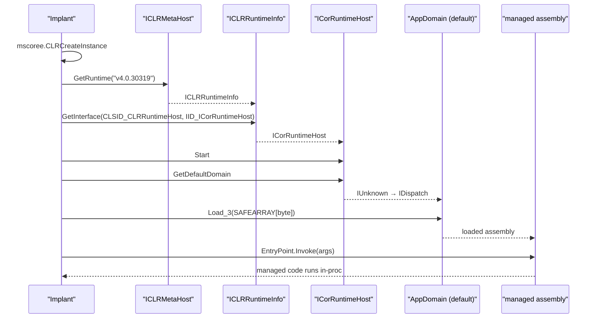

# CLR (.NET) in-process hosting

[← runtime index](README.md) · [docs/index](../../index.md)

## TL;DR

You want to run a .NET assembly (Mimikatz / SharpHound /
Rubeus / Seatbelt) inside your implant without dropping `.exe`
to disk and without spawning `powershell.exe -enc ...`. This
package hosts the CLR in your process and runs the assembly
from memory.

| You want to… | Use | Notes |
|---|---|---|
| Run an assembly from disk | [`Run`](#run) | Loads file, hosts CLR, calls EntryPoint |
| Run an assembly from memory bytes | [`RunBytes`](#runbytes) | Pre-decrypted assembly never lands on disk |
| Pass `Main(string[] args)` arguments | `Config.Args` | Forwarded to the assembly's entry point |
| Capture stdout/stderr from the assembly | `Config.Stdout` / `Config.Stderr` | `io.Writer` interface; default = `os.Stdout` / `os.Stderr` |

⚠ **AMSI v2 scans every `AppDomain.Load_3` payload** —
SharpHound, Rubeus, Seatbelt will be blocked unless you patch
AMSI first. Apply [`evasion/amsi.PatchAll`](../evasion/preset.md)
or [`preset.Stealth`](../evasion/preset.md) BEFORE calling Run.

What this DOES achieve:

- Equivalent to Cobalt Strike's `execute-assembly` — same
  capability, native Go.
- No `.exe` on disk; no child-process creation; no
  `powershell.exe -enc` (which is the textbook EDR trigger).
- COM-based hosting via `ICLRMetaHost` / `ICorRuntimeHost` —
  works against .NET 4.x runtimes (most Windows installs).

What this does NOT achieve:

- **Doesn't bypass AMSI** — must be done upstream.
- **Doesn't bypass ETW DotNETRuntime provider** — JIT events
  (assembly load, method compile) fire to that provider
  regardless. Defenders subscribed see the assembly load.
- **CLR loads only once per process** — first call wins. Can't
  swap runtimes between `Run` calls.
- **Pre-.NET 4.0 / .NET Core / .NET 5+ unsupported** — those
  use a different hosting API. Most operator tools target
  4.x because Windows ships it.

## Primer

The Common Language Runtime is the .NET execution engine. Any
process can host the CLR by importing `mscoree.dll` and calling
`CLRCreateInstance`. The hosting process gets a managed runtime
inside its address space and can load + invoke .NET assemblies
without spawning `dotnet.exe` / `powershell.exe`.

Operationally:

- Run SharpHound / Rubeus / Seatbelt / GhostPack tooling
  in-process from a Go implant — no separate `.exe` to drop, no
  process-tree anomaly.
- Side-step `dotnet.exe` / `powershell.exe` lineage rules.
- Bridge to the entire .NET ecosystem for credential dumping,
  token theft, AD enumeration.

The trade-offs are loud:

- Loading `clr.dll` + `mscoreei.dll` in a non-.NET process is
  itself a high-fidelity heuristic.
- AMSI v2 scans every `Load_3` call; without an AMSI patch most
  published tooling is blocked.
- ETW Microsoft-Windows-DotNETRuntime emits assembly-load events.

## How It Works



`Load(nil)` picks the preferred installed runtime
(v4 > legacy). For .NET 3.5 (legacy) targets call
[InstallRuntimeActivationPolicy] first to register the required
CLSID — disabled by default on modern Windows. The package
returns [ErrLegacyRuntimeUnavailable] when the legacy runtime
can't be activated.

## API → godoc

[`pkg.go.dev/github.com/oioio-space/maldev/runtime/clr`](https://pkg.go.dev/github.com/oioio-space/maldev/runtime/clr) is the authoritative
reference for every exported symbol. This page teaches the
*concepts*; the godoc is the *specification*.

## Examples

### Simple — load + execute

```go
import (
    "os"

    "github.com/oioio-space/maldev/runtime/clr"
)

rt, err := clr.Load(nil)
if err != nil {
    return
}
defer rt.Close()

asm, _ := os.ReadFile("Seatbelt.exe")
_ = rt.ExecuteAssembly(asm, []string{"-group=system"})
```

### Composed — AMSI patch + ETW patch + execute

```go
import (
    "os"

    "github.com/oioio-space/maldev/evasion/amsi"
    "github.com/oioio-space/maldev/evasion/etw"
    "github.com/oioio-space/maldev/runtime/clr"
)

if err := amsi.PatchAll(); err != nil {
    return
}
_ = etw.PatchAll()

rt, _ := clr.Load(nil)
defer rt.Close()

asm, _ := os.ReadFile("Rubeus.exe")
_ = rt.ExecuteAssembly(asm, []string{"triage"})
```

### Advanced — list + pick runtime

```go
versions, _ := clr.InstalledRuntimes()
for _, v := range versions {
    fmt.Println("installed:", v)
}
```

## OPSEC & Detection

| Artefact | Where defenders look |
|---|---|
| `clr.dll` + `mscoreei.dll` module load in non-.NET host | High-fidelity heuristic — Defender for Endpoint, Elastic, S1 |
| `AmsiScanBuffer` flagging the assembly | AMSI v2 scans every `Load_3` — published tooling caught universally |
| Microsoft-Windows-DotNETRuntime ETW provider | Assembly-load events; without ETW patch every load is logged |
| `ICorRuntimeHost` COM activation from non-Microsoft process | EDR COM-activation telemetry |
| Process Hollowing-like behaviour: process metadata says non-.NET, runtime hosts CLR | Behavioural EDR rule |

**D3FEND counters:**

- [D3-PSA](https://d3fend.mitre.org/technique/d3f:ProcessSpawnAnalysis/) — module-load lineage.
- [D3-FCA](https://d3fend.mitre.org/technique/d3f:FileContentAnalysis/) — AMSI on assembly bytes.

**Hardening for the operator:**

- Always patch AMSI ([`evasion/amsi.PatchAll`](../evasion/amsi-bypass.md))
  before `ExecuteAssembly`.
- Pair with [`evasion/etw`](../evasion/etw-patching.md) for the
  .NET runtime ETW silencing.
- Run inside a process where `clr.dll` load is plausible
  (Office, browsers, managed-service hosts).
- Pair with [`pe/masquerade/preset/svchost`](../pe/masquerade.md)
  if running from a fresh process.

## MITRE ATT&CK

| T-ID | Name | Sub-coverage | D3FEND counter |
|---|---|---|---|
| [T1620](https://attack.mitre.org/techniques/T1620/) | Reflective Code Loading | full — CLR-hosted in-memory .NET | D3-FCA, D3-PSA |
| [T1059](https://attack.mitre.org/techniques/T1059/) | Command and Scripting Interpreter | partial — in-process .NET execution without dotnet.exe | D3-PSA |

## Limitations

- **AMSI / ETW upstream patches required for hostile assemblies.**
- **CLR lifecycle is global per-process.** Once started, a CLR
  cannot be cleanly unloaded; subsequent `Load` calls re-use
  the same instance.
- **Output capture.** Stdout / stderr from the assembly require
  redirection setup before `ExecuteAssembly`.
- **AppDomain isolation absent.** All assemblies share the
  default AppDomain; one exception can take down the runtime.
- **.NET 3.5 disabled-by-default on modern Windows.** Legacy
  runtime hosting needs the policy install.
- **`[STAThread]` requirement.** Some assemblies require an
  STA apartment; running without re-creating that apartment
  may fail for COM-heavy tooling.

## Credit

- ropnop/go-clr — canonical Go port; vendored upstream.

## See also

- [`runtime/bof`](bof-loader.md) — sibling reflective runtime
  (COFF / native code).
- [`evasion/amsi`](../evasion/amsi-bypass.md) — REQUIRED for
  hostile assemblies.
- [`evasion/etw`](../evasion/etw-patching.md) — silence .NET
  runtime ETW.
- [`pe/srdi`](../pe/pe-to-shellcode.md) — alternative path for
  .NET → shellcode via Donut.
- [Operator path](../../by-role/operator.md).
- [Detection eng path](../../by-role/detection-eng.md).
