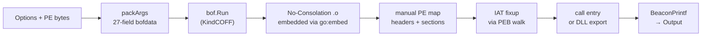

# PE loader (in-process EXE / DLL)

[← runtime index](README.md) · [docs/index](../../index.md)

## TL;DR

You have a Windows EXE or DLL (`hello.exe`, `mimikatz.exe`, a
homemade tool). You want to run it inside your implant without
spawning a child process, without dropping the file to disk, and
you want to capture its stdout back as a Go string. This package
maps the PE into the current process and runs it via an embedded
[Fortra No-Consolation](https://github.com/fortra/No-Consolation)
BOF that rides on top of [`runtime/bof`](bof-loader.md).

| You want to… | Use | Notes |
|---|---|---|
| Run an EXE from memory, capture stdout | [`RunExecutable`](#runexecutable) | Bytes pass-through; cmdline via `Options.Args` |
| Run a DLL export | `RunExecutable` + `Options.Method` | Calls the named export instead of `_start` |
| Run an EXE on the calling thread (TLS-safe) | `Options.InThread` | Blocks until completion |
| Chain into PEB.Ldr | `Options.LinkToPEB` | Visible to `EnumProcessModules` — opsec hot |

What this DOES achieve:

- Public PEs (Mimikatz, Rubeus, SharpHound's `.exe` build,
  Microsoft sysinternals) run unmodified.
- Output captured via the underlying BOF's `BeaconPrintf` /
  `BeaconOutput` and returned as one `string`.
- The PE never lands on disk — `peBytes` is passed through the
  bofdata buffer directly into the loader's memory map.

What this does NOT achieve:

- **Default build ships no loader** — rebuild with
  `-tags=pe_noconsolation` after running
  [`scripts/build-no-consolation.sh`](#building-the-embedded-loader),
  same discipline as the BYOVD drivers under
  `kernel/driver/rtcore64`.
- **x64 only** — `.x86.o` build is wired but untested.
- **Process-wide consequences** — `AllocConsole`, PEB.Ldr
  chaining, and `dont_unload` mutate the implant's own state.
  Read each `Options` field before flipping.

## Primer

[No-Consolation](https://github.com/fortra/No-Consolation) is a
public BOF (MIT-licensed) that implements a manual PE loader
in C: it parses the EXE/DLL headers, allocates RWX memory,
applies IAT fixups, resolves dependencies, and jumps to the
entry point — all without `CreateProcess` or `LoadLibrary` on
the target image itself. `runtime/pe` is the Go-side wrapper:
it marshals the loader's 27-field bofdata input from an
ergonomic `Options` struct and dispatches the BOF through
`runtime/bof.Run`.

The split keeps the surface clean: format-level concerns (PE
parsing, relocations, IAT) live inside the BOF; runtime
plumbing (output capture, args, build tags) lives in Go.

## How It Works



## API → godoc

[`pkg.go.dev/github.com/oioio-space/maldev/runtime/pe`](https://pkg.go.dev/github.com/oioio-space/maldev/runtime/pe)
is the authoritative reference. This page teaches the *concepts*;
the godoc is the *specification*.

## Examples

### Recommended shape — DLL with exported entry

```go
import (
    "os"

    "github.com/oioio-space/maldev/runtime/pe"
)

bytes, _ := os.ReadFile("hello.x64.dll")
out, err := pe.RunExecutable(bytes, pe.Options{
    Method: "hello_main",
    Args:   []string{"--name", "world"},
})
if err != nil {
    return err
}
fmt.Println(out)
```

The export receives the cmdline as its single argument:

```c
__declspec(dllexport) int hello_main(const char *cmdline) {
    printf("hello: %s\n", cmdline);
    return 0;
}
```

### EXE — works but risks tearing down the host

```go
// fragile: hello.exe's CRT eventually calls ExitProcess.
// Prefer the DLL shape unless you have a sacrificial process.
out, _ := pe.RunExecutable(exeBytes, pe.Options{
    Args: []string{"--name", "world"},
})
```

### Thread-locked + console — for PEs that need a real stdout

```go
out, _ := pe.RunExecutable(bytes, pe.Options{
    InThread:     true, // block on calling thread
    AllocConsole: true, // PE writes to a real console
    Headers:      true, // some installers re-read their own headers
    Timeout:      120 * time.Second,
})
```

### From disk — when the PE is already on the target

```go
out, _ := pe.RunExecutable(nil, pe.Options{
    Local: true,
    Path:  `C:\Windows\System32\whoami.exe`,
    Args:  []string{"/all"},
})
```

## Building the embedded loader

The default `go build` returns `ErrLoaderMissing` from
`RunExecutable` — the No-Consolation `.o` is not vendored.
Produce it from the official MIT source:

```bash
bash scripts/build-no-consolation.sh
go build -tags=pe_noconsolation ./...
```

Requirements: `bash`, `git`, `x86_64-w64-mingw32-gcc`
(mingw-w64). The script clones the upstream repo at a pinned
commit, compiles `source/entry.c`, and drops the artefact
under `runtime/pe/internal/noconsolation/` (git-ignored by
default — pick per-implant).

## OPSEC & Detection

`runtime/pe` inherits the parent BOF loader's exposure profile
(RWX allocation, manual-map artefact) and adds PE-loader-specific
telemetry:

- **PEB.Ldr mutation** when `LinkToPEB` is set — every userspace
  EDR walks this list at API resolution time.
- **Per-DLL LdrLoadDll calls** when `LoadAllDeps` is true; AMSI
  / ETW providers see each dependency load.
- **Console allocation** with `AllocConsole` creates a visible
  window unless the implant has previously detached its console.
- **NtMapViewOfSection telemetry** from the unmap-and-remap
  pattern the loader uses to apply IAT fixups in RW before
  flipping to RX.

Default-safe posture: `InThread=false`, `LinkToPEB=false`,
`Headers=false`, `AllocConsole=false`. Flip individually with
intent.

## Limitations

- **EXE in-process is unstable.** Real Windows EXEs reach
  ExitProcess at the end of `main()` and tear the host down
  before output can be returned. No-Consolation tries to hook
  ExitProcess but the in-process model with the Go runtime
  sharing the host makes it unreliable. The supported shape is
  **DLLs with an explicit exported function** — call via
  `Options.Method`. The exported function receives the cmdline
  as its first arg (NOT `(argc, argv)`).
- **No loader embedded by default** — gated behind the
  `pe_noconsolation` build tag. The `.o` is committed to the
  repo under `runtime/pe/internal/noconsolation/`; rebuild with
  `scripts/build-no-consolation.sh` to refresh from upstream.
- **No x86 path yet** — `.x86.o` build is supported but the
  Go-side wiring only embeds `.x64.o`. A future
  `pe_noconsolation_x86` tag would parallel the x64 one.
- **No streaming output** — output is captured by the underlying
  BOF and returned as one string at end of run. Long-running
  PEs that print incrementally don't surface progress until they
  finish (or hit `Timeout`). Slice 1.c.7's `ExecuteStream`
  surface is reserved for a future iteration.
- **Crashes propagate** — a faulty PE that AVs or executes
  invalid memory takes the implant with it. No sandbox.
- **GUI EXEs** — anything that calls `CreateWindow` / message
  loop runs but never returns useful output unless wired to
  console redirection separately.

## See also

- [`runtime/bof`](bof-loader.md) — the underlying COFF loader
- [`runtime/clr`](clr.md) — sibling reflective runtime for .NET
- [`pe/srdi`](../pe/pe-to-shellcode.md) — file-format counterpart (PE → shellcode)
- Upstream: <https://github.com/fortra/No-Consolation>
- Plan: `.dev/refactor-2026/bof-loader-revamp-plan.md` slice 1.c.9
