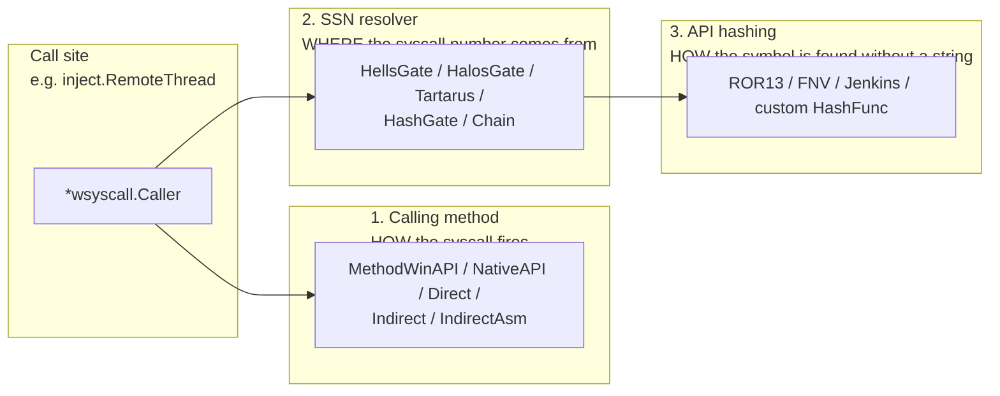
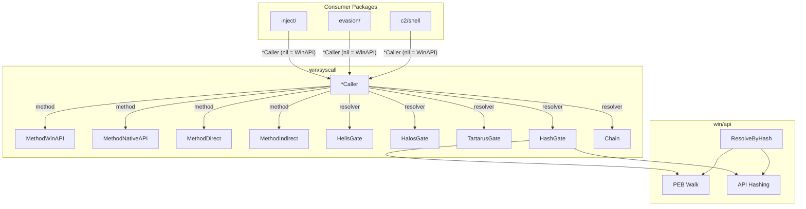

---
---

# Syscall Methods & SSN Resolvers

[← maldev README](../../../README.md) · [docs/index](../../index.md)

The `win/syscall` package composes **three orthogonal concerns**
behind a single `*Caller`. Operators tune each axis independently;
downstream packages (`inject/*`, `evasion/*`, `c2/shell`) accept a
`*Caller` and inherit the chosen posture without recompiling.

## Primer — vocabulary

Eight terms recur throughout the syscalls/* pages:

> **Syscall** — direct kernel transition (`syscall` instruction
> on x64). The actual mechanism Windows uses to call into the
> kernel; everything else (Win32, NTAPI) is a wrapper that
> eventually issues a syscall.
>
> **NTAPI** — `ntdll.dll`'s Nt* functions
> (`NtAllocateVirtualMemory`, `NtCreateThreadEx`, …). Thin
> userland wrappers around the syscall instruction. Every
> Win32 API call (`VirtualAlloc`, `CreateThread`) eventually
> bottoms out in an NTAPI call.
>
> **SSN (System Service Number)** — the integer index of a
> syscall in the kernel's service table. Hardcoded in each
> ntdll prologue. Rotates between Windows builds — `NtAllocateVirtualMemory`
> is SSN 0x18 on one build, 0x19 on the next.
>
> **Userland hook** — inline patch (typically `JMP rel32`)
> an EDR installs at the start of an NTAPI prologue so it
> can inspect arguments before the syscall fires. "Bypassing
> hooks" means issuing the syscall without going through the
> patched bytes.
>
> **Direct syscall** — issuing the `syscall` instruction
> from your own code with the SSN you obtained somehow.
> Skips the (possibly hooked) ntdll prologue entirely.
>
> **Indirect syscall** — calling INTO ntdll's `syscall`
> instruction (which lives at a fixed offset past the
> prologue). Trades direct-syscall's "RIP outside ntdll"
> tell for "uses the canonical syscall site". EDRs scanning
> for syscall instructions in non-ntdll memory miss this.
>
> **API hashing** — replacing string lookups (`"NtAllocateVirtualMemory"`)
> with constant integer hashes (`0xE0762FEA`) so the implant's
> `.rdata` doesn't carry plaintext API names. ROR13 is the
> classical algorithm; Hellgate / HashGate use this internally
> to find Nt* exports.
>
> **Hellsgate / Halosgate / Tartarus / HashGate / Chain** —
> SSN-resolution strategies. Each has different fallbacks for
> when the canonical source (a clean ntdll prologue) is
> compromised. See [ssn-resolvers.md](ssn-resolvers.md).

## Three concerns (read this first)

The three axes answer different questions:

| Axis | Question it answers | Pages |
|---|---|---|
| **1 — Calling method** | How does the implant *issue* the syscall once the SSN is known? Which userland boundary do we cross / skip? | [direct-indirect.md](direct-indirect.md) |
| **2 — SSN resolver** | Where does the SSN come from? What happens when the canonical source (the unhooked ntdll prologue) is unavailable? | [ssn-resolvers.md](ssn-resolvers.md) |
| **3 — API hashing** | How do we identify the right Nt* export without a plaintext name in the binary? | [api-hashing.md](api-hashing.md) |

Tuning one axis does NOT imply tuning the others. You can:

- pick `MethodIndirect` (axis 1) with `HellsGate` (axis 2) — no api-hashing.
- pick `MethodWinAPI` (axis 1) with `HashGate` (axis 2 — uses axis 3 internally).
- swap the hash function on `HashGate` (axis 3) without touching axis 1 / 2.

## Architecture Overview

## Quick Reference

| Method | Hook Bypass | Stack Clean | Memory Clean | Stealth |
|--------|------------|-------------|-------------|---------|
| WinAPI | None | N/A | N/A | Lowest |
| NativeAPI | kernel32 | N/A | N/A | Low |
| Direct | All userland | No | No | Medium |
| Indirect | All userland | Yes | Yes | High (heap stub, RW↔RX cycle) |
| IndirectAsm | All userland | Yes | Yes | Highest (Go-asm stub, no writable code) |

| Resolver | Unhooked ntdll | JMP-hooked ntdll | Fully hooked ntdll | String-free |
|----------|---------------|------------------|-------------------|-------------|
| HellsGate | Yes | No | No | No |
| HalosGate | Yes | Yes (neighbor) | No | No |
| TartarusGate | Yes | Yes (trampoline) | Yes (neighbor fallback) | No |
| HashGate | Yes | No | No | Yes |
| Chain | Depends on composition | Depends on composition | Depends on composition | Depends |

## Quick decision tree

| You want to… | Use |
|---|---|
| …call a Windows API with no plaintext name in the binary | [api-hashing.md](api-hashing.md) (HashGate) |
| …skip kernel32-level hooks but stay in ntdll | [direct-indirect.md](direct-indirect.md) — `MethodNativeAPI` |
| …skip every userland hook (kernel32 + ntdll) | [direct-indirect.md](direct-indirect.md) — `MethodIndirect` / `MethodIndirectAsm` |
| …make the syscall return inside ntdll's `.text` (call-stack stealth) | [direct-indirect.md](direct-indirect.md) — `MethodIndirect` family |
| …avoid any writable code page in the implant | [direct-indirect.md](direct-indirect.md) — `MethodIndirectAsm` |
| …randomise the syscall return address per call | [direct-indirect.md](direct-indirect.md) — gadget pool |
| …auto-fall-back when the target stub is hooked | [ssn-resolvers.md](ssn-resolvers.md) — Halo's / Tartarus / Chain |
| …read the SSN even when the entire ntdll text section is hooked | [ssn-resolvers.md](ssn-resolvers.md) — TartarusGate |
| …swap in your own hash function (defeat ROR13 fingerprints) | `NewHashGateWith(fn)` + `Caller.WithHashFunc(fn)` |

## Documentation

| Document | Description |
|----------|-------------|
| [Direct & Indirect Syscalls](direct-indirect.md) | The five invocation methods (incl. Go-asm IndirectAsm) and when to use each |
| [API Hashing](api-hashing.md) | PEB walk + ROR13 hashing to eliminate plaintext strings |
| [SSN Resolvers](ssn-resolvers.md) | Hell's Gate, Halo's Gate, Tartarus Gate, HashGate |

## MITRE ATT&CK

| Technique | ID | Description |
|-----------|-----|-------------|
| Native API | [T1106](https://attack.mitre.org/techniques/T1106/) | Directly interact with the native OS API |

## D3FEND Countermeasures

| Countermeasure | ID | Description |
|----------------|-----|-------------|
| System Call Analysis | [D3-SCA](https://d3fend.mitre.org/technique/d3f:SystemCallAnalysis/) | Monitor syscall origins and patterns |
| Function Call Restriction | [D3-FCR](https://d3fend.mitre.org/technique/d3f:FunctionCallRestriction/) | Restrict dynamic function resolution |

## See also

- [`syscalls/api-hashing.md`](api-hashing.md) — string-free import resolution
- [`syscalls/direct-indirect.md`](direct-indirect.md) — calling-method matrix
- [`syscalls/ssn-resolvers.md`](ssn-resolvers.md) — Hells/Halos/Tartarus/HashGate
- [`tokens` techniques (index)](../tokens/README.md) — sibling Layer-1 OS-primitive area
