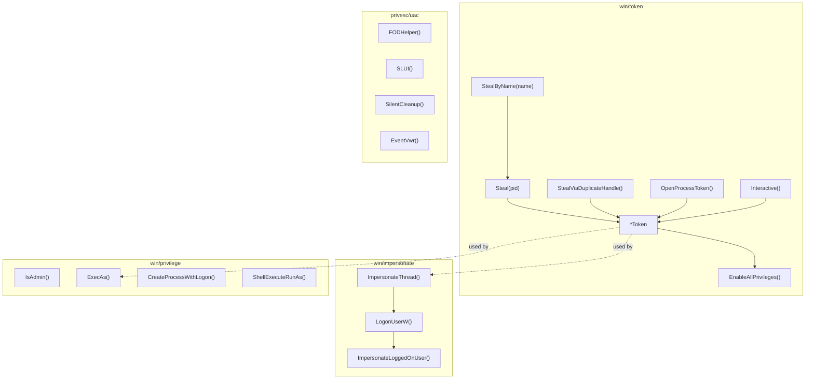

---
---

# Token Manipulation

[<- Back to README](../../../README.md)

The `win/token`, `win/impersonate`, `win/privilege`, and `privesc/uac` packages provide Windows token manipulation: stealing tokens from other processes, thread impersonation, privilege escalation, and UAC bypass.

---

## Architecture Overview

> **Where to start (novice path):**
> 1. [`win/token`](token-theft.md) — `Steal(pid)` / `StealByName`.
>    Grab another process's token (typically winlogon's SYSTEM
>    token) and impersonate. Foundation everything else builds on.
> 2. [`win/impersonate`](impersonation.md) — `LogonUser`-based
>    impersonation when you have plaintext creds (vs token theft).
> 3. [`win/privilege`](privilege-escalation.md) — enable specific
>    privileges in the current token (`SeDebugPrivilege` for
>    LSASS access, `SeBackupPrivilege` for `reg save`).
> 4. [`privesc/uac`](../privesc/uac.md) — UAC bypass methods
>    (FODHelper, ComputerDefaults, sdclt, etc.) when you're
>    Medium-IL and need High-IL.

## Documentation

| Document | Description |
|----------|-------------|
| [Token Theft](token-theft.md) | Steal, StealByName, StealViaDuplicateHandle |
| [Thread Impersonation](impersonation.md) | LogonUserW + ImpersonateLoggedOnUser |
| [Privilege Escalation](privilege-escalation.md) | ExecAs, CreateProcessWithLogon, UAC bypass |

## Quick decision tree

| You want to… | Use |
|---|---|
| …steal a primary token from another PID | [token-theft.md](token-theft.md) — `Steal(pid)` |
| …steal a token by process name | [token-theft.md](token-theft.md) — `StealByName(name)` |
| …run code as `domain\user` with credentials | [impersonation.md](impersonation.md) — `ImpersonateThread` |
| …run code as `NT AUTHORITY\SYSTEM` | [impersonation.md](impersonation.md) — `GetSystem` (winlogon clone) |
| …run code as `TrustedInstaller` | [impersonation.md](impersonation.md) — `GetTrustedInstaller` |
| …enable `SeDebugPrivilege` (or any SeXxx) on the current token | [privilege-escalation.md](privilege-escalation.md) — `EnablePrivilege` |
| …spawn a child process under alternate credentials | [privilege-escalation.md](privilege-escalation.md) — `ExecAs(...)` |
| …check if I'm admin / elevated right now | [privilege-escalation.md](privilege-escalation.md) — `IsAdmin()` |
| …trigger a UAC consent prompt and elevate | [privilege-escalation.md](privilege-escalation.md) — `ShellExecuteRunAs` |

## MITRE ATT&CK

| Technique | ID | Description |
|-----------|-----|-------------|
| Access Token Manipulation | [T1134](https://attack.mitre.org/techniques/T1134/) | Token theft and manipulation |
| Token Impersonation/Theft | [T1134.001](https://attack.mitre.org/techniques/T1134/001/) | Thread impersonation |
| Abuse Elevation Control Mechanism: UAC Bypass | [T1548.002](https://attack.mitre.org/techniques/T1548/002/) | FODHelper, SLUI, SilentCleanup, EventVwr |

## D3FEND Countermeasures

| Countermeasure | ID | Description |
|----------------|-----|-------------|
| Token Authentication and Authorization Normalization | [D3-TAAN](https://d3fend.mitre.org/technique/d3f:TokenAuthenticationandAuthorizationNormalization/) | Monitor token manipulation |
| User Account Profiling | [D3-UAP](https://d3fend.mitre.org/technique/d3f:UserAccountProfiling/) | Detect privilege escalation |

## See also

- [`tokens/token-theft.md`](token-theft.md) — open + duplicate primary tokens
- [`tokens/impersonation.md`](impersonation.md) — run code under a stolen context
- [`tokens/privilege-escalation.md`](privilege-escalation.md) — adjust SeXxx privileges
- [`syscalls` techniques (index)](../syscalls/README.md) — sibling Layer-1 area
