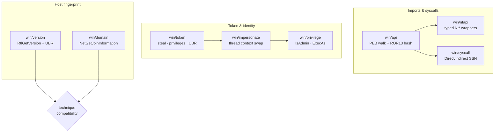

---
---

# Windows-platform primitives (`win/*`)

[← maldev README](../../../README.md) · [docs/index](../../index.md)

The `win/*` package tree is **Layer 1**: low-level Windows
primitives every higher-layer technique builds on. There is no
single "win technique" — the area is a foundation for the others.

> **Where to start (novice path):**
>
> The `win/*` packages are foundations — most operators land
> here from a higher-layer technique that needs to resolve an
> API, steal a token, or fingerprint the host. There is no
> "first thing to read" — pick the row in the decision tree
> below that answers your current question.
>
> If you're new to maldev altogether and want a guided tour:
> start at the [maldev README's Packages table](../../../README.md),
> pick a TECHNIQUE area (Evasion / Injection / Credentials /
> Persistence), and let it pull you into the specific `win/*`
> primitive it depends on.

## Decision tree

| Operator question | Package | Pages |
|---|---|---|
| "Resolve a Windows API without a string in my binary." | [`win/api`](../syscalls/api-hashing.md) | api-hashing |
| "Call NtXxx through ntdll (skip kernel32 hooks)." | [`win/ntapi`](../syscalls/README.md) | syscalls/README |
| "Call NtXxx skipping ALL userland hooks." | [`win/syscall`](../syscalls/direct-indirect.md) | direct-indirect, ssn-resolvers |
| "Steal a token from PID X." | [`win/token`](../tokens/token-theft.md) | token-theft |
| "Run a callback as `user@domain` / SYSTEM / TI." | [`win/impersonate`](../tokens/impersonation.md) | impersonation |
| "Am I admin / elevated right now? Spawn as a different user?" | [`win/privilege`](../tokens/privilege-escalation.md) | privilege-escalation |
| "What Windows build am I on? Is it patched for CVE-X?" | [`win/version`](version.md) | version |
| "Is this host workgroup or AD-joined?" | [`win/domain`](domain.md) | domain |

## Per-package pages

Pages owned by this directory:

- [domain.md](domain.md) — `NetGetJoinInformation` host fingerprint.
- [version.md](version.md) — `RtlGetVersion` + UBR + CVE-state probe.

Pages owned by sibling directories:

- `win/api` — [`syscalls/api-hashing.md`](../syscalls/api-hashing.md)
- `win/syscall` — [`syscalls/direct-indirect.md`](../syscalls/direct-indirect.md), [`syscalls/ssn-resolvers.md`](../syscalls/ssn-resolvers.md)
- `win/ntapi` — [`syscalls/README.md`](../syscalls/README.md)
- `win/token` — [`tokens/token-theft.md`](../tokens/token-theft.md)
- `win/impersonate` — [`tokens/impersonation.md`](../tokens/impersonation.md)
- `win/privilege` — [`tokens/privilege-escalation.md`](../tokens/privilege-escalation.md)

## MITRE ATT&CK rollup

| ID | Technique | Owners |
|---|---|---|
| T1106 | Native API | win/api, win/ntapi, win/syscall |
| T1027 | Obfuscated Files or Information | win/api (hash imports) |
| T1027.007 | Dynamic API Resolution | win/api, win/syscall (gates) |
| T1134 | Access Token Manipulation | win/token, win/impersonate, win/privilege |
| T1134.001 | Token Impersonation/Theft | win/token, win/impersonate |
| T1134.002 | Create Process with Token | win/privilege |
| T1078 | Valid Accounts | win/privilege (alt-creds spawn) |
| T1082 | System Information Discovery | win/version, win/domain |
| T1016 | System Network Configuration Discovery | win/domain (paired with recon/network) |

## See also

- [`docs/techniques/syscalls/`](../syscalls/) — full syscall stack docs
- [`docs/techniques/tokens/`](../tokens/) — token + identity docs
- [`docs/architecture.md`](../../architecture.md) — layering rules
