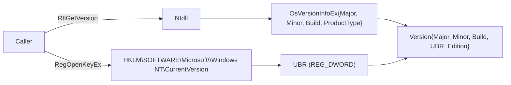

# Windows version & build probe

[← win techniques](README.md) · [docs/index](../../index.md)

## TL;DR

`version.Current()` returns the real running Windows version
including the **UBR** (Update Build Revision — the patch number
inside a build) by reading `RtlGetVersion` (kernel-side, manifest
shim free) plus `HKLM\SOFTWARE\Microsoft\Windows NT\CurrentVersion`.
Used to gate technique selection — many syscall SSN tables, UAC
shims, and kernel exploits are build-specific.

> [!IMPORTANT]
> `GetVersionEx` returns the **manifest-declared** compatibility
> target, not the real OS version. On any process without an explicit
> manifest declaring Win10+ support, `GetVersionEx` reports 6.2 (Win 8).
> Always use `version.Current()` instead.

## Primer

Windows version is more nuanced than `Major.Minor.Build`:

- **Major.Minor.Build** — kernel branch (e.g., 10.0.19045 = Win10 22H2).
- **UBR** — monthly patch level inside a build (19045.5189 = January 2025
  cumulative).
- **Edition** — Pro / Enterprise / Server. Affects feature gates
  (Server-only WTSEnumerateSessions session 0).
- **HVCI / VBS posture** — gates BYOVD: HVCI-on hosts refuse the
  vulnerable-driver block-list before driver load.

For maldev technique selection the build + UBR are usually enough.
Token-stealing techniques don't change between minor builds, but
syscall SSN tables do, and kernel exploits like CVE-2024-30088 are
gated on a UBR cut-off.

## How it works



Implementation:

1. `version.Current()` calls `RtlGetVersion` directly via
   `golang.org/x/sys/windows`. The function reads
   `KUSER_SHARED_DATA.NtProductType / NtMajorVersion / NtMinorVersion /
   NtBuildNumber` — **no manifest shim**.
2. `version.readUBR()` opens
   `HKLM\SOFTWARE\Microsoft\Windows NT\CurrentVersion` and reads the
   `UBR` REG_DWORD value.
3. `version.Windows()` returns an [`Info`] struct combining both,
   plus a human-readable `Edition` string ("Windows 10 22H2",
   "Windows Server 2022").
4. `version.AtLeast(target *Version)` is the comparison operator
   used by callers.

## API → godoc

[`pkg.go.dev/github.com/oioio-space/maldev/win/version`](https://pkg.go.dev/github.com/oioio-space/maldev/win/version) is the authoritative
reference for every exported symbol. This page teaches the
*concepts*; the godoc is the *specification*.

## Examples

### Simple — gate on Win10 1809+

```go
v := version.Current()
if !version.AtLeast(version.WINDOWS_10_1809) {
    return errors.New("technique requires Win10 1809 or later")
}
log.Printf("running on %s build %d.%d", v, v.BuildNumber, /* ubr */ 0)
```

### Composed — UBR-aware patch gate

```go
info, err := version.Windows()
if err != nil {
    return err
}
const minPatchUBR = 5189 // 22H2 January 2025 CU
if info.Build == 19045 && info.Revision < minPatchUBR {
    log.Println("host below required patch level")
}
```

### Advanced — pre-flight a kernel exploit

```go
info, err := version.CVE202430088()
if err != nil {
    return err
}
if !info.Vulnerable {
    return errors.New("host patched")
}
log.Printf("vulnerable: %s build %d.%d", info.Edition, info.Build, info.Revision)
return cve202430088.Run(ctx)
```

## OPSEC & Detection

| Vector | Visibility | Mitigation |
|---|---|---|
| `RtlGetVersion` ntdll call | Not logged | None needed |
| Registry read of CurrentVersion | Not logged at default audit | None |
| Process behaviour | Identical to `winver.exe` | — |

`RtlGetVersion` and the CurrentVersion registry key are read by
practically every Windows program at startup. No incremental signal.

## MITRE ATT&CK

- **T1082 (System Information Discovery)**

## Limitations

- Edition string is hard-coded against a known build → SKU table.
  New SKUs (e.g., Server vNext) appear as "unknown" until the table
  is bumped.
- UBR read requires HKLM read access — rare to be denied in
  user-mode, but possible on hardened OOBE images.
- No HVCI / VBS detection — call
  [`recon/sandbox`](../recon/sandbox.md) helpers if VBS posture
  matters for technique selection.

## See also

- [`win/domain`](domain.md) — companion host fingerprint
- [`win/syscall`](../syscalls/direct-indirect.md) — build-gated SSN tables
- [`privesc/cve202430088`](../privesc/cve202430088.md) — version-gated kernel exploit
